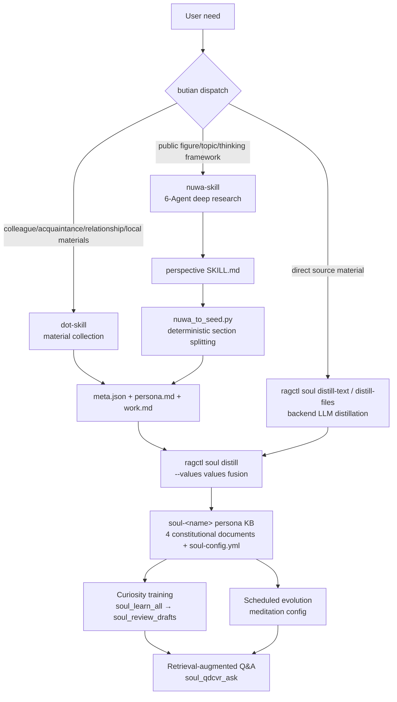

# Butian (补天) Architecture — The SOUL Persona Initialization Distillation System

> Version: 1.0 | Related: soul skill §E · soul-distill-integration.md · seed-contract.md

## 1. Positioning

**Butian (补天) distillation = nuwa-skill (innate-gene deep research) × dot-skill (local-material distillation) dual engines + SOUL acquired evolution.**

```
Knowledge base (what there is)   ←knowledgebase skill  72 kb_* tools
SOUL (who explains it)     ←soul skill          16 soul_* tools
Butian (initial personas)    ←butian skill        dual-engine dispatch + seed conversion + SOUL landing
```

## 2. Dual-Engine Division of Labor

| Dimension | nuwa-skill (Nuwa's craft of making people) | dot-skill (unified meta-skill engine) |
|---|---|---|
| Target | Public figures / topics / thinking frameworks | Colleagues / acquaintances / relationships / celebrity role-play |
| Material source | Web deep research (6 parallel Agents) + optional local corpora | Local material collection (Feishu/DingTalk/email/files/paste) |
| Research depth | 6-dimension research (writings/conversations/expression/external views/decisions/timeline) + triple verification | Direct material intake, 3-question intake |
| Artifacts | `[person]-perspective/SKILL.md` + `references/research/0X-*.md` | `<dir>/meta.json + persona.md + work.md + SKILL.md` |
| Signature output | Mental models / decision heuristics / expression DNA / intellectual lineage / honesty boundaries | Relationship profiles / work personas / evolution patterns / version management |
| Cost scale | quick ≈ 1/3 of standard · standard medium · deep highest (requires Phase 0A confirmation) | Low (mostly local materials) |
| SOUL landing | Needs conversion (section splitting → seed package) | Artifacts are natively the seed contract, direct pass-through |

**Complementarity**: nuwa supplies "thinking depth" (framework distillation); dot-skill supplies "material breadth"
(relationship/work-scenario collection). When both could apply to the same target: deep frameworks → nuwa;
quick landing / insiders → dot-skill.

## 3. Overall Architecture



## 4. File Layout (fits the project .claude/skills system)

```
.claude/skills/
├── butian/                        # Butian dispatcher (core of this architecture)
│   ├── SKILL.md                   # Dispatch protocol: triage/conversion/landing/evolution/usage
│   ├── scripts/
│   │   └── nuwa_to_seed.py        # nuwa SKILL.md → seed package (deterministic, no LLM)
│   └── references/
│       ├── butian-architecture.md # this document
│       └── seed-contract.md       # seed package format contract
├── nuwa-skill/                    # Nuwa: deep-research distillation of public figures/topics
│   ├── SKILL.md                   # includes Phase 3.5 (seed export) / Phase 6 (SOUL landing)
│   ├── references/
│   │   ├── skill-template.md      # (original) figure SKILL template
│   │   └── soul-seed-mapping.md   # (new) nuwa section → SOUL document mapping
│   ├── scripts/                   # subtitle download / quality checks etc. (original)
│   └── examples/                  # already-distilled examples (original)
├── dot-skill/                     # unified meta-skill engine
│   ├── SKILL.md                   # includes the SOUL integration section (points to butian)
│   ├── tools/  prompts/  references/   # (original)
│   └── skills/{colleague,relationship,celebrity}/   # artifact directories
├── soul/                          # SOUL full lifecycle (original)
│   ├── SKILL.md                   # §E extended: three-engine distillation paths
│   └── references/soul-distill-integration.md   # authoritative protocol (now includes the nuwa mapping)
└── soul-rag/                      # retrieval-augmented persona Q&A (original)
```

## 5. Seed Package Contract (unified landing format)

```
seed-dir/
├── meta.json    # {slug, name, display_name, character, research_profile,
│                #  tags:{personality:[routing labels]}, impression, source}
├── persona.md   # identity/personality/expression DNA/honesty boundaries → soul-definition.md appended section
├── work.md      # duties/mental models/decision heuristics/workflows → thinking-style.md appended section
└── values.md    # (optional) values and anti-patterns → values.md appended section (ragctl --values)
```

- dot-skill artifacts = the seed contract natively (meta.json+persona.md+work.md), direct pass-through
- nuwa artifacts are aligned via nuwa_to_seed.py conversion; additionally produces values.md (values enhancement)
- Landing: `ragctl soul distill <seed-dir> --values values.md` → template + seed fused into the
  4 constitutional documents → bootstrap → index

## 6. Distillation → SOUL Mapping (nuwa section level)

| nuwa SKILL.md section | Seed file | SOUL document | Purpose |
|---|---|---|---|
| Identity card | persona.md | soul-definition.md appended section | Identity positioning / core mission |
| Expression DNA | persona.md | soul-definition.md appended section (language-style side) | Language style injection |
| Role-play rules | persona.md | soul-definition.md appended section | Five personality dimensions / output discipline |
| Honesty boundaries | persona.md | soul-definition.md appended section | Knowledge boundary declaration |
| Answering workflow (Agentic Protocol) | work.md | thinking-style.md appended section | Reasoning patterns / do the homework first |
| Core mental models | work.md | thinking-style.md appended section | Thinking lenses |
| Decision heuristics | work.md | thinking-style.md appended section | Judgment rules |
| Intellectual lineage | work.md | thinking-style.md appended section | Sources of thought |
| Figure timeline | work.md | thinking-style.md appended section (background) | Contextual knowledge |
| Failure modes and fallback tree | work.md | thinking-style.md appended section | Degradation rules |
| Values and anti-patterns | values.md | values.md appended section | Constitutional-layer values |
| frontmatter name/description | meta.json | domain_labels + KB description | Routing labels / impression |
| Appendix: research sources | (stays in the skill directory) | — | Provenance basis |

dot-skill mapping (existing, see soul-distill-integration.md §2): persona.md →
soul-definition.md, work.md → thinking-style.md, meta.json tags/impression →
domain_labels.

## 7. Advanced Play: Second-Pass Digestion of Research Material (optional)

nuwa's `references/research/01-writings.md … 06-timeline.md` are high-quality first-hand
research. Optional flow:
1. Ingest: `kb_doc_save_parsed` or fs_upload_file into a separate KB `butian-research-<name>`
2. Add that KB to the SOUL's kb_scope: `ragctl soul scope` / soul_config_update
3. Curiosity training automatically learns the research material → the persona masters knowledge about "itself" more deeply
4. Not executed by default (stays lightweight); enable manually via Steps 2/3 when needed

## 8. Data Flow and Consistency

```
Distillation artifacts (disk) → seed package (unified contract) → ragctl soul distill (create KB + 4 docs + bootstrap + index)
                                     ↓
        soul-<name> five-layer consistency: disk .md ↔ .tree-fs.json ↔ .knowledge-base.yml
                             ↔ ChromaDB vectors ↔ Neo4j graph
```

- Constitutional layer (4 documents + soul-config): fixed once at creation (including --values fusion), read-only afterwards
- Evolution layer (memories/ questions/ cognition-drafts/ checkpoints/): training writes continuously
- Three entry points consistent: frontend (SOUL page) / ragctl / MCP (soul_*) — same backend, same data

## 9. Quality Gate Chain (anti-self-congratulation chain)

```
Distillation checkpoints (nuwa 1.5 research / 2.5 distillation / 4 verification) → seed confirmation (butian Step 3)
→ landing verification (docs_created=4 + profile generated) → training pre-gate (retrieval ≥0.5) + four-dimension self-eval
→ double-judge (divergence >1.5 blocks) → draft written only at distill ≥3 → manual approval (≥3 normal, <3 force + audit)
→ register + index → calibration-set drift detection → reflect drift report → checkpoint rollback available
```

## 9.5 ⭐ Butian Curiosity Engine v2 (metacognitive reinforcement training)

Algorithm reference: arXiv:2604.25648 (Desvaux/Abdelghani/Oudeyer/Sauzéon,
"Curiosity and Metacognition", 2026) — curiosity depends on metacognitive monitoring, interventions require
individual-profile customization, and AI is a cognitive partner rather than a shortcut.

```
Each training round:
  ① read the metacognitive profile questions/mastery.json (per-topic memory counts/avg scores/gaps/footprints)
  ② document selection: new documents (exploration) first + relearning of weak topics (exploitation: gaps/zero memories/avg score <3)
  ③ adaptive question generation: dynamic four-layer ratios by mastery (new topics build foundations → strong mastery 50% challenge)
     + injection of known memory summaries + novelty_filter jaccard dedup (prevents relearning)
  ④ the learning pipeline (retrieval → self-answer → four-dimension self-eval → distillation) unchanged
  ⑤ refresh mastery.json at round end (metacognitive input for the next round/RL, zero LLM cost)
```

Implementation: `backend/app/services/soul_curiosity.py` + wired into soul_learn.py;
unit tests: `backend/tests/test_soul_curiosity.py`.

## 10. Relationship to Existing Documents

| Document | Content | Relationship |
|---|---|---|
| butian-architecture.md (this document) | Dual-engine architecture / file layout / data flow | Master plan |
| seed-contract.md | Seed package format | Contract (consumed by ragctl) |
| soul-distill-integration.md | SOUL × Butian landing protocol | Authoritative protocol (§2 mapping table includes nuwa) |
| soul-seed-mapping.md (inside nuwa) | nuwa section → SOUL mapping details | Engine-side details |
| soul-training.md | Training/RL/scheduling | Post-landing evolution |
