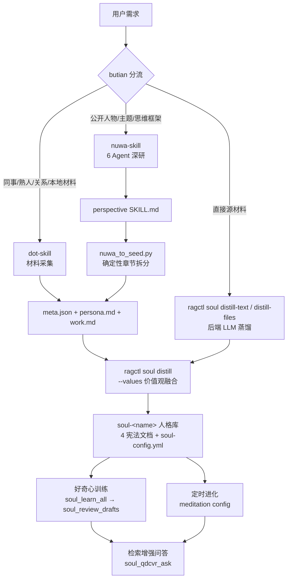

# 补天架构 — SOUL 人格初始化蒸馏体系

> 版本: 1.0 | 关联: soul skill §E · soul-distill-integration.md · seed-contract.md

## 1. 定位

**补天 = nuwa-skill(先天基因深研) × dot-skill(本地材料蒸馏) 双引擎 + SOUL 后天进化。**

```
知识库(有什么)   ←knowledgebase skill  72 个 kb_* 工具
SOUL(谁来讲)     ←soul skill          16 个 soul_* 工具
补天(初始人格)    ←butian skill        双引擎调度 + 种子转换 + SOUL 落地
```

## 2. 双引擎分工

| 维度 | nuwa-skill(女娲造人术) | dot-skill(统一 meta-skill 引擎) |
|---|---|---|
| 对象 | 公开人物 / 主题 / 思维框架 | 同事 / 熟人 / 关系 / 名人扮演 |
| 素材来源 | 网络深研(6 Agent 并行)+ 可选本地语料 | 本地材料采集(飞书/钉钉/邮件/文件/粘贴) |
| 调研深度 | 6 维调研(著作/对话/表达/他者/决策/时间线)+ 三重验证 | 素材直取, 3 问 intake |
| 产物 | `[person]-perspective/SKILL.md` + `references/research/0X-*.md` | `<dir>/meta.json + persona.md + work.md + SKILL.md` |
| 特点 | 心智模型 / 决策启发式 / 表达DNA / 智识谱系 / 诚实边界 | 关系画像 / 工作人格 / 进化模式 / 版本管理 |
| 成本量级 | 快速≈标准1/3 · 标准中等 · 深度最高(需 Phase 0A 确认) | 低(本地材料为主) |
| SOUL 落地 | 需转换(章节拆分→种子包) | 产物即种子契约, 直通 |

**互补点**: nuwa 补"思维深度"(框架提炼), dot-skill 补"材料广度"(关系/工作
场景采集)。同一对象两者皆可时: 深度框架 → nuwa; 快速落地/内部人 → dot-skill。

## 3. 总架构



## 4. 文件定义(符合项目 .claude/skills 体系)

```
.claude/skills/
├── butian/                        # 补天调度器(本架构核心)
│   ├── SKILL.md                   # 调度协议: 分流/转换/落地/进化/使用
│   ├── scripts/
│   │   └── nuwa_to_seed.py        # nuwa SKILL.md → 种子包(确定性, 无 LLM)
│   └── references/
│       ├── butian-architecture.md # 本文档
│       └── seed-contract.md       # 种子包格式契约
├── nuwa-skill/                    # 女娲: 公开人物/主题深研蒸馏
│   ├── SKILL.md                   # 含 Phase 3.5(种子导出)/Phase 6(SOUL 落地)
│   ├── references/
│   │   ├── skill-template.md      # (原) 人物 SKILL 模板
│   │   └── soul-seed-mapping.md   # (新增) nuwa 章节 → SOUL 文档映射
│   ├── scripts/                   # 字幕下载/质量检查等(原)
│   └── examples/                  # 已蒸馏示例(原)
├── dot-skill/                     # 统一 meta-skill 引擎
│   ├── SKILL.md                   # 含 SOUL 集成段(指向 butian)
│   ├── tools/  prompts/  references/   # (原)
│   └── skills/{colleague,relationship,celebrity}/   # 产物目录
├── soul/                          # SOUL 全生命周期(原)
│   ├── SKILL.md                   # §E 已扩展: 三引擎蒸馏路径
│   └── references/soul-distill-integration.md   # 权威协议(已含 nuwa 映射)
└── soul-rag/                      # 检索增强人格问答(原)
```

## 5. 种子包契约(统一落地格式)

```
seed-dir/
├── meta.json    # {slug, name, display_name, character, research_profile,
│                #  tags:{personality:[路由标签]}, impression, source}
├── persona.md   # 身份/性格/表达DNA/诚实边界 → soul-definition.md 追加段
├── work.md      # 职责/心智模型/决策启发式/工作流程 → thinking-style.md 追加段
└── values.md    # (可选) 价值观与反模式 → values.md 追加段(ragctl --values)
```

- dot-skill 产物 = 种子契约原生(meta.json+persona.md+work.md), 直通
- nuwa 产物经 nuwa_to_seed.py 转换对齐; 额外产出 values.md(价值观增强)
- 落地: `ragctl soul distill <seed-dir> --values values.md` → 模板+种子融合写
  4 宪法文档 → bootstrap → 索引

## 6. 蒸馏 → SOUL 映射(nuwa 章节级)

| nuwa SKILL.md 章节 | 种子文件 | SOUL 文档 | 作用 |
|---|---|---|---|
| 身份卡 | persona.md | soul-definition.md 追加段 | 身份定位/核心使命 |
| 表达DNA | persona.md | soul-definition.md 追加段(language-style 侧) | 语言风格注入 |
| 角色扮演规则 | persona.md | soul-definition.md 追加段 | 性格五维/输出纪律 |
| 诚实边界 | persona.md | soul-definition.md 追加段 | 知识边界声明 |
| 回答工作流(Agentic Protocol) | work.md | thinking-style.md 追加段 | 推理模式/先做功课 |
| 核心心智模型 | work.md | thinking-style.md 追加段 | 思维镜片 |
| 决策启发式 | work.md | thinking-style.md 追加段 | 判断规则 |
| 智识谱系 | work.md | thinking-style.md 追加段 | 思想来源 |
| 人物时间线 | work.md | thinking-style.md 追加段(背景) | 语境知识 |
| 失败模式与 Fallback 树 | work.md | thinking-style.md 追加段 | 降级规则 |
| 价值观与反模式 | values.md | values.md 追加段 | 宪法层价值观 |
| frontmatter name/description | meta.json | domain_labels + KB description | 路由标签/印象 |
| 附录:调研来源 | (留在 skill 目录) | — | 溯源依据 |

dot-skill 映射(既有, 见 soul-distill-integration.md §2): persona.md →
soul-definition.md, work.md → thinking-style.md, meta.json tags/impression →
domain_labels。

## 7. 高级玩法: 调研素材二次消化(可选)

nuwa 的 `references/research/01-writings.md … 06-timeline.md` 是高质量一手
调研。可选流程:
1. 入库: `kb_doc_save_parsed` 或 fs_upload_file 到独立库 `butian-research-<name>`
2. 该 SOUL kb_scope 追加该库: `ragctl soul scope` / soul_config_update
3. 好奇心训练自动学习调研素材 → 人格对"自己"的知识掌握更深
4. 不默认执行(保持轻量); 需要时按 Step 2/3 手动启用

## 8. 数据流与一致性

```
蒸馏产物(磁盘) → 种子包(统一契约) → ragctl soul distill(建库+4文档+bootstrap+索引)
                                     ↓
        soul-<name> 五层一致: 磁盘 .md ↔ .tree-fs.json ↔ .knowledge-base.yml
                             ↔ ChromaDB 向量 ↔ Neo4j 图谱
```

- 宪法层(4 文档 + soul-config): 创建时一次定型(含 --values 融合), 之后只读
- 进化层(memories/ questions/ cognition-drafts/ checkpoints/): 训练持续写入
- 三入口一致: 前端(SOUL 页面) / ragctl / MCP(soul_*) 同后端同数据

## 9. 质量闸门(防自嗨链)

```
蒸馏检查点(nuwa 1.5 调研/2.5 提炼/4 验证) → 种子确认(butian Step 3)
→ 落地验证(docs_created=4 + profile 生成) → 训练前置门(检索≥0.5) + 四维自评
→ 双判官(分歧>1.5 拦截) → 蒸馏≥3 才写草稿 → 人工审批(≥3 正常, <3 force+审计)
→ 注册+索引 → 校准集漂移检测 → reflect 漂移报告 → checkpoint 可回滚
```

## 9.5 ⭐ 补天好奇心引擎 v2(元认知强化训练)

算法参考: arXiv:2604.25648(Desvaux/Abdelghani/Oudeyer/Sauzéon,
"Curiosity and Metacognition", 2026) — 好奇心依赖元认知监控、干预需个体画像
定制、AI 是认知伙伴而非捷径。

```
每轮训练:
  ① 读元认知画像 questions/mastery.json(per-topic 记忆数/均分/gaps/足迹)
  ② 文档选择: 新文档(探索)优先 + 薄弱主题重学(利用, 缺口/零记忆/均分<3)
  ③ 自适应问题生成: 按掌握度动态四层比例(新主题打基础 → 强掌握挑战 50%)
     + 已知记忆摘要注入 + novelty_filter jaccard 去重(防重复学习)
  ④ 学习管道(检索→自答→四维自评→蒸馏)不变
  ⑤ 轮末刷新 mastery.json(下一轮/RL 的元认知输入, 零 LLM 成本)
```

实现: `backend/app/services/soul_curiosity.py` + soul_learn.py 接入;
单测: `backend/tests/test_soul_curiosity.py`。

## 10. 与既有文档的关系

| 文档 | 内容 | 关系 |
|---|---|---|
| butian-architecture.md(本文) | 双引擎架构/文件定义/数据流 | 总纲 |
| seed-contract.md | 种子包格式 | 契约(ragctl 消费方) |
| soul-distill-integration.md | SOUL × 补天落地协议 | 权威协议(§2 映射表已含 nuwa) |
| soul-seed-mapping.md(nuwa 内) | nuwa 章节 → SOUL 映射细则 | 引擎侧细则 |
| soul-training.md | 训练/RL/调度 | 落地后的进化 |
