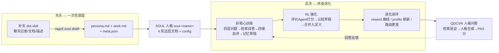

<div align="center">


# RAG Knowledge Platform

### 企业级文档智能与 Agentic 知识库平台

**从原始 PDF 到可验证、可被 Agent 查询的知识 —— 全程一条流水线，内容验证检索拒绝被向量相似度欺骗。**

<p>
<em>QDCVR 语义搜索 · Neo4j 知识图谱 · 经验全生命周期 (E0–E12)<br>
94 个 MCP 工具 · 17 个 Agent 技能 · MinerU OCR · 跨平台 · SOUL 人格系统</em>
</p>

<p>
<a href="#-快速开始"></a>
<a href="#-目录"></a>
<a href="#%EF%B8%8F-94-个-mcp-工具"></a>
<a href="#%EF%B8%8F-四种界面一个后端"></a>
</p>

<p>
<a href="https://github.com/kingdol666/rag-knowledge/stargazers"></a>
<a href="https://github.com/kingdol666/rag-knowledge/releases"></a>


</p>

<p>
<sub><a href="./README.md">English</a></sub> &nbsp;&middot;&nbsp; <sub><b>中文</b></sub>
</p>

---


</div>

---

## 📋 目录

<p align="center">
<a href="#-为什么会有这个项目">起源</a> ·
<a href="#-八大支柱">特性</a> ·
<a href="#-快速开始">快速开始</a> ·
<a href="#%EF%B8%8F-四种安装方式">安装</a> ·
<a href="#-前置要求">前置要求</a> ·
<a href="#%EF%B8%8F-四种界面一个后端">使用</a> ·
<a href="#-系统架构">架构</a> ·
<a href="#-配置">配置</a> ·
<a href="#%EF%B8%8F-94-个-mcp-工具">MCP 工具</a> ·
<a href="#-路线图">路线图</a> ·
<a href="#-贡献指南">贡献</a>
</p>

---

## ✨ 为什么会有这个项目

> **现代 RAG 的核心问题：** 向量高相似 ≠ 内容相关。查询 *"PET 双向拉伸"*，向量检索会开心地返回 *"PP 薄膜"* 文献（余弦相似度 0.90）—— 二者都处在"聚合物薄膜"的语义空间里，嵌入模型被骗了。LLM 随后幻觉出一个自信但错误的答案。

本平台在**检索层**而非生成层解决这个问题。其核心方法 —— **QDCVR（查询驱动 · 内容验证检索）** —— 会读取候选文档正文，按独立的 **0–8 内容评分标准**打分，并执行一条不留情面的规则：

> ### 🎯 *"向量很快召回，内容才是真裁决。"*
> 即使向量相似度高达 **0.95**，只要内容评分 **≤ 4**，该文档就会被**丢弃**。

<div align="center">

| | 传统知识库工具 | **RAG Knowledge Platform** |
|:---:|:---|:---|
| 🔍 | 单一搜索策略（向量*或*关键词） | **多策略**：BM25 + 向量 + 标签语义 + 图谱扩展 |
| 🧠 | 盲信向量相似度 | **内容验证检索** —— 独立的 0–8 内容裁决 |
| 🤖 | AI 是后挂的，难集成 Agent | **Agent 原生**：94 个 MCP 工具，17 个技能，任意 MCP 客户端 |
| 💡 | 无结构化知识复用 | **经验库**：E0–E12 全生命周期，P0/P1/P2 可信度分级 |
| 🔧 | 多工具复杂安装，配置分散 | **一条命令** `ragctl setup`，单一 `config.yml` 真相源 |
| 🪟 | 满屏终端窗口 | **静默无头** —— dev 和 prod 均零终端窗口 |

</div>

---

## 🌟 八大支柱

<div align="center">

</div>

<div align="center">

| # | 支柱 | 你将获得 |
|:---:|:---|:---|
| 📄 | **文档解析** | PDF / Word / Excel / PPT / 图片 → Markdown，基于 **MinerU OCR** 引擎 |
| 🧠 | **QDCVR 检索** | 查询驱动、内容验证的检索 —— 独立 0–8 内容评分 |
| 🔍 | **多策略搜索** | BM25 + 向量两阶段召回 · 跨库企业搜索 · `balance_kbs` 多样性防护 |
| 📊 | **知识图谱** | Neo4j 驱动 · 11 个图谱工具 · 实体/关系图 · 跨库文档桥接 |
| 💡 | **经验库** | E0–E12 全生命周期 · 结构化问题→方案→教训 · P0/P1/P2 可信度 · 衰减 |
| 🔌 | **94 个 MCP 工具** | 知识库 CRUD · 搜索 · 图谱 · 经验 · SOUL 人格 · 解析 · 标签 · 向量索引 · 生命周期 |
| 🎯 | **17 个 Agent 技能** | 自然语言命令 · 中英双语触发 · 自动分发到 Archival Agent · SOUL 人格管理 |
| 🧠 | **SOUL 人格系统** | 补天蒸馏初始人格 · 好奇心驱动训练 · RL 强化进化 · QDCVR 人格增强问答 · 20 个专用 MCP 工具 |
| 🤫 | **静默无头** | 所有启动器均 **零终端窗口** · dev 和 prod 行为一致 |

</div>

---

## 🧠 QDCVR 检索方法

<div align="center">

### 查询驱动 · 内容验证检索

*你不会信任只看过封面的律师。你的 RAG 也不该信任一个余弦相似度分数。*

</div>

**QDCVR** 是一个 6 步检索流水线，设计目的就是抵御向量相似度的欺骗性评分：

```
用户查询
    │
    ▼
┌──────────────────────────────┐
│  ① 选择 KB                   │  智能分发到合适的知识库
│  (balance_kbs 多样性守卫)     │  防止大 KB 主导检索结果
└──────────────┬───────────────┘
               ▼
┌──────────────────────────────┐
│  ② 多路径召回                 │  BM25 → 向量 → 标签语义 → 图谱
│  (4 条并行路径)               │  从每个角度查一遍
└──────────────┬───────────────┘
               ▼
┌──────────────────────────────┐
│  ③ 内容验证                   │  ⭐ 核心创新
│  (0-8 评分标准)               │  读取文档正文，独立打分
│                               │  分数 < 6？→ 标签+描述扩展
│                               │  分数 < 4？→ 硬丢弃
└──────────────┬───────────────┘
               ▼
┌──────────────────────────────┐
│  ④ 交叉验证                   │  去重，跨库合并，融合排序
└──────────────┬───────────────┘
               ▼
┌──────────────────────────────┐
│  ⑤ 置信度评级                 │  P0（验证）/ P1（可能）/ P2（提示）
│  + 盲区声明                   │  诚实的"我不知道"——从不伪造答案
└──────────────┬───────────────┘
               ▼
┌──────────────────────────────┐
│  ⑥ 合成答案 + 来源引用        │  每个结论都链接到源文档
└──────────────────────────────┘
```

<details>
<summary><b>🎯 0–8 内容评分标准（点击展开）</b></summary>

| 分数 | 含义 | 示例 |
|:----:|------|------|
| **0–2** | 离题/幻觉 | 向量相似度 0.95 但内容完全在说另一种材料 —— **丢弃** |
| **3–4** | 边缘提及 | 查询 "PET 拉伸"，命中在 20 页关于 PP 的文档中有一句提到 PET —— **丢弃** |
| **5–6** | 部分相关 | 涵盖了主题但缺少关键细节 —— 执行标签+描述 **扩展扫描** |
| **7–8** | 直接回答 | 精确匹配查询的领域、材料、上下文 —— 作为 **P0** 返回 |

> **规则**：向量负责建议候选，内容决定真实答案。0.95 的向量分数如果内容评分 ≤ 4，毫无意义。
</details>

<details>
<summary><b>🧪 实验结果对比</b></summary>

在 6 个领域的 20 个对抗性查询测试中：

| 方法 | P@5 | FPR | 延迟 |
|------|:---:|:---:|:----:|
| 纯向量（盲信） | 0.590 | 12.0% | 84 ms |
| QDCVR 领域检索（验证后） | **0.630** | **3.0%** | **38 ms** |
| 跨域对抗查询 | — | **0.00%** | — |

跨域假阳性率：**0%**（纯向量 50–77%）。

完整基准测试： [`docs/paper/benchmark/SYSTEM-BENCHMARK-PLAN.md`](./docs/paper/benchmark/SYSTEM-BENCHMARK-PLAN.md)
</details>

---

## 🧬 SOUL 人格系统 — 人格层

> **知识库管「有什么」；SOUL 管「谁来讲、怎么讲」。** 知识库持有事实，SOUL 决定*由谁*讲解、*如何*讲解 —— 一个会学习、会进化、带身份回答的人格层。

<div align="center">


<sub><b>SOUL Persona Studio</b> — 人格清单 · 训练实时监控 · RL 进化曲线 · 人格定义查看器</sub>

</div>

### 🧠 双引擎心智模型

每个人格 = 一个 **`soul-<name>` 知识库**，包含 4 份宪法层文档（`soul-definition` · `values` · `thinking-style` · `memory-conventions`）+ `soul-config.yml`。



| 引擎 | 输入 | 产出 | 频率 |
|---|---|---|---|
| **补天蒸馏**（先天） | 聊天记录 / 文档 / 人物描述 | 初始人格种子（身份/风格/思维框架） | 一次性 |
| **好奇心训练**（后天） | kb_scope 内文档 | 记忆草稿（事实/概念/跨文档/挑战四层问题） | 持续 |
| **RL 强化**（进化） | 评价 Agent 四维评分 | 认知草稿 → 合并入人格定义文档 | 每轮训练 |

### 🎓 先天种子：补天（dot-skill）蒸馏

`/dot-skill` 把源材料（飞书/钉钉聊天记录、PDF、粘贴文本）蒸馏成
`meta.json + persona.md + work.md`，一键转化为 SOUL 人格：

```bash
ragctl soul distill .claude/skills/dot-skill/skills/colleague/example_tianyi \
  --name soul-天意 --scope Energy-Batteries --labels 靠谱,代码规范,热心 --harness omp
```

转换映射（适配本系统 schema）：`persona.md → soul-definition.md 追加段` · `work.md → thinking-style.md 追加段` · `meta.json tags → domain_labels`（路由标签）。

### 🔬 后天进化：好奇心驱动的强化学习（RL）

<div align="center">


<sub><b>训练实时监控</b> — 提交 → 探索轮实时进度 → 评价得分 → 事件流（实测录制）</sub>

</div>

**好奇心协议**（每次 learn 内部）：

```
Step 1  文档读取（≤50k 字符）
Step 2  生成四层问题: 事实 30% | 概念 30% | 跨文档 20% | 挑战 20%
Step 3  每问自答: 两阶段检索(scope 限定) → 图谱邻居 → LLM 带引用合成
Step 4  四维自评: 接地性/完整性/思维一致/信息增益 (0-5) + 10% 双判官
Step 5  蒸馏: 接地性≥3 且无判官分歧 → 记忆草稿(pending)
Step 6  记录 learned_hash(内容 SHA256) → 内容变更自动重学(增量幂等)
```

**RL 强化循环**（train-rl，每轮 = 探索 × 奖励 × 策略更新）：

```
┌─ 探索(Exploration)  learn_incremental — 学习 kb_scope 内增量文档
├─ 奖励(Reward)       evaluate_persona — 评价 Agent 四维打分
│                      identity / values / thinking / language (0-5)
├─ 策略更新(Policy)   generate_cognition_drafts — 低分维度(<3.5)
│                      → 认知草稿(对人格定义文档的受控优化建议)
├─ 策略落地(Apply)    soul_review_drafts(draft_type=cognition) 审批
│                      → 合并入 soul-definition.md 对应章节(仅追加,
│                        checkpoint 保护, 幂等+行级去重)
└─ 进化曲线(Log)      reports/reward-history.jsonl — 逐轮 reward
```

> **实测进化曲线**（soul-天意，真实数据）：`3.25 → 3.75 → 3.12 → 3.5 → 4.25`
> 认知草稿合并后 identity 3→4、language 3→4、thinking 3→3.5；四维均 ≥3.5 后不再生成草稿（收敛态）。
> 人格增强问答 **PAS 5.0（满分人格一致性）**，回答逐字体现进化后的语言风格（"引用统一编号""证据不足明说"）。

### 🎭 三个入口，同一数据

| 操作 | 🌐 Web Studio | 🖥️ ragctl | 🔌 MCP 工具 |
|---|---|---|---|
| 蒸馏创建 | —（建议 ragctl） | `soul distill <dir>` | `soul_init` + 文档覆盖 |
| 训练（文档/全库/RL） | 训练控制台三模式 + 实时监控 | `soul learn` / `learn-all` / `train-rl` | `soul_learn` / `soul_learn_all` / `soul_train_rl` |
| 评价 | RL 曲线 + reward 指标 | `soul evaluate` | `soul_evaluate` |
| 审批（记忆/认知） | 审批 modal 双页签 + 异步进度 | `soul review` / `review-cognition` | `soul_review_drafts(draft_type)` |
| 定时训练 | 配置 modal（间隔/轮数/预算） | `meditation config` | `experience_meditation_config_update` |
| 问答 | 一键检索+人格回答 | `soul ask --qdcvr` | `soul_qdcvr_ask` / `soul_ask` |
| 人格定义 | 查看器（4 文档 + RL 进化行标记） | — | `soul_status` |

<div align="center">


<sub><b>一键检索+人格回答</b> — 证据注入 · 引用锚点 · PAS 人格一致性分</sub>

</div>

**长任务异步契约**（训练/批量审批都是分钟级作业，任何入口都不阻塞等待）：
触发 → 立即返回 `task_id` → 轮询 `GET /api/v1/soul/tasks/{id}`（或 `kb_task_status`）→ `progress` 实时可见（轮次/问题/记忆/文档，审批 processed/total）。

---

## 🚀 快速开始

> **三条命令，从零到完整可用的平台。**

```bash
# 1 — 克隆仓库
git clone https://github.com/kingdol666/rag-knowledge.git
cd rag-knowledge

# 2 — 一键安装（自动安装所有依赖 + 模型）
./ragctl setup

# 3 — 启动所有服务（静默，零终端窗口）
./ragctl up
```

<div align="center">
<br>
<a href="https://github.com/kingdol666/rag-knowledge/stargazers"></a>
<a href="https://github.com/kingdol666/rag-knowledge/issues"></a>
<br>
</div>

<details>
<summary><b>🔧 Windows 用户 — 使用相同命令（原生）</b></summary>

```powershell
.\ragctl.bat setup
.\ragctl.bat up

# 或 ragctl 全局注册后：
ragctl setup
ragctl up
```
</details>

> [!TIP]
> **没有 Claude Code？没问题。** Web UI 完全独立运行。用任何 MCP 客户端即可访问 94 个工具，或直接在 `http://localhost:6789` 浏览和搜索。

### ✅ 验证一切正常

```bash
ragctl status                                   # 双模式：dev + prod 并排显示
curl http://localhost:8765/api/v1/health        # → {"status":"healthy"}
```

### 🔍 界面对照

| 界面 | 地址 | 用途 |
|------|:----:|------|
| 🌐 **Web UI** | `http://localhost:6789` | 浏览 KB、搜索、图谱可视化 |
| 📚 **API 文档** | `http://localhost:8765/docs` | Swagger UI，76 个端点 |
| 🖥️ **CLI** | `ragctl status` | 服务健康检查 |
| 🤖 **Agent** | Claude Code 会话 | 说"列出所有知识库" |

---

## 🗺️ 四种安装方式

<table>
<tr>
<th width="25%">A. Claude Code 插件<br><sub>推荐</sub></th>
<th width="25%">B. OMP 全局安装</th>
<th width="25%">C. Skills 复制 + 向导</th>
<th width="25%">D. Git Clone（本地）</th>
</tr>
<tr>
<td valign="top">

使用 **Claude Code**，全局注册。

```bash
/plugin marketplace add kingdol666/rag-knowledge
/plugin install rag-knowledge@rag-knowledge
/reload-plugins
```

然后告诉 Agent：

> **"初始化知识库"**

</td>
<td valign="top">

使用 **Oh My Pi** 作为 Agent。

```bash
git clone https://github.com/kingdol666/rag-knowledge.git
cd rag-knowledge
node scripts/install_omp.cjs
```

然后告诉 Agent：

> **"初始化知识库系统"** → `/knowledgebase-init`

</td>
<td valign="top">

仅复制技能，不装插件。

```bash
git clone https://github.com/kingdol666/rag-knowledge.git ~/rag-knowledge
mkdir -p ~/.claude/skills
cp -r ~/rag-knowledge/.claude/skills/knowledgebase* ~/.claude/skills/
```

然后告诉 Agent：

> **"初始化知识库"**

</td>
<td valign="top">

完全手动控制。

```bash
git clone https://github.com/kingdol666/rag-knowledge.git
cd rag-knowledge
./ragctl setup && ./ragctl up
```

打开 **http://localhost:6789**。

</td>
</tr>
</table>

---

## 📦 前置要求

| 工具 | 版本 | 是否必需 | 说明 |
|------|------|:--------:|------|
| **Git** | 任意 | ✅ | 克隆仓库 |
| **Node.js** | ≥ 18 | ✅ | `ragctl` CLI + Nuxt 前端 |
| **uv** | ≥ 0.7 | ⚡ 自动安装 | Python 包管理器 |
| **Python** | 3.12 | ⚡ via uv | uv 自动管理，无需手动安装 |
| **Docker** | 任意 | 📋 可选 | 仅 Neo4j 图谱需要 |
| **Rust** | stable | 📋 可选 | 仅 Tauri 桌面应用需要 |

> **磁盘：** 约 5 GB · 首次运行下载 BGE-M3（~2.2 GB）。默认 ModelScope（国内高速），海外用户在 `config.yml` 中设 `embedding.model_source: huggingface`。

---

## 🖥️ 四种界面，一个后端

### 1. 🤖 Claude Code — *自然语言*

```text
"列出所有知识库"                              → kb_list
"把 ./papers 里的 PDF 全部导入到 ML-research 知识库" → knowledgebase-ingest
"搜索：PET 双轴拉伸参数有哪些？"                 → QDCVR → 验证答案 + 来源
"整理所有知识库 — 修复标签、描述、移动错位文档"      → knowledgebase-organize
"记录这个排查经验"                              → knowledgebase-experience-summarize
```

### 2. ⌨️ CLI — *`ragctl`*

```bash
ragctl up                          # 启动全部（静默）
ragctl up --appmode prod           # 生产端口（8001/3000）
ragctl status                      # 双模式状态
ragctl logs web --tail             # 实时跟踪 Web 日志
ragctl restart backend -f          # 强制重启
ragctl backup                      # 跨平台备份
ragctl down                        # 停止所有服务
```

### 3. 🔌 MCP 客户端 — *任意 Agent*

```python
kb_project_start(backend=True, web=True, wait=True)
kb_search_two_stage(query="强化学习", balance_kbs=True)
experience_search_global(query="ConnectError 排查")
kb_graph_cross_kb_documents(min_kbs=2)
```

### 4. 🌐 Web UI — *浏览器访问*

打开 **http://localhost:6789**：

| 页面 | 路由 | 功能 |
|------|:----:|------|
| 🏠 **首页** | `/` | 实时仪表盘（KB/文档/标签/边数动态统计） |
| 📁 **文件系统** | `/file-system` | 树形浏览、上传、解析、预览 |
| 🗄️ **知识库** | `/knowledge-base` | 知识库 CRUD，文档管理 |
| 🔎 **知识搜索** | `/knowledge-search` | QDCVR 搜索，策略选择 |
| 🌐 **图谱探索** | `/knowledge-graph` | D3.js 力导向图可视化 |
| 🤖 **Claude 对话** | `/claude-chat` | Agent SDK 流式交互 |
| 🧬 **SOUL 人格** | `/soul` | Persona Studio：训练实时监控 · RL 曲线 · 人格定义查看器 · 人格问答 |
| ⚙️ **系统设置** | `/settings` | 配置编辑器，热重载 |
| ❓ **关于** | `/about` / `/about-project` | 发布说明 + 路线图 |

<div align="center">

**界面一览** —— 每个页面都是同一后端的实时视图：

| 知识库 | QDCVR 搜索 | 图谱探索 |
|:---:|:---:|:---:|
|  |  |  |

</div>

---

## 🏗️ 系统架构

```
浏览器 / Claude Code / MCP 客户端
        │
        ▼
┌──────────────────────────────┐
│  Nuxt 3 Web UI （代理层）     │  6789 (dev) / 3000 (prod)
└──────────────┬───────────────┘
               │ 服务间通信 (trust_env=False)
               ▼
┌──────────────────────────────┐
│  FastAPI 后端 + MinerU OCR   │  8765 (dev) / 8001 (prod)
└──────────────┬───────────────┘
               │ 文件 I/O
               ▼
┌──────────────────────────────────────────────┐
│  存储层                                        │
│  ├── .tree-fs.json  （全局文件树索引）           │
│  ├── {KB}/.knowledge-base.yml（文档索引）       │
│  ├── {KB}/*.md     （文档内容）                 │
│  ├── ChromaDB      （BGE-M3 1024维向量）        │
│  └── Neo4j         （bolt://127.0.0.1:7687）    │
└──────────────────────────────────────────────┘
```

### 五层存储模型

| 层 | 内容 | 技术 |
|:---:|------|------|
| **L1** | 原始 Markdown 文档 | `storage/tree-file-system/{KB}/{doc}.md` |
| **L2** | 文件树索引 | `.tree-fs.json` |
| **L3** | 文档注册表 | `.knowledge-base.yml` |
| **L4** | 向量嵌入（1024 维） | ChromaDB + BGE-M3 |
| **L5** | 知识图谱 | Neo4j（文档/标签/KB 节点 + 关系） |

> **原则：** 写入 → HTTP API（保证 5 层一致）。读取 → 直接文件读取（零后端负载）。

---

## ⚙️ 配置

`config.yml`（项目根目录）是唯一的真相源。`.env` 可覆盖，由 `ragctl setup` 自动创建。

| 变量 | 默认值（dev / prod） | 用途 |
|------|---------------------|------|
| `APP_MODE` | `dev` | 选择配置段 |
| `BACKEND_PORT` | `8765` / `8001` | FastAPI 端口 |
| `WEB_PORT` | `6789` / `3000` | Nuxt 端口 |
| `BACKEND_URL` | `http://localhost:8765` | 后端完整 URL |
| `TREE_STORAGE_PATH` | `./storage/tree-file-system` | KB 数据根路径 |
| `NEO4J_PASSWORD` | (docker-compose) | 图谱数据库认证 |

```bash
ragctl up --appmode prod        # 切换到生产端口
ragctl status                   # dev + prod 并排显示
ragctl down --appmode prod      # 仅停止 prod，保留 Neo4j
```

---

## ⚡ 94 个 MCP 工具

所有工具均可通过 `mcp__kb-mcp__*` 从任何 MCP 兼容 Agent 访问。

<div align="center">

| 类别 | 数量 | 类别 | 数量 |
|:-----|:----:|:-----|:----:|
| **服务生命周期** | 4 | **知识库 CRUD** | 5 |
| **文档 CRUD** | 9 | **搜索** | 4 |
| **向量索引** | 6 | **文件系统** | 3 |
| **知识图谱** | 11 | **经验（含冥想）** | 26 |
| **标签** | 4 | **解析**（非阻塞） | 3 |
| **🧠 SOUL 人格** | **20** | **合计** | **94** |
</div>

---

## 🗺️ 路线图

- [x] **v1.0** — 核心 QDCVR 检索，知识库 CRUD，Web UI，MCP 工具
- [x] **v2.0** — 知识图谱，经验生命周期，双语 i18n
- [x] **v2.1** — 冥想（自动经验），MinerU OCR，多格式解析
- [x] **v2.2** — Tauri 桌面应用，CIKM 基准测试（18 实验）
- [x] **v2.3** — 五层一致性，静默无头，删除时自动清理图谱
- [ ] **v2.4** — 多模态（图片搜索），REST API 密钥认证
- [ ] **v2.5** — WebSocket 实时协作，团队工作区
- [ ] **v3.0** — 分布式索引（Ray），10 万+ 文档规模

---

## 🤝 贡献指南

欢迎提交贡献！

1. 🍴 **Fork** 本仓库
2. 🌿 创建**功能分支**（`git checkout -b feature/amazing`）
3. 💻 **编码**，遵循现有风格
4. ✅ **测试**（`pytest backend/tests/`）
5. 📝 **提交**，写清晰的消息
6. 🚀 **推送**并发起 **Pull Request**

**准则：**
- 保持**原子化** —— 一个 PR 一个功能/修复
- **先测试**再提交（前端：`npx vue-tsc --noEmit`，后端：`pytest`）
- **文档化**新功能
- **没有 AI 废代码** —— 每行代码都应有其目的

---

## 🌐 社区与支持

<div align="center">

| 资源 | 链接 |
|:-----|:-----|
| 🐛 **报告 Bug** | [GitHub Issues](https://github.com/kingdol666/rag-knowledge/issues) |
| ⭐ **给我们点星** | [GitHub](https://github.com/kingdol666/rag-knowledge) |
| :gb: **英文文档** | [README.md](./README.md) |
| 💬 **讨论** | [GitHub Discussions](https://github.com/kingdol666/rag-knowledge/discussions) |
| 📦 **版本发布** | [GitHub Releases](https://github.com/kingdol666/rag-knowledge/releases) |

</div>

---

## 📄 许可证

MIT © [kingdol](https://github.com/kingdol666)

---

<div align="center">

<sub>基于</sub>
<a href="https://fastapi.tiangolo.com/">FastAPI</a> ·
<a href="https://nuxt.com/">Nuxt 3</a> ·
<a href="https://neo4j.com/">Neo4j</a> ·
<a href="https://www.chromadb.com/">ChromaDB</a> ·
<a href="https://modelcontextprotocol.io/">MCP</a> ·
<a href="https://mineru.net/">MinerU</a>

<br>

**⭐ 在 GitHub 上给我们点星 —— 每一颗星都让项目变得更好！** ⭐

<a href="https://github.com/kingdol666/rag-knowledge/stargazers">
<picture>
<source media="(prefers-color-scheme: dark)" srcset="https://api.star-history.com/svg?repos=kingdol666/rag-knowledge&type=Date&theme=dark" />
<source media="(prefers-color-scheme: light)" srcset="https://api.star-history.com/svg?repos=kingdol666/rag-knowledge&type=Date" />

</picture>
</a>

</div>
