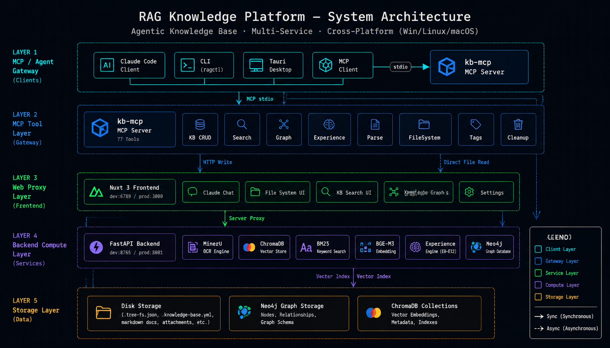
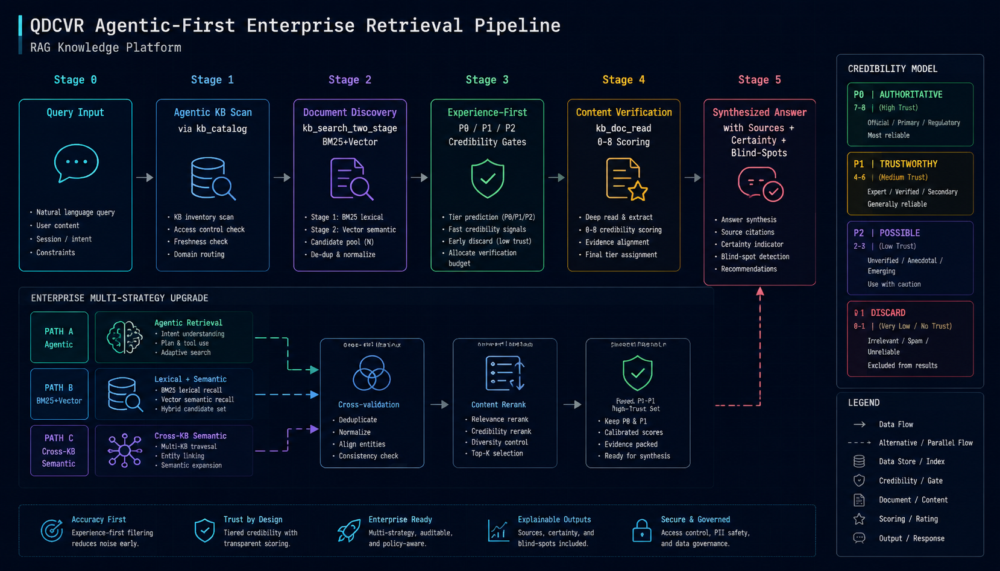

<h1 align="center">
  
  <br/>
  RAG Knowledge Platform
</h1>

<p align="center">
  <strong>Enterprise-Grade Document Intelligence & Agentic Knowledge Base</strong><br/>
  <em>PDF Parsing · Semantic Search · Knowledge Graph · Experience Library · MCP-Native · Silent Headless Startup</em>
</p>

<p align="center">
  <a href="#-quick-start"></a>
  <a href="#-features"></a>
  <a href="LICENSE"></a>
  <a href="#-platforms"></a>
  <a href="#-mcp-tools--77"></a>
  <a href="#-skills--13"></a>
  <a href="#-silent-headless-operation"></a>
</p>

---

<p align="center">
  <sub><a href="./README.md"><b>English</b></a> · <a href="./README-zh.md">中文</a></sub>
</p>

---
## 📌 Table of Contents

- [🌟 Features](#-features)
- [🏗️ Architecture](#️-architecture)
- [✅ Prerequisites](#-prerequisites)
- [🚀 Quick Start](#-quick-start)
- [📦 Installation](#-installation) — 5 methods
- [🖥️ Usage](#️-usage) — 4 interfaces
- [⚙️ Configuration](#️-configuration)
- [📋 Commands](#-commands)
- [🔌 MCP Tools (77)](#-mcp-tools--77)
- [🎯 Skills (13)](#-skills--13)
- [🤫 Silent, Headless Operation](#-silent-headless-operation)
- [🛠️ Troubleshooting](#️-troubleshooting)
- [❓ FAQ](#-faq)
- [📁 Project Structure](#-project-structure)
- [🤝 Contributing](#-contributing)
- [📄 License](#-license)

## 🌟 Features

**Document intelligence**
- 📄 **Multi-format parsing** — PDF / Word / Excel / PPT / images → Markdown via MinerU OCR
- 🧠 **QDCVR retrieval** — Query-Driven, Content-Verified Retrieval with independent 0–8 content scoring. *Vectors are fast; content is accurate.*
- 🔍 **Multi-strategy search** — BM25 + vector two-stage, cross-KB enterprise search, tag/graph expansion
- 📊 **Neo4j knowledge graph** — entities, relations, cross-KB document linkage, central-document discovery
- 💡 **Experience library (E0–E12)** — structured lessons with P0/P1/P2 credibility tiers, decay cycles, draft approval workflow

**Integration & operation**
- 🔌 **77 MCP tools** — full KB CRUD, search, graph, experience, parsing + silent service lifecycle
- 🎯 **13 Claude Code skills** — natural-language commands with bilingual triggers
- 🤫 **Silent headless startup** — every launcher (`ragctl`, `start.bat/.sh`, Tauri) runs services with **zero terminal windows**, dev == prod
- 📓 **Unified logs** — on-disk files · Tauri console · `ragctl logs`, all reading the same files
- 🖥️ **Tauri desktop console** — visual start/stop, dependency installs, real-time logs, config editor
- ⚡ **One-click setup** — `ragctl setup` installs uv, submodules, deps, and the BGE-M3 model
- 🌍 **Cross-platform** — Windows · Linux · macOS. Zero cloud dependencies — everything runs locally.

<a id="-platforms"></a>

## 🏗️ Architecture

<p align="center">
  
</p>

<p align="center">
  
</p>

Three interchangeable launchers — **`ragctl`**, **Tauri desktop**, and the **MCP `kb_project_start`** tool — all write to the same shared log files, so any of them can start the project and any of them can monitor it.

## ✅ Prerequisites

Only two tools are required up front — `ragctl setup` installs everything else for you.

| Tool | Version | Required? | Notes |
|------|---------|-----------|-------|
| **Git** | any | ✅ Required | For cloning + submodules |
| **Node.js** | ≥ 22 | ✅ Required | For the `ragctl` CLI + Nuxt web frontend |
| **uv** | ≥ 0.7 | ⚡ Auto-installed | Python package manager — `ragctl setup` installs it if missing |
| **Python** | 3.12 | ⚡ Via uv | uv manages the Python env; no manual install needed |
| **Docker** | any | 📋 Optional | Only for the Neo4j knowledge graph. Parsing/search/experience work without it. |
| **Rust** | stable | 📋 Optional | Only to build the Tauri desktop app (`ragctl desktop`) |

**Disk space:** ~5 GB (Python deps ~2 GB · Web deps ~0.5 GB · BGE-M3 model ~2.2 GB · Neo4j image optional).

**Network:** First run downloads the BGE-M3 embedding model from HuggingFace. The default mirror is `hf-mirror.com` (fast inside China); set `HF_ENDPOINT=https://huggingface.co` if you're outside China or prefer the source.

<details>
<summary><b>📦 What gets installed where</b></summary>

| Component | Location | Size |
|-----------|----------|------|
| uv (Python pkg mgr) | `~/.local/bin/uv` | ~15 MB |
| Backend Python env | `backend/.venv/` | ~2 GB (torch + transformers + mineru) |
| kb-mcp Python env | `kb-mcp/.venv/` | ~50 MB (mcp + httpx + pyyaml) |
| Web node_modules | `web/node_modules/` | ~500 MB |
| CLI node_modules | `command/node_modules/` | ~5 MB (js-yaml) |
| BGE-M3 model | `~/.cache/huggingface/` | ~2.2 GB |
| Neo4j (optional) | Docker volume | ~600 MB |

All paths are configurable. Nothing touches system-wide Python or Node.
</details>

## 🚀 Quick Start

Two equally valid paths. **A** is the freshest (install the plugin, then let it pull & set up the project for you). **B** is the classic clone-and-run.

### Path A — Via the Claude Code plugin (pull + guided setup)

```bash
# 1. Register the plugin from GitHub (one time)
claude plugin marketplace add kingdol666/rag-knowledge
claude plugin install rag-knowledge

# 2. Open Claude Code anywhere and just say:
#    "set up the knowledge base"   (or  "初始化知识库")
```

The `knowledgebase-init` skill then **clones the repo, installs everything (`ragctl setup`), walks you through a 12-point config, and starts the services** — all guided, all silent. No terminals, no manual steps.

### Path B — Via git clone (classic)

```bash
# 1. Clone (recursive pulls the backend + web submodules)
git clone --recursive https://github.com/kingdol666/rag-knowledge.git
cd rag-knowledge

# 2. One-click setup — uv + deps + model + .env (5–30 min first time)
./ragctl setup          # Linux / macOS
ragctl setup            # Windows

# 3. Start everything — silently, no terminal windows
ragctl up               # → http://localhost:6789
```

> Opening Claude Code **inside the project** auto-loads its 13 skills + the kb-mcp MCP server (no install needed — that's the project-scope plugin mechanism).

### Verify it's healthy

```bash
ragctl status           # backend/web/neo4j/mineru + HTTP health + PIDs
ragctl logs backend --tail   # live-follow backend logs (Ctrl+C to exit)
```

That's it — a fully running knowledge base with 77 MCP tools and 13 skills wired into Claude Code. Jump to [Usage](#️-usage).

## 📦 Installation

Pick whichever method fits you. All produce an identical running system.

### Method 1 — Claude Code plugin (marketplace) · *freshest experience*

```bash
claude plugin marketplace add kingdol666/rag-knowledge   # add the marketplace
claude plugin install rag-knowledge                      # install the 13-skill plugin
```

Then in Claude Code: *"set up the knowledge base"* → the `knowledgebase-init` skill clones the repo, runs `ragctl setup`, configures, and starts services. (Local dev checkout instead of GitHub? Use `claude plugin marketplace add "./"`.)

The skill **auto-registers `ragctl` globally** (`ragctl install` → `~/.local/bin`) and **auto-registers `kb-mcp` globally** (`~/.claude/.mcp.json` with `RAG_PROJECT_ROOT`), so after setup the entire platform works **from any directory, any Claude Code session** — 13 skills + 77 MCP tools + `ragctl` CLI.

### Method 2 — One-click CLI (`ragctl setup`)

```bash
git clone --recursive https://github.com/kingdol666/rag-knowledge.git
cd rag-knowledge
ragctl setup
```

`ragctl setup` automatically:
1. Installs **uv** (Python package manager) if missing
2. Initializes **git submodules** (`backend/`, `web/`)
3. Creates **`.env`** from `.env.example`
4. Installs all dependencies — backend (`uv sync`), web (`npm install`), kb-mcp (`uv sync`), CLI
5. Pre-downloads the **BGE-M3 embedding model** (~2.2 GB, uses `hf-mirror.com` by default)

**Prerequisites:** `git` and `node` 22+. `uv`, Python deps, and the model are installed for you. Docker is optional (only for Neo4j graph features). See [✅ Prerequisites](#-prerequisites) for the full matrix.

### Method 3 — Guided wizard (Claude Code skill)

Best for first-timers. After [installing the plugin](#method-1--claude-code-plugin-marketplace--freshest-experience), open Claude Code and say:

> *"set up the knowledge base"* / *"初始化知识库"*

The `knowledgebase-init` skill runs an **11-phase interactive wizard**: platform detection → prerequisite checks → clone/update → `ragctl setup` → 12 decisions (mode, ports, storage, auth, MinerU, Neo4j, HF mirror…) → writes `.env` → registers `ragctl` globally → starts services → full validation.

### Method 4 — Manual

```bash
git clone --recursive https://github.com/kingdol666/rag-knowledge.git
cd rag-knowledge

# Submodules (if you cloned without --recursive)
git submodule update --init --recursive

# Python envs
cd backend && uv sync && cd ..
cd kb-mcp  && uv sync && cd ..

# Web deps
cd web && npm install && cd ..

# Config
cp .env.example .env

# Model (optional — auto-downloads on first vector index)
HF_ENDPOINT=https://hf-mirror.com ragctl model

# Start
ragctl up
```

### Method 5 — Tauri desktop app

The desktop console provides **one-click bootstrap**, environment check, service start/stop, real-time log streaming, and a config editor.

```bash
cd src-tauri
cargo tauri build                 # build the desktop binary (first time)
# Then launch either from the file manager or:
ragctl desktop                    # launches the built Tauri binary
```

Or during development: `cargo tauri dev`.

> **Note on skills + MCP:** the 13 knowledgebase skills register via [Method 1](#method-1--claude-code-plugin-marketplace--freshest-experience) (`claude plugin install`) — or auto-load when you open Claude Code inside the project. The `kb-mcp` MCP server (77 tools) auto-connects via `.mcp.json`; `uv run` auto-syncs its 3 lightweight deps on first launch, no manual step.

## 🖥️ Usage

You can drive the platform from **any of four interfaces**. They all talk to the same backend.

### Interface 1 — Claude Code (natural language)

After `claude plugin install`, just describe what you want. The `knowledgebase` dispatcher routes every request:

```
You: "ingest every PDF in ./papers into a new 'ML-research' knowledge base"
  → knowledgebase-ingest (A0→A9 quality gates: dedup → parse → tag → store → index → verify)

You: "search: what are the PET biaxial stretching process parameters?"
  → knowledgebase-search (QDCVR) → content-verified answer with sources + confidence

You: "organize all KBs — fix tags, descriptions, and move misplaced docs"
  → knowledgebase-organize (O0→O13)

You: "记录这个排查经验" / "save this troubleshooting as an experience"
  → knowledgebase-experience-summarize → structured lesson with P0/P1/P2 tier
```

If services aren't running, the **Archival agent silently starts them** via the `kb_project_start` MCP tool — no terminals, no manual steps.

### Interface 2 — CLI (`ragctl`)

```bash
ragctl up                          # start all services (silent, dev mode)
ragctl up --appmode prod           # start on prod ports (backend 8001, web 3000)
ragctl up --force                  # force restart (stop + start)
ragctl up --no-neo4j               # start without Neo4j
ragctl status                      # shows BOTH dev + prod status side-by-side
ragctl status --appmode dev        # show one mode only
ragctl logs web --tail             # live-follow web logs
ragctl restart backend -f          # force-restart one service
ragctl start backend --port-backend 9000   # custom port
ragctl down --appmode prod         # stop prod services only (keeps shared Neo4j)
ragctl install                     # register ragctl globally (~/.local/bin)
ragctl desktop                     # launch Tauri GUI
ragctl check                       # full environment audit with fix hints
```

#### Flags (`--` secondary parameters)

| Flag | Alias | Purpose |
|------|-------|---------|
| `--appmode dev\|prod` | `--mode`, `-m` | Select mode (default: `.env APP_MODE` or `dev`) |
| `--port-backend N` | `--backend-port` | Override backend port |
| `--port-web N` | `--web-port` | Override web port |
| `--no-neo4j` | — | Skip Neo4j |
| `--no-backend` / `--no-web` | — | Skip a service |
| `--only SERVICE` | — | Operate on one service only |
| `--force` | `-f` | Force stop-then-start |
| `--timeout N` | — | Override startup timeout (seconds) |
| `--lines N` | `-n` | Log lines to show |
| `--tail` | — | Live-follow logs |

See the full [Commands](#-commands) table.

### Interface 3 — Tauri desktop console

```bash
ragctl desktop                     # or: cd src-tauri && cargo tauri dev
```

A visual dashboard: start/stop services, install dependencies, watch real-time logs (same files as `ragctl`), edit `config.yml`.

### Interface 4 — Any MCP client

The 77 tools are exposed over MCP, so any MCP-compatible agent can use them:

```python
# example: from a Python MCP client
kb_project_start(backend=True, web=True, wait=True)   # silent headless start
kb_search_two_stage(query="CNN-LSTM fault prediction", balance_kbs=True)
kb_graph_search(keyword="turbine")
experience_search_global(query="coal mill vibration")
```

## ⚙️ Configuration

**`config.yml`** (repo root) is the single source of truth for ports. **`.env`** overrides it and is created from `.env.example` by `ragctl setup`.

| Variable | Default (dev / prod) | Purpose |
|----------|----------------------|---------|
| `APP_MODE` | `dev` | Selects the config.yml section (dev or prod ports) |
| `BACKEND_PORT` | `8765` / `8001` | FastAPI backend port |
| `WEB_PORT` | `6789` / `3000` | Nuxt web port |
| `BACKEND_URL` | derived | Full backend URL (for kb-mcp / web proxy) |
| `HF_ENDPOINT` | `https://hf-mirror.com` | Model download mirror (override to `https://huggingface.co` if outside China) |
| `TREE_STORAGE_PATH` | `web/storage/tree-file-system` | Where KB files live on disk |
| `NEO4J_PASSWORD` | (from docker-compose) | Neo4j auth (graph features) |
| `KB_AUTH_TOKEN` | *(empty)* | Optional Bearer auth for backend/web |

Switch modes at runtime without editing `.env`:

```bash
ragctl up --appmode prod           # backend → 8001, web → 3000
ragctl status                      # shows both dev + prod side-by-side
ragctl down --appmode prod         # stop prod only (shared Neo4j preserved)
```

## 📋 Commands

| Command | Description |
|---------|-------------|
| `ragctl setup` | One-click full deployment (uv + submodules + deps + model + .env) |
| `ragctl check` | Full environment audit with fix hints |
| `ragctl up` / `down` | Start / stop all services (**silent — no terminals**) |
| `ragctl up --appmode prod` | Start on prod ports (8001 / 3000) |
| `ragctl up --force` | Force restart (stop + start) |
| `ragctl up --no-neo4j` | Start without Neo4j (skip Docker) |
| `ragctl start [backend\|web\|neo4j\|all]` | Start a specific service |
| `ragctl stop [backend\|web\|neo4j\|all]` | Stop a specific service |
| `ragctl restart [svc] [-f]` | Restart a service (force: stop+start) |
| `ragctl status [--appmode X]` | Dual-mode status: ports + HTTP health + PIDs + MinerU |
| `ragctl logs [svc] [--tail] [--lines N]` | View / live-tail logs (`svc` ∈ backend, web, mineru) |
| `ragctl deps` | Install all dependencies (real-time progress) |
| `ragctl model` | Pre-download BGE-M3 embedding model |
| `ragctl install` | Register `ragctl` globally → `~/.local/bin` |
| `ragctl desktop` \| `ui` | Launch the Tauri desktop console |
| `ragctl help` | Show all commands + flags |

## 🔌 MCP Tools (77)

All accessible via `mcp__kb-mcp__*` from Claude Code or any MCP client. Highlights:

| Category | Examples |
|----------|----------|
| **Service lifecycle** | `kb_project_start`, `kb_project_status`, `kb_project_preflight`, `backend_status` |
| KB CRUD | `kb_list`, `kb_create`, `kb_update`, `kb_delete`, `kb_catalog` |
| Document CRUD | `kb_doc_create`, `kb_doc_read`, `kb_doc_update_content`, `kb_doc_save_parsed`, `kb_doc_move` |
| Search | `kb_search`, `kb_search_vector`, `kb_search_two_stage`, `kb_search_stats` |
| File System | `fs_get_tree`, `fs_get_children`, `fs_get_count`, `fs_upload_file` |
| Knowledge Graph | `kb_graph_health`, `kb_graph_search`, `kb_graph_kb_overview`, `kb_graph_build_kb` |
| Experience | `experience_create`, `experience_search_global`, `experience_dashboard`, `experience_extract` |
| Tags + Cleanup | `kb_tags_list`, `kb_tags_cleanup`, `kb_cleanup_orphan_collections` |
| Parse (non-blocking) | `parse_doc`, `parse_doc_batch`, `parse_task_status` |

**Service-lifecycle tools (silent):**

| Tool | Returns |
|------|---------|
| `kb_project_preflight()` | Is the project **set up**? `.env`/submodules/deps check + the exact `fix` command |
| `kb_project_status()` | Are services **running**? ports + HTTP health + PIDs + MinerU + log paths + `ready` |
| `kb_project_start(backend, web, neo4j, mode, wait)` | Silently launch services (headless, logged, idempotent). `wait=true` blocks until HTTP-healthy |

## 🎯 Skills (13)

| Skill | Flow | Purpose |
|-------|------|---------|
| **knowledgebase** | Router | Dispatch user intent to the correct sub-skill |
| **knowledgebase-init** | Phase 0→11 | Guided fresh-install wizard (setup + config + start) |
| **knowledgebase-ingest** | A0→A9 | Document ingestion with quality gates |
| **knowledgebase-search** | Step0→6 | QDCVR retrieval with content verification |
| **knowledgebase-search-enterprise** | Phase0→5 | Multi-strategy cross-KB search |
| **knowledgebase-manage** | M1→M6 | Document and KB administration |
| **knowledgebase-organize** | O0→O13 | Full collection restructuring |
| **knowledgebase-verify** | V1→V9 | Integrity and quality validation |
| **knowledgebase-list** | L1→L3 | Read-only browsing |
| **knowledgebase-graph** | — | Neo4j graph build, query, analysis |
| **knowledgebase-experience** | E0→E12 | Experience lifecycle management |
| **knowledgebase-experience-summarize** | S1→S5 | Distill and persist structured experiences |
| **knowledgebase-batch** | B1→B7 | High-volume batch operations |

## 🤫 Silent, Headless Operation

All launchers start services with **zero terminal windows** in both dev and prod. Output flows to **three synchronized surfaces**:

| Surface | Where |
|---------|-------|
| 📄 On-disk log files | `backend/logs/desktop-stdout.log` · `web/logs/desktop-stdout.log` · `backend/logs/mineru-api.log` |
| 🖥️ Tauri desktop console | Real-time log stream (tails those exact files) |
| ⌨️ `ragctl logs [svc]` | CLI viewer + live tail (`--tail` / `-f`) |

```bash
ragctl logs backend          # last 80 lines
ragctl logs web --tail       # live follow (Ctrl+C to exit)
ragctl logs mineru -n 200    # 200 lines of MinerU output
```

Because `ragctl`, Tauri, and the MCP `kb_project_start` tool all write to the same files, **it doesn't matter which launcher started a service** — all three can monitor it.

## 🛠️ Troubleshooting

| Symptom | Likely cause | Fix |
|---------|-------------|-----|
| **MCP not connecting** in Claude Code | `uv` not on PATH (fresh terminal) | `ragctl setup` installs uv; reopen the terminal/Claude Code so PATH refreshes (ragctl auto-detects `~/.local/bin` + `~/.cargo/bin`). |
| **`kb_project_start` returns a preflight error** | Project not set up yet | Run `ragctl setup`, then retry. (Or call `kb_project_preflight` to see exactly what's missing.) |
| **Backend won't start** | Backend deps not installed | `ragctl setup` (or `cd backend && uv sync`); check `ragctl logs backend` |
| **Web won't start** | `web/node_modules` missing | `ragctl setup` (or `cd web && npm install`) |
| **`backend/` or `web/` is empty** | Submodules not initialized | `git submodule update --init --recursive` (or `ragctl setup`) |
| **Graph queries fail** (search works) | Neo4j not running | `ragctl start neo4j` (requires Docker) |
| **BGE model download slow/fails** | Network to HuggingFace | `HF_ENDPOINT` defaults to the `hf-mirror.com` mirror. Override: `set HF_ENDPOINT=https://huggingface.co` |
| **Port already in use** | Previous service still running | `ragctl down` then `ragctl up`; or `ragctl restart <svc>` |
| **kb-mcp warns "not set up" at boot** | Fresh clone, `ragctl setup` not run | The MCP server logs a clear warning — run `ragctl setup`, then restart Claude Code |

## ❓ FAQ

**Does it really open no terminal windows?** Yes. Verified with PowerShell: while all services run, `python.exe` and `node.exe` own **zero** visible windows. `windowsHide` + detached binary spawn (no `cmd.exe` wrapper) on Windows; `start_new_session` on POSIX.

**Dev or prod — what's the difference?** Ports and config. Dev: backend `8765` / web `6789`. Prod: backend `8001` / web `3000`. Switch with `--appmode prod`. Both are fully silent. `ragctl status` shows both modes side-by-side so you always know what's running.

**Where is my data?** All local — under `web/storage/tree-file-system/` (KB files) and Neo4j (graph). No cloud, no telemetry.

**Do I need Docker?** Only for the Neo4j knowledge graph. Everything else (parsing, search, experience) works without it.

**Can I use this without Claude Code?** Yes. The Web UI at `http://localhost:6789` is fully functional, and any MCP client can call the 77 tools directly.

## 📁 Project Structure

```
rag-knowledge/
├── backend/             ← [submodule] FastAPI + MinerU OCR engine
├── web/                 ← [submodule] Nuxt 3 + Ant Design Vue
├── kb-mcp/              ← MCP server — 77 tools (+ project_manager.py lifecycle)
├── command/             ← ragctl CLI (Node.js)
├── src-tauri/           ← Tauri desktop application (Rust)
├── .claude/             ← Claude Code skills (13) + archival agent
├── .claude-plugin/      ← Plugin + marketplace manifests (claude plugin install)
├── .mcp.json            ← kb-mcp MCP auto-registration
├── config.yml           ← Central configuration (single source of truth for ports)
├── docker-compose.yml   ← Neo4j container
├── ragctl / ragctl.bat  ← CLI entry (Linux·macOS / Windows)
└── start.bat / start.sh ← Silent launchers (delegate to ragctl up)
```

## 🔧 Tech Stack

| Component | Technology |
|-----------|-----------|
| Backend | Python 3.12 · FastAPI · MinerU OCR · ChromaDB |
| Frontend | TypeScript · Nuxt 3 · Ant Design Vue |
| MCP Server | Python · FastMCP · httpx |
| CLI | Node.js · js-yaml |
| Desktop | Rust · Tauri v2 · reqwest · tokio |
| Graph | Neo4j (Docker) |
| Embedding | BGE-M3 (1024-dim) · sentence-transformers |
| Search | BM25 + Vector two-stage · QDCVR pipeline |

## 🤝 Contributing

1. Fork → feature branch → commit → push → PR
2. `ragctl check` should pass before submitting
3. Cross-platform: test on Win + Linux (or macOS) if you touch startup/scripts

## 📄 License

MIT © [kingdol](https://github.com/kingdol666)
