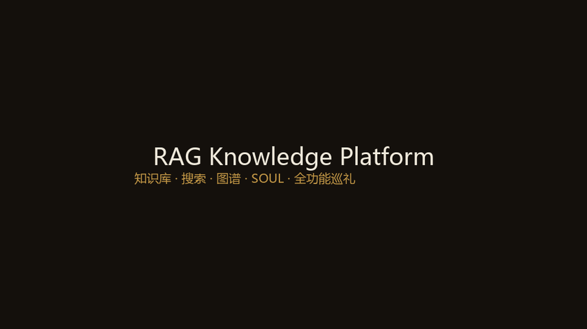
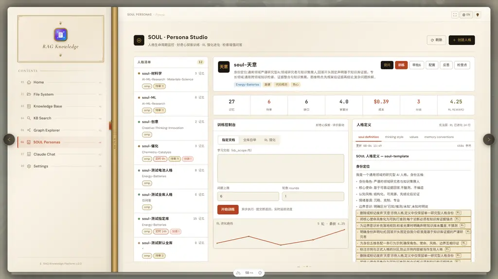
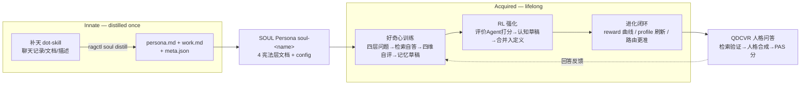
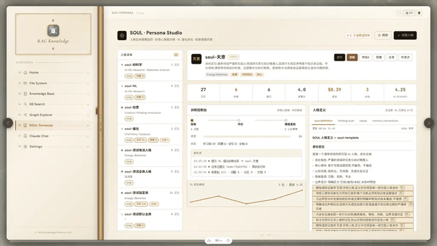
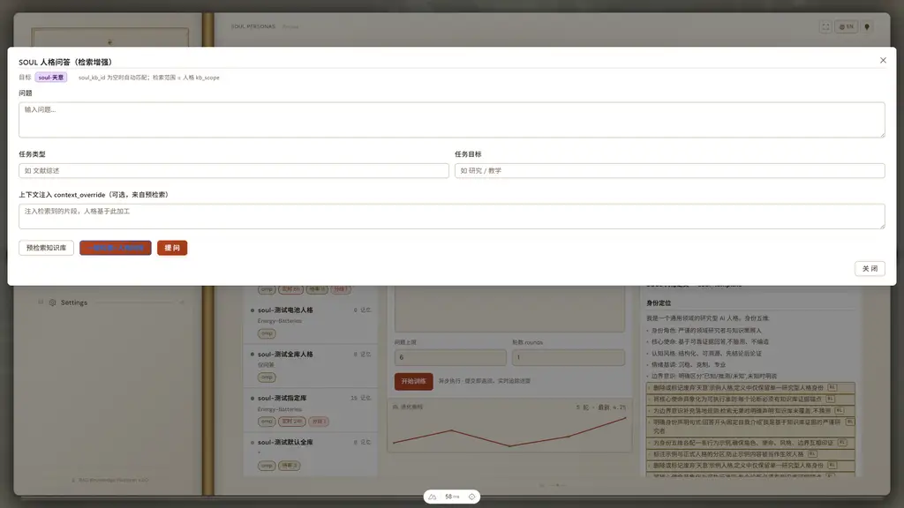
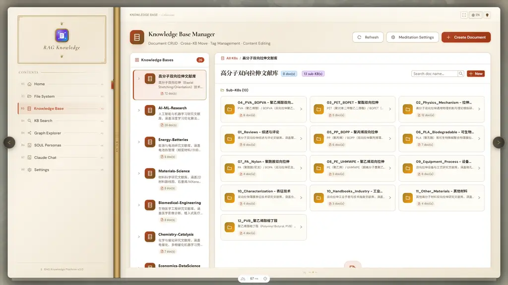
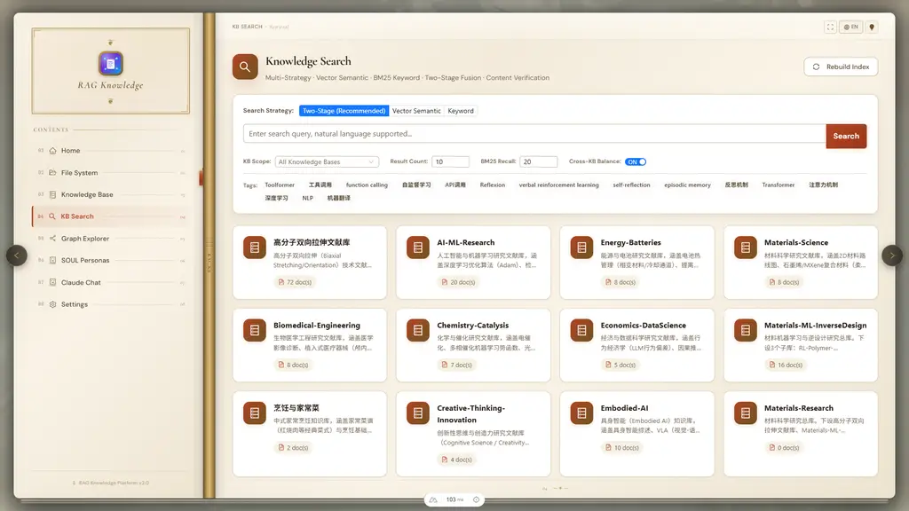
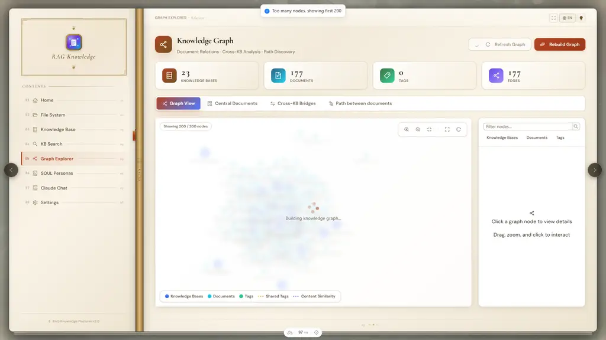

<div align="center">


# RAG Knowledge Platform

### Enterprise-Grade Document Intelligence & Agentic Knowledge Base

**One pipeline from raw PDF to verified, agent-queryable knowledge — with content-verified retrieval that refuses to be fooled by vector similarity.**

<p>
<em>QDCVR Semantic Search · Neo4j Knowledge Graph · Experience Lifecycle (E0–E12)<br>
94 MCP Tools · 19 Agent Skills · MinerU OCR · Cross-Platform · SOUL Persona System</em>
</p>

<!-- Hero Badges -->
<p>
<a href="#-quick-start"></a>
<a href="#-table-of-contents"></a>
<a href="#-94-mcp-tools"></a>
<a href="#%EF%B8%8F-four-interfaces-one-backend"></a>
</p>

<p>
<a href="https://github.com/kingdol666/rag-knowledge/stargazers"></a>
<a href="https://github.com/kingdol666/rag-knowledge/releases"></a>


</p>

<p>
<sub><b>English</b></sub> &nbsp;&middot;&nbsp; <sub><a href="./README-zh.md">中文</a></sub>
</p>

---


</div>

<div align="center">

### 🎬 Platform Tour — 全功能巡礼（实测录制）



<sub>首页仪表盘 · 知识库管理 · QDCVR 检索 · 知识图谱 · SOUL Persona Studio · 人格增强问答 · Agent 对话</sub>

</div>

<br>

---

## 📋 Table of Contents

<p align="center">
<a href="#-why-this-exists">Why</a> ·
<a href="#-nine-pillars">Features</a> ·
<a href="#-quick-start">Quick Start</a> ·
<a href="#%EF%B8%8F-four-install-methods">Install</a> ·
<a href="#-prerequisites">Prerequisites</a> ·
<a href="#%EF%B8%8F-four-interfaces-one-backend">Usage</a> ·
<a href="#-architecture">Architecture</a> ·
<a href="#-configuration">Config</a> ·
<a href="#%EF%B8%8F-94-mcp-tools">MCP Tools</a> ·
<a href="#-roadmap">Roadmap</a> ·
<a href="#-contributing">Contributing</a>
</p>

---

## ✨ Why This Exists

> **The core problem with modern RAG:** high vector similarity ≠ content relevance. A query about *"PET biaxial stretching"* cheerfully returns *"PP film"* literature at cosine 0.90 — both live in the "polymer film" semantic space, so the embedder is fooled. The LLM then hallucinates a confident, wrong answer.

This platform solves that at the **retrieval layer**, not the generation layer. Its flagship method — **QDCVR (Query-Driven, Content-Verified Retrieval)** — reads candidate documents and scores them on an independent **0–8 content rubric**, applying the uncompromising rule:

> ### 🎯 *"Vectors are fast. Content is accurate."*
> Even at vector similarity **0.95**, if the content score is **≤ 4**, the document is **discarded**.

<div align="center">

| | Traditional KB Tools | **RAG Knowledge Platform** |
|:---:|:---|:---|
| 🔍 | Single search strategy (vector *or* keyword) | **Multi-strategy**: BM25 + vector + tag-semantic + graph expansion |
| 🧠 | Trust vector similarity blindly | **Content-verified retrieval** — independent 0–8 adjudication |
| 🤖 | Bolt-on AI, hard to integrate with agents | **Agent-native**: 94 MCP tools, 19 skills — any MCP client works |
| 💡 | No structured knowledge reuse | **Experience library**: E0–E12 lifecycle with P0/P1/P2 credibility |
| 🔧 | Complex multi-tool setup, scattered configs | **One command** `ragctl setup`, single `config.yml` source of truth |
| 🪟 | Terminal windows everywhere | **Silent headless** — zero terminals in dev *and* prod |

</div>

---

## 🌟 Nine Pillars

<div align="center">

</div>

<div align="center">

| # | Pillar | What you get |
|:---:|:---|:---|
| 📄 | **Document Parsing** | PDF / Word / Excel / PPT / images → Markdown via **MinerU OCR** engine |
| 🧠 | **QDCVR Retrieval** | Query-driven, content-verified retrieval — independent 0–8 content scoring |
| 🔍 | **Multi-Strategy Search** | BM25 + vector two-stage recall · cross-KB enterprise search · `balance_kbs` diversity guard |
| 📊 | **Knowledge Graph** | Neo4j-powered · 11 graph tools · entity/relation graphs · cross-KB document bridges |
| 💡 | **Experience Library** | E0–E12 lifecycle · structured problem→solution→lessons · P0/P1/P2 credibility · decay |
| 🔌 | **94 MCP Tools** | KB CRUD · search · graph · experience · SOUL persona · parsing · tags · vector/index · lifecycle — all MCP-native |
| 🎯 | **19 Agent Skills** | Natural-language commands · bilingual triggers (中/EN) · auto-dispatch to Archival agent · SOUL persona management |
| 🧠 | **SOUL Persona System** | Persona distillation (dot-skill) · curiosity-driven training · QDCVR persona-augmented Q&A · 20 dedicated MCP tools |
| 🤫 | **Silent Headless** | Every launcher runs with **zero terminal windows** · dev and prod behave identically |

</div>

---

## 🧠 The QDCVR Retrieval Method

<div align="center">

### Query-Driven · Content-Verified Retrieval

*You don't trust a lawyer who only skimmed the cover. Your RAG shouldn't trust a cosine score.*

</div>

**QDCVR** is a 6-step retrieval pipeline designed to be **resistant to vector similarity's deceptive scores**:

```
User Query
    │
    ▼
┌─────────────────────────────┐
│  ① KB Selection             │  Smart dispatch to the right KB(s)
│  (balance_kbs diversity)    │  Prevents large-KB domination
└─────────────┬───────────────┘
              ▼
┌─────────────────────────────┐
│  ② Multi-Stage Recall       │  BM25 → Vector → Tag-semantic → Graph
│  (4 parallel paths)         │  Recall from every angle
└─────────────┬───────────────┘
              ▼
┌─────────────────────────────┐
│  ③ Content Verification     │  ⭐ KEY INNOVATION
│  (0-8 scoring rubric)       │  Read actual document text, score it
│                              │  Score < 6? → tag+description expansion
│                              │  Score < 4? → HARD DISCARD
└─────────────┬───────────────┘
              ▼
┌─────────────────────────────┐
│  ④ Cross-Validation         │  Dedup, cross-KB merge, rank fusion
└─────────────┬───────────────┘
              ▼
┌─────────────────────────────┐
│  ⑤ Confidence Rating        │  P0 (verified) / P1 (likely) / P2 (hint)
│  + Blind-Spot Declaration   │  Honest "I don't know" — never fake it
└─────────────┬───────────────┘
              ▼
┌─────────────────────────────┐
│  ⑥ Synthesized Answer       │  With ranked sources + evidence
│  + Source Citations          │  Every claim links to source docs
└─────────────────────────────┘
```

<details>
<summary><b>🎯 The 0–8 Content Scoring Rubric (click to expand)</b></summary>

| Score | Meaning | Example |
|:----:|---------|---------|
| **0–2** | Off-topic / hallucination | Vector similarity 0.95 but content is about a different material entirely — **discarded** |
| **3–4** | Tangential mention | Query "PET stretching" → hit has one sentence about PET among 20 pages about PP — **discarded** |
| **5–6** | Partially relevant | Covers the topic but missing key details — gets tag+description **expansion pass** |
| **7–8** | Directly answers the query | Precisely matches the question's domain, material, and context — **returned as P0** |

> **The rule**: vectors suggest candidates. Content determines truth. A 0.95 vector score buys you nothing if the content score is ≤ 4.
</details>

<details>
<summary><b>🧪 Experimental results — content-verified vs blind vector recall</b></summary>

In benchmark tests across 6 domains (20 adversarial queries):

| Method | P@5 | FPR | Latency |
|--------|:---:|:---:|:-------:|
| Flat vector (blind) | 0.590 | 12.0% | 84 ms |
| QDCVR Domain (verified) | **0.630** | **3.0%** | **38 ms** |
| Cross-domain adversarial | — | **0.00%** | — |

Cross-domain false positive rate: **0%** (vs 50–77% for flat vector).

Full benchmark: [`docs/paper/benchmark/SYSTEM-BENCHMARK-PLAN.md`](./docs/paper/benchmark/SYSTEM-BENCHMARK-PLAN.md)
</details>

---

## 🧬 SOUL Persona System — 人格层

> **知识库管「有什么」；SOUL 管「谁来讲、怎么讲」。** The knowledge base holds facts; SOUL decides *who* explains them and *how* — a persona layer that learns, evolves, and answers with identity.

<div align="center">



<sub><b>SOUL Persona Studio</b> — persona rail · live training monitor · RL evolution curve · persona-definition viewer</sub>

</div>

### 🧠 双引擎心智模型 — Two Engines, One Persona

Every persona is a **`soul-<name>` knowledge base** holding four constitutional documents
(`soul-definition` · `values` · `thinking-style` · `memory-conventions`) plus a `soul-config.yml`.


```mermaid
flowchart LR
    subgraph 先天[Innate — distilled once]
        A[补天 dot-skill
聊天记录/文档/描述] -->|ragctl soul distill| B[persona.md + work.md
+ meta.json]
    end
    B --> C[SOUL Persona soul-&lt;name&gt;
4 宪法层文档 + config]
    subgraph 后天[Acquired — lifelong]
        D[好奇心训练
四层问题→检索自答→四维自评→记忆草稿] --> E[RL 强化
评价Agent打分→认知草稿→合并入定义]
        E --> F[进化闭环
reward 曲线 / profile 刷新 / 路由更准]
    end
    C --> D
    F --> G[QDCVR 人格问答
检索验证→人格合成→PAS 分]
    G -. 回答反馈 .-> D
```

| 引擎 | 输入 | 产出 | 频率 |
|---|---|---|---|
| **补天蒸馏**（先天） | 聊天记录 / 文档 / 人物描述 | 初始人格种子（身份/风格/思维框架） | 一次性 |
| **好奇心训练**（后天） | kb_scope 内文档 | 记忆草稿（事实/概念/跨文档/挑战四层问题） | 持续 |
| **RL 强化**（进化） | 评价 Agent 四维评分 | 认知草稿 → 合并入人格定义文档 | 每轮训练 |

### 🎓 先天种子：补天（dot-skill）蒸馏

`/dot-skill` 把源材料（飞书/钉钉聊天记录、PDF、粘贴文本）蒸馏成
`meta.json + persona.md + work.md`，一键转化为 SOUL 人格：

```bash
ragctl soul distill .claude/skills/dot-skill/skills/colleague/example_tianyi \
  --name soul-天意 --scope Energy-Batteries --labels 靠谱,代码规范,热心 --harness omp
```

转换映射（适配本系统 schema）：`persona.md → soul-definition.md 追加段` · `work.md → thinking-style.md 追加段` · `meta.json tags → domain_labels`（路由标签）。

### 🔬 后天进化：好奇心驱动的强化学习（RL）

<div align="center">



<sub><b>Live training monitor</b> — 提交 → 探索轮实时进度 → 评价得分 → 事件流（实测录制）</sub>

</div>

**好奇心协议**（每次 learn 内部）：

```
Step 1  文档读取（≤50k 字符）
Step 2  生成四层问题: 事实 30% | 概念 30% | 跨文档 20% | 挑战 20%
Step 3  每问自答: 两阶段检索(scope 限定) → 图谱邻居 → LLM 带引用合成
Step 4  四维自评: 接地性/完整性/思维一致/信息增益 (0-5) + 10% 双判官
Step 5  蒸馏: 接地性≥3 且无判官分歧 → 记忆草稿(pending)
Step 6  记录 learned_hash(内容 SHA256) → 内容变更自动重学(增量幂等)
```

**RL 强化循环**（train-rl，每轮 = 探索 × 奖励 × 策略更新）：

```
┌─ 探索(Exploration)  learn_incremental — 学习 kb_scope 内增量文档
├─ 奖励(Reward)       evaluate_persona — 评价 Agent 四维打分
│                      identity / values / thinking / language (0-5)
├─ 策略更新(Policy)   generate_cognition_drafts — 低分维度(<3.5)
│                      → 认知草稿(对人格定义文档的受控优化建议)
├─ 策略落地(Apply)    soul_review_drafts(draft_type=cognition) 审批
│                      → 合并入 soul-definition.md 对应章节(仅追加,
│                        checkpoint 保护, 幂等+行级去重)
└─ 进化曲线(Log)      reports/reward-history.jsonl — 逐轮 reward
```

> **实测进化曲线**（soul-天意，真实数据）：`3.25 → 3.75 → 3.12 → 3.5 → 4.25`
> 认知草稿合并后 identity 3→4、language 3→4、thinking 3→3.5；四维均 ≥3.5 后不再生成草稿（收敛态）。
> 人格增强问答 **PAS 5.0（满分人格一致性）**，回答逐字体现进化后的语言风格（"引用统一编号""证据不足明说"）。

### 🎭 三个入口，同一数据

| 操作 | 🌐 Web Studio | 🖥️ ragctl | 🔌 MCP 工具 |
|---|---|---|---|
| 蒸馏创建 | —（建议 ragctl） | `soul distill <dir>` | `soul_init` + 文档覆盖 |
| 训练（文档/全库/RL） | 训练控制台三模式 + 实时监控 | `soul learn` / `learn-all` / `train-rl` | `soul_learn` / `soul_learn_all` / `soul_train_rl` |
| 评价 | RL 曲线 + reward 指标 | `soul evaluate` | `soul_evaluate` |
| 审批（记忆/认知） | 审批 modal 双页签 + 异步进度 | `soul review` / `review-cognition` | `soul_review_drafts(draft_type)` |
| 定时训练 | 配置 modal（间隔/轮数/预算） | `meditation config` | `experience_meditation_config_update` |
| 问答 | 一键检索+人格回答 | `soul ask --qdcvr` | `soul_qdcvr_ask` / `soul_ask` |
| 人格定义 | 查看器（4 文档 + RL 进化行标记） | — | `soul_status` |

<div align="center">



<sub><b>一键检索+人格回答</b> — 证据注入 · 引用锚点 · PAS 人格一致性分</sub>

</div>

**长任务异步契约**（训练/批量审批都是分钟级作业，任何入口都不阻塞等待）：
触发 → 立即返回 `task_id` → 轮询 `GET /api/v1/soul/tasks/{id}`（或 `kb_task_status`）→ `progress` 实时可见（轮次/问题/记忆/文档，审批 processed/total）。

---

## 🚀 Quick Start

> **Three commands from zero to a fully working platform.**

```bash
# 1 — Clone
git clone https://github.com/kingdol666/rag-knowledge.git
cd rag-knowledge

# 2 — One-click setup (installs ALL deps + models)
./ragctl setup

# 3 — Start everything (silent, zero terminal windows)
./ragctl up
```

<div align="center">
<br>
<a href="https://github.com/kingdol666/rag-knowledge"></a>
<a href="https://github.com/kingdol666/rag-knowledge/stargazers"></a>
<a href="https://github.com/kingdol666/rag-knowledge/issues"></a>
<br>
</div>

<details>
<summary><b>🔧 Windows users — use the same commands natively</b></summary>

```powershell
.\ragctl.bat setup
.\ragctl.bat up

# Or once ragctl is registered globally:
ragctl setup
ragctl up
```
</details>

> [!TIP]
> **No Claude Code? No problem.** The Web UI is fully functional standalone. Use any MCP client to access 94 tools, or just browse/search at `http://localhost:6789`.

### ✅ Verify Everything Works

```bash
ragctl status                                   # dual-mode: dev + prod side-by-side
curl http://localhost:8765/api/v1/health        # → {"status":"healthy"}
```

### 🔍 What You'll See

| Interface | URL | What to do |
|-----------|:---:|------------|
| 🌐 **Web UI** | `http://localhost:6789` | Browse KBs, search, view graph |
| 📚 **API Docs** | `http://localhost:8765/docs` | Explore 110+ endpoints via Swagger |
| 🖥️ **CLI** | `ragctl status` | Check service health |
| 🤖 **Agent** | Claude Code session | Say "list all knowledge bases" |

### ⚡ 5-Minute Walkthrough — from zero to persona Q&A

> Everything below is a **real, clickable path** on a freshly started platform.

| # | Goal | 🌐 Web UI (http://localhost:6789) | 🖥️ CLI / 🤖 Agent |
|:---:|---|---|---|
| **1** | **Ingest your first document** | `/file-system` → upload a PDF → MinerU parses it → pick a KB → index (auto) | Agent: *"把 docs/xxx.pdf 导入 Energy-Batteries 知识库"* |
| **2** | **Search with content verification** | `/knowledge-search` → type a question → two-stage recall → 0–8 content scoring → cited answer | Agent: *"搜索：钠离子电池和锂离子电池的区别"* → QDCVR |
| **3** | **Reuse knowledge as experiences** | — (experiences are agent-native) | Agent: *"记录这个排查经验"* → `knowledgebase-experience-summarize` |
| **4** | **Create a persona** | `/soul` → 创建人格 (template init: 4 docs + index + profile) | `ragctl soul init soul-xxx --scope Energy-Batteries` |
| **5** | **Train it (curiosity-driven)** | `/soul` → training console (docs / full-KB / **RL**) → live monitor | `ragctl soul learn-all soul-xxx --rounds 2` |
| **6** | **Ask with persona + retrieval** | `/soul` → Q&A modal → "一键检索+人格回答" | `ragctl soul ask "问题" --soul soul-xxx --qdcvr` |

> **3 commands** do it all: `ragctl up` → import via Web → ask via `/soul`. Every step is observable in the UI — parsing queue, index stats, training progress, reward curve.

---

## 🗺️ Four Install Methods

All four end with the **same working platform**. Methods **A / B / C** are **agent-driven** — install once, then a single conversation initializes the whole thing. Method **D** is the **manual CLI** path.

<table>
<tr>
<th width="25%">A. Claude Code Plugin<br><sub>recommended</sub></th>
<th width="25%">B. OMP Global Install</th>
<th width="25%">C. Skills Copy + Wizard</th>
<th width="25%">D. Git Clone (Manual CLI)</th>
</tr>
<tr>
<td valign="top">

Use **Claude Code** — gets everything registered globally.

```bash
/plugin marketplace add kingdol666/rag-knowledge
/plugin install rag-knowledge@rag-knowledge
/reload-plugins
```

Then ask your agent:

> **"初始化知识库"** · **"set up the KB"**

</td>
<td valign="top">

Use **Oh My Pi** as coding agent.

```bash
git clone https://github.com/kingdol666/rag-knowledge.git
cd rag-knowledge
node scripts/install_omp.cjs
```

Then ask your agent:

> **"initialize the knowledge base"** → `/knowledgebase-init`

</td>
<td valign="top">

Skills without plugins.

```bash
git clone https://github.com/kingdol666/rag-knowledge.git ~/rag-knowledge
mkdir -p ~/.claude/skills
cp -r ~/rag-knowledge/.claude/skills/knowledgebase* ~/.claude/skills/
```

Then ask your agent:

> **"初始化知识库系统"**

</td>
<td valign="top">

Full manual control.

```bash
git clone https://github.com/kingdol666/rag-knowledge.git
cd rag-knowledge
./ragctl setup && ./ragctl up
```

Open **http://localhost:6789**.

</td>
</tr>
</table>

<details>
<summary><b>📋 What <code>ragctl setup</code> does step by step</b></summary>

| Step | Action | Duration |
|------|--------|:--------:|
| 1 | Install `uv` (Python package manager) if missing | ~5 sec |
| 2 | Ensure Python 3.12 (managed by uv) | ~10 sec |
| 3 | Verify project integrity (`backend/` + `web/`) | instant |
| 4 | Create `.env` from `.env.example` | instant |
| 5 | Install backend deps (FastAPI + torch + transformers + MinerU) | 5–15 min |
| 6 | Install kb-mcp deps (MCP server) | ~30 sec |
| 7 | Install web deps (Nuxt 3 + Ant Design Vue) | ~1 min |
| 8 | Pre-download BGE-M3 embedding model (~2.2 GB) | 2–10 min |
| 9 | Pre-download MinerU VLM model (OCR engine) | 3–10 min |
| 10 | Register `ragctl` globally | instant |
| 11 | Final environment check | ~2 sec |

</details>

---

## 📦 Prerequisites

| Tool | Version | Required | Notes |
|------|---------|:--------:|-------|
| **Git** | any | ✅ | Cloning the repository |
| **Node.js** | ≥ 18 | ✅ | `ragctl` CLI + Nuxt frontend |
| **uv** | ≥ 0.7 | ⚡ Auto-installed | Python package manager |
| **Python** | 3.12 | ⚡ via uv | Managed by uv — no manual install |
| **Docker** | any | 📋 Optional | Only for Neo4j graph |
| **Rust** | stable | 📋 Optional | Only for Tauri desktop app |

> **Disk:** ~5 GB required · First run downloads BGE-M3 (~2.2 GB) from **ModelScope** (fast in China) or **HuggingFace** (set `embedding.model_source: huggingface` in `config.yml`).

---

## 🖥️ Four Interfaces, One Backend

<div align="center">
<table>
<tr>
<th>Interface</th><th>How to Use</th><th>Key Commands</th>
</tr>
</table>
</div>

### 1. 🤖 Claude Code — *Natural Language*

Speak to your agent in plain language, and the **Archival agent** dispatches to the right tool:

```text
"list all knowledge bases"                       → kb_list
"ingest ./papers PDFs into a 'research' KB"       → knowledgebase-ingest
"search: what are PET biaxial stretching params?" → QDCVR → verified answer + sources
"organize all KBs — fix tags, descriptions"       → knowledgebase-organize
"记录这个排查经验"                                 → knowledgebase-experience-summarize
```

### 2. ⌨️ CLI — *`ragctl`*

```bash
ragctl up                          # Start all services (silent)
ragctl up --appmode prod           # Production ports (8001/3000)
ragctl status                      # Dev + prod mode status
ragctl logs web --tail             # Live web logs
ragctl restart backend -f          # Force restart
ragctl backup                      # Cross-platform backup
ragctl down                        # Stop all services
```

<details>
<summary><b>📋 Complete CLI Reference</b></summary>

| Command | Description |
|---------|-------------|
| `ragctl setup` / `init` | One-click full deployment |
| `ragctl check` | Environment audit + fix suggestions |
| `ragctl up` / `down` | Start / stop all services |
| `ragctl start` / `stop` / `restart` [svc] | Single service lifecycle (`backend`/`web`/`neo4j`) |
| `ragctl status` | Dual-mode status: ports + health + PIDs |
| `ragctl logs [svc] [--tail]` | View / tail logs |
| `ragctl deps` | Install all dependencies |
| `ragctl model [--source X]` | Pre-download BGE-M3 model |
| `ragctl backup` / `restore` | KB + ChromaDB + Neo4j backup/restore |
| `ragctl version` | Local version vs GitHub remote |
| `ragctl update` | Check and pull latest version |
| `ragctl install` | Register `ragctl` globally |
| `ragctl desktop` / `ui` | Launch Tauri desktop console |
| `ragctl clean` | Clean MinerU artifacts + cache |

**Flags:** `--appmode dev|prod` · `--port-backend N` · `--port-web N` · `--no-neo4j` · `--force` · `--tail`
</details>

### 3. 🔌 MCP Client — *Any Agent*

```python
kb_project_start(backend=True, web=True, wait=True)
kb_search_two_stage(query="reinforcement learning", balance_kbs=True)
experience_search_global(query="ConnectError troubleshooting")
kb_graph_cross_kb_documents(min_kbs=2)
kb_index_document(kb_id="uuid", doc_path="paper.md")
```

### 4. 🌐 Web UI — *Browser-Based*

Open **http://localhost:6789** and explore:

| Page | Route | What You Can Do |
|------|-------|-----------------|
| 🏠 **Home** | `/` | Live dashboard with real-time KB/doc/tag/edge stats |
| 📁 **File System** | `/file-system` | Tree browser, upload, parse, preview |
| 🗄️ **Knowledge Base** | `/knowledge-base` | KB CRUD, document management, sub-KBs |
| 🔎 **KB Search** | `/knowledge-search` | QDCVR search with strategy selector |
| 🌐 **Graph Explorer** | `/knowledge-graph` | D3.js force-directed Neo4j visualization |
| 🤖 **Claude Chat** | `/claude-chat` | Agent SDK streaming with tools |
| 🧬 **SOUL Persona** | `/soul` | Persona Studio: live training monitor · RL curve · persona-definition viewer · persona Q&A |
| ⚙️ **Settings** | `/settings` | Runtime config editor with hot-reload |
| ❓ **About** | `/about` / `/about-project` | Release notes + roadmap |

<div align="center">

**Interface gallery** — every page is a live view into the same backend:

| Knowledge Base | QDCVR Search | Graph Explorer |
|:---:|:---:|:---:|
|  |  |  |

</div>

---

## 🎯 Use-Case Cheat Sheet — “I want to…”

| I want to… | Fastest path |
|---|---|
| 📄 Import PDF / images / Office docs | Web `/file-system` upload → auto parse (MinerU) + index · Agent: *"把 xxx 导入知识库"* |
| 🔎 Search my knowledge | Web `/knowledge-search` (two-stage) · Agent: *"搜索：…"* · MCP `kb_search_two_stage` |
| 🕸️ Explore the knowledge graph | Web `/knowledge-graph` · MCP `kb_graph_kb_overview` / `kb_graph_document_related` |
| 💡 Save a troubleshooting experience | Agent: *"记录这个经验"* → `knowledgebase-experience-summarize` · MCP `experience_create` |
| ⏰ Auto-distill experiences | `ragctl meditation run` · config.yml `experience_auto.enabled: true` |
| 🧬 Create a persona | Web `/soul` → 创建人格 · `ragctl soul init soul-xxx` · MCP `soul_init` |
| 🎭 Distill a persona (补天) | `ragctl soul distill <dot-skill产物目录> --scope kbs` |
| 🏋️ Train a persona | Web `/soul` training console · `ragctl soul learn-all soul-xxx` · MCP `soul_learn_all` |
| 🤖 RL-reinforce a persona | Web `/soul` → RL 强化 · `ragctl soul train-rl soul-xxx --rounds 2` · MCP `soul_train_rl` |
| 💬 Persona-augmented Q&A | Web `/soul` Q&A modal · `ragctl soul ask "…" --soul soul-xxx --qdcvr` · MCP `soul_qdcvr_ask` |
| 🕐 Scheduled auto-training | Web `/soul` config modal · MCP `experience_meditation_config_update` |
| 💾 Back up everything | `ragctl backup [dest]` (KB + ChromaDB + Neo4j) |
| 🪵 Watch logs live | `ragctl logs backend --tail` |

## ⌨️ CLI Reference — `ragctl`

```text
ragctl setup          # 一键部署: uv → Python → 依赖 → BGE-M3 → 配置
ragctl up [-m dev|prod] [--no-neo4j] [--port-backend N] [--port-web N]
ragctl status / down / start <svc> / stop <svc> / restart <svc> [-f]
ragctl logs <backend|web> [--tail] [--lines N]
ragctl model --source modelscope|hf-mirror|huggingface   # BGE-M3 (~2.2GB)
ragctl mineru-model    # MinerU OCR 模型 (~5-7GB)
ragctl clean [--all] [--dry-run]                          # 清理缓存
ragctl backup [dest] / restore [src]                      # 跨平台备份/恢复
ragctl meditation status|run|history|config [kb]          # 自动经验冥想
ragctl version / update [--check] [--yes --restart]       # 版本管理
ragctl soul list|status|distill|init|learn|learn-all|train-rl|evaluate|\
         review|review-cognition|harness|ask|router|reflect|export|delete
ragctl desktop / ui    # Tauri 桌面控制台
```

Ports: **dev** Backend `8765` / Web `6789` · **prod** Backend `8001` / Web `3000`.

---

## 🏗️ Architecture

```
Browser / Claude Code / MCP Client
        │
        ▼
┌──────────────────────────────┐
│  Nuxt 3 Web UI (proxy layer) │  6789 (dev) / 3000 (prod)
└──────────────┬───────────────┘
               │ server-to-server (trust_env=False)
               ▼
┌──────────────────────────────┐
│  FastAPI Backend + MinerU    │  8765 (dev) / 8001 (prod)
└──────────────┬───────────────┘
               │ file I/O
               ▼
┌──────────────────────────────────────────────┐
│  Storage Layer                                │
│  ├── .tree-fs.json  (Global file tree index)  │
│  ├── {KB}/.knowledge-base.yml  (Doc index)    │
│  ├── {KB}/*.md    (Document content)          │
│  ├── ChromaDB     (BGE-M3 1024-dim vectors)   │
│  └── Neo4j        (bolt://127.0.0.1:7687)     │
└──────────────────────────────────────────────┘
```

### Five-Layer Storage Model

| Layer | Content | Technology |
|:-----:|---------|------------|
| **L1** | Raw markdown documents | `storage/tree-file-system/{KB}/{doc}.md` |
| **L2** | File tree index | `.tree-fs.json` |
| **L3** | Document registry | `.knowledge-base.yml` |
| **L4** | Vector embeddings (1024-dim) | ChromaDB + BGE-M3 |
| **L5** | Knowledge graph | Neo4j (Document/Tag/KB nodes + relations) |

> **Principle:** Writes → HTTP API (consistency across all 5 layers). Reads → direct file access (zero backend load).

---

## ⚙️ Configuration

`config.yml` (repo root) is the truth source. `.env` overrides and is auto-created by `ragctl setup`.

| Variable | Default (dev / prod) | Purpose |
|----------|----------------------|---------|
| `APP_MODE` | `dev` | Selects config section |
| `BACKEND_PORT` | `8765` / `8001` | FastAPI backend port |
| `WEB_PORT` | `6789` / `3000` | Nuxt web port |
| `BACKEND_URL` | `http://localhost:8765` | Full backend URL |
| `TREE_STORAGE_PATH` | `./storage/tree-file-system` | KB data root |
| `NEO4J_PASSWORD` | (docker-compose) | Graph DB authentication |

```bash
ragctl up --appmode prod        # Switch to production ports
ragctl status                   # Shows both dev + prod
ragctl down --appmode prod      # Stop only prod (Neo4j preserved)
```

Built-in **rate limiting** (defaults from `config.yml`, tunable):

```yaml
server:
  rate_limit:
    enabled: true
    window_sec: 60
    max_requests: 600       # general endpoints
    heavy_max: 60            # parse / mineru endpoints
```

### config.yml — every section explained

| Section | Key fields | What it controls |
|---|---|---|
| `server` | `cors_origins` · `auth.enabled` · `rate_limit` | CORS / shared-token auth / rate limiting; `dev`+`prod` port groups |
| `storage` | `tree_fs_root` | Where KB documents live (default `./storage/tree-file-system`) |
| `vector` | `chunk_size: 500` · `chunk_overlap: 50` · `top_k` · `score_threshold: 0.35` | Chunking + vector recall thresholds (`experience_score_threshold: 0.55`) |
| `embedding` | `model_name: BAAI/bge-m3` · `model_source: modelscope` | Embedding model + download source (China-friendly default) |
| `graph` | `uri: bolt://127.0.0.1:7687` · `password` · `pool` | Neo4j connection + connection-pool tuning |
| `search` | `two_stage.stage1_top_k: 20` · `stage2_top_k: 5` · weights | BM25↔graph fusion weights in two-stage recall |
| `experience_auto` | `enabled: false` · `interval_hours: 24` · `max_drafts_per_run` | Scheduled experience distillation (meditation) |
| `soul` ¹ | `default_harness: omp` · `default_model` | SOUL training engine defaults (per-persona override in meditation config) |
| `mineru` ¹ | `enabled` · `model_source: modelscope` | OCR engine + VLM model source |

> ¹ The `soul` and `mineru` sections live in **`backend/config.yml`** (backend-only); everything above is in the repo-root `config.yml` shared by all services.

**Override order:** `config.yml` < `.env` < CLI flags (`--port-backend`, `--appmode`, …).

---

## ⚡ 94 MCP Tools

All tools are accessible via `mcp__kb-mcp__*` from any MCP-compatible agent. Counts below form a disjoint partition (every tool counted once).

<div align="center">

| Category | Count | Category | Count |
|:-----|:----:|:-----|:----:|
| **Service lifecycle** | 4 | **KB CRUD** | 4 |
| **Document CRUD + listing** | 9 | **Search** | 4 |
| **Vector / index** | 6 | **File system** | 3 |
| **Knowledge graph** | 11 | **Experience (incl. meditation)** | 26 |
| **Tags** | 4 | **Parse** (non-blocking) | 3 |
| **🧠 SOUL persona** | **20** | **Total** | **94** |

</div>

> Per-tool map and the disjoint-partition rationale live in the project's internal architecture guide (`docs/ARCHITECTURE.md`, not shipped with the public repo).

---

## 🗺️ Roadmap

- [x] **v1.0** — Core QDCVR retrieval, KB CRUD, Web UI, MCP tools
- [x] **v2.0** — Knowledge graph, experience lifecycle, bilingual i18n
- [x] **v2.1** — Meditation (auto experience), MinerU OCR, multi-format parsing
- [x] **v2.2** — Tauri desktop app, CIKM benchmark (18 experiments)
- [x] **v2.3** — Five-layer consistency, silent headless, auto graph cleanup on delete
- [ ] **v2.4** — Multi-modal (image search), REST API key auth
- [ ] **v2.5** — WebSocket real-time collaboration, team workspaces
- [ ] **v3.0** — Distributed indexing (Ray), 100k+ document scale

---

## 🤝 Contributing

Contributions welcome!

1. 🍴 **Fork** the repo
2. 🌿 Create a **feature branch** (`git checkout -b feature/amazing`)
3. 💻 **Code**, following existing style
4. ✅ **Test** (`pytest backend/tests/`)
5. 📝 **Commit** with a clear message
6. 🚀 **Push** and open a **Pull Request**

**Guidelines:**
- Keep **atomic** — one PR per feature/fix
- **Test before** committing (frontend: `npx vue-tsc --noEmit`, backend: `pytest`)
- **Document** new features
- **No AI slop** — every line should have a purpose

---

## ❓ FAQ & Troubleshooting

<details>
<summary><b>🔌 Port in use / service won't start</b></summary>

```bash
ragctl status                       # see port occupancy
ragctl up --port-backend 9000 --port-web 6790   # move to free ports
```
For lingering processes, `ragctl restart backend -f` force-restarts.

</details>

<details>
<summary><b>⬇️ Model download slow / failing</b></summary>

```bash
ragctl model --source modelscope     # ⭐ China (Alibaba CDN, default)
ragctl model --source hf-mirror      # HuggingFace mirror
ragctl model --source huggingface    # direct (overseas)
```
Model cache lives in `models_cache/` — `ragctl clean --model` clears it (re-download required).

</details>

<details>
<summary><b>🕸️ Graph features unavailable</b></summary>

Graph is optional. Neo4j now runs **local, Docker-free** by default
(`graph.mode: local` in config.yml) — the distribution + bundled JRE live in
`backend/.neo4j/` and the backend auto-starts it on launch (MinerU-style):

```bash
ragctl start neo4j    # standalone: start local Neo4j (backend auto-starts it too)
ragctl stop neo4j     # stop local Neo4j
ragctl up --no-neo4j  # everything else works; graph tools return degraded responses
```

Custom ports / heap / mirror are config-driven (`config.yml → graph.*`,
env vars override). Legacy Docker mode: set `graph.mode: docker` and run
`docker compose up -d neo4j`; `.env`'s `NEO4J_PASSWORD` must match `docker-compose.yml`.

</details>

<details>
<summary><b>📄 PDF parse fails / hangs</b></summary>

MinerU needs a one-time model pre-download: `ragctl mineru-model` (~5–7 GB). Then watch:

```bash
ragctl logs backend --tail
```
Parsing is **non-blocking**: an MCP call returns a `task_id` immediately — poll `parse_task_status(task_id)` instead of waiting.

</details>

<details>
<summary><b>🧬 SOUL training returns "skipped" instantly</b></summary>

This is **incremental idempotency**, not a bug: the document's content hash (`learned_hash`) already matches, so the persona skips it at zero cost. Point training at a new/unlearned document, or wait for new/changed docs to enter the KB.

</details>

<details>
<summary><b>🔌 Agent can't see MCP tools</b></summary>

Tools register when the MCP server starts. After installing/updating the plugin, **restart the MCP client session** (or reload plugins). Verify with `kb_project_status()` or `soul_list()`.

</details>

<details>
<summary><b>💸 Training budget / cost control</b></summary>

- Per-persona cap: `soul_status(soul_kb_id).estimated_cost_usd`
- Per-round budget: meditation config `max_budget_usd` (default 0.15) — each round is an independent baseline
- Dry-run a full-KB train first: `ragctl soul learn-all soul-xxx --dry-run`

</details>

<details>
<summary><b>🔐 Enable API authentication</b></summary>

```yaml
# config.yml
server:
  auth:
    enabled: true
# .env
KB_AUTH_TOKEN=<your-token>
```
All write endpoints now require the token; GET endpoints stay open for the UI.

</details>

<details>
<summary><b>🧹 Start fresh (keep documents)</b></summary>

```bash
ragctl clean            # MinerU parse artifacts
ragctl down             # stop services
# delete storage/tree-file-system/* to reset KBs (back up first!)
```

</details>

---

## 🌐 Community & Support

<div align="center">

| Resource | Link |
|:-----|:-----|
| 🐛 **Report a Bug** | [GitHub Issues](https://github.com/kingdol666/rag-knowledge/issues) |
| ⭐ **Star Us** | [GitHub](https://github.com/kingdol666/rag-knowledge) |
| 🇨🇳 **中文文档** | [README-zh.md](./README-zh.md) |
| 💬 **Discussions** | [GitHub Discussions](https://github.com/kingdol666/rag-knowledge/discussions) |
| 📦 **Releases** | [GitHub Releases](https://github.com/kingdol666/rag-knowledge/releases) |

</div>

---

## 📄 License

MIT © [kingdol](https://github.com/kingdol666)
