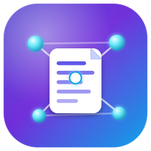
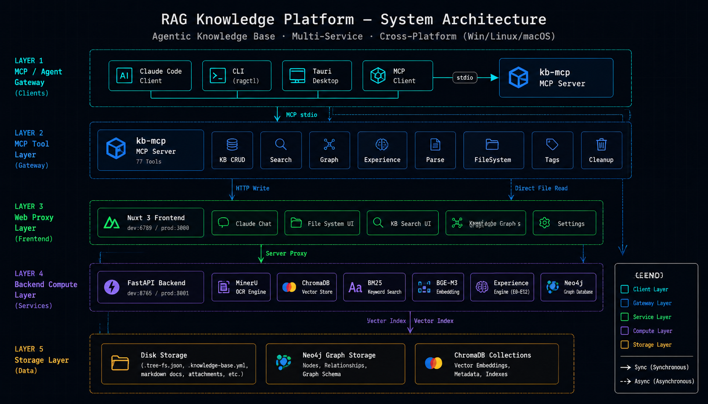
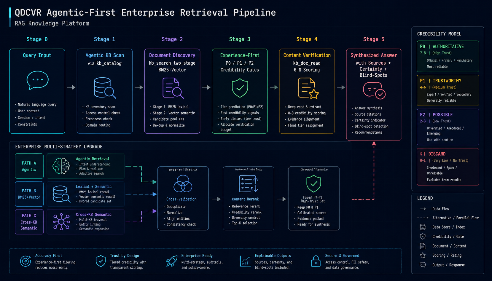

<div align="center">



# RAG Knowledge Platform

### Enterprise-Grade Document Intelligence & Agentic Knowledge Base

**One pipeline from raw PDF to verified, agent-queryable knowledge — with content-verified retrieval that refuses to be fooled by vector similarity.**

<p>
<em>QDCVR Semantic Search · Neo4j Knowledge Graph · Experience Lifecycle (E0–E12)<br>
74 MCP Tools · 14 Agent Skills · MinerU OCR · Cross-Platform</em>
</p>

<!-- Hero Badges -->
<p>
<a href="#-quick-start"></a>
<a href="#-table-of-contents"></a>
<a href="#-74-mcp-tools"></a>
<a href="#%EF%B8%8F-four-interfaces-one-backend"></a>
</p>

<p>
<a href="https://github.com/kingdol666/rag-knowledge/stargazers"></a>
<a href="https://github.com/kingdol666/rag-knowledge/releases"></a>


</p>

<p>
<sub><b>English</b></sub> &nbsp;&middot;&nbsp; <sub><a href="./README-zh.md">中文</a></sub>
</p>

---



</div>

<br>

---

## 📋 Table of Contents

<p align="center">
<a href="#-why-this-exists">Why</a> ·
<a href="#-eight-pillars">Features</a> ·
<a href="#-quick-start">Quick Start</a> ·
<a href="#%EF%B8%8F-four-install-methods">Install</a> ·
<a href="#-prerequisites">Prerequisites</a> ·
<a href="#%EF%B8%8F-four-interfaces-one-backend">Usage</a> ·
<a href="#-architecture">Architecture</a> ·
<a href="#-configuration">Config</a> ·
<a href="#%EF%B8%8F-74-mcp-tools">MCP Tools</a> ·
<a href="#-roadmap">Roadmap</a> ·
<a href="#-contributing">Contributing</a>
</p>

---

## ✨ Why This Exists

> **The core problem with modern RAG:** high vector similarity ≠ content relevance. A query about *"PET biaxial stretching"* cheerfully returns *"PP film"* literature at cosine 0.90 — both live in the "polymer film" semantic space, so the embedder is fooled. The LLM then hallucinates a confident, wrong answer.

This platform solves that at the **retrieval layer**, not the generation layer. Its flagship method — **QDCVR (Query-Driven, Content-Verified Retrieval)** — reads candidate documents and scores them on an independent **0–8 content rubric**, applying the uncompromising rule:

> ### 🎯 *"Vectors are fast. Content is accurate."*
> Even at vector similarity **0.95**, if the content score is **≤ 4**, the document is **discarded**.

<div align="center">

| | Traditional KB Tools | **RAG Knowledge Platform** |
|:---:|:---|:---|
| 🔍 | Single search strategy (vector *or* keyword) | **Multi-strategy**: BM25 + vector + tag-semantic + graph expansion |
| 🧠 | Trust vector similarity blindly | **Content-verified retrieval** — independent 0–8 adjudication |
| 🤖 | Bolt-on AI, hard to integrate with agents | **Agent-native**: 74 MCP tools, 14 skills — any MCP client works |
| 💡 | No structured knowledge reuse | **Experience library**: E0–E12 lifecycle with P0/P1/P2 credibility |
| 🔧 | Complex multi-tool setup, scattered configs | **One command** `ragctl setup`, single `config.yml` source of truth |
| 🪟 | Terminal windows everywhere | **Silent headless** — zero terminals in dev *and* prod |

</div>

---

## 🌟 Eight Pillars

<div align="center">

</div>

<div align="center">

| # | Pillar | What you get |
|:---:|:---|:---|
| 📄 | **Document Parsing** | PDF / Word / Excel / PPT / images → Markdown via **MinerU OCR** engine |
| 🧠 | **QDCVR Retrieval** | Query-driven, content-verified retrieval — independent 0–8 content scoring |
| 🔍 | **Multi-Strategy Search** | BM25 + vector two-stage recall · cross-KB enterprise search · `balance_kbs` diversity guard |
| 📊 | **Knowledge Graph** | Neo4j-powered · 11 graph tools · entity/relation graphs · cross-KB document bridges |
| 💡 | **Experience Library** | E0–E12 lifecycle · structured problem→solution→lessons · P0/P1/P2 credibility · decay |
| 🔌 | **74 MCP Tools** | KB CRUD · search · graph · experience · parsing · tags · vector/index · lifecycle — all MCP-native |
| 🎯 | **14 Agent Skills** | Natural-language commands · bilingual triggers (中/EN) · auto-dispatch to Archival agent |
| 🤫 | **Silent Headless** | Every launcher runs with **zero terminal windows** · dev and prod behave identically |

</div>

---

## 🧠 The QDCVR Retrieval Method

<div align="center">

### Query-Driven · Content-Verified Retrieval

*You don't trust a lawyer who only skimmed the cover. Your RAG shouldn't trust a cosine score.*

</div>

**QDCVR** is a 6-step retrieval pipeline designed to be **resistant to vector similarity's deceptive scores**:

```
User Query
    │
    ▼
┌─────────────────────────────┐
│  ① KB Selection             │  Smart dispatch to the right KB(s)
│  (balance_kbs diversity)    │  Prevents large-KB domination
└─────────────┬───────────────┘
              ▼
┌─────────────────────────────┐
│  ② Multi-Stage Recall       │  BM25 → Vector → Tag-semantic → Graph
│  (4 parallel paths)         │  Recall from every angle
└─────────────┬───────────────┘
              ▼
┌─────────────────────────────┐
│  ③ Content Verification     │  ⭐ KEY INNOVATION
│  (0-8 scoring rubric)       │  Read actual document text, score it
│                              │  Score < 6? → tag+description expansion
│                              │  Score < 4? → HARD DISCARD
└─────────────┬───────────────┘
              ▼
┌─────────────────────────────┐
│  ④ Cross-Validation         │  Dedup, cross-KB merge, rank fusion
└─────────────┬───────────────┘
              ▼
┌─────────────────────────────┐
│  ⑤ Confidence Rating        │  P0 (verified) / P1 (likely) / P2 (hint)
│  + Blind-Spot Declaration   │  Honest "I don't know" — never fake it
└─────────────┬───────────────┘
              ▼
┌─────────────────────────────┐
│  ⑥ Synthesized Answer       │  With ranked sources + evidence
│  + Source Citations          │  Every claim links to source docs
└─────────────────────────────┘
```

<details>
<summary><b>🎯 The 0–8 Content Scoring Rubric (click to expand)</b></summary>

| Score | Meaning | Example |
|:----:|---------|---------|
| **0–2** | Off-topic / hallucination | Vector similarity 0.95 but content is about a different material entirely — **discarded** |
| **3–4** | Tangential mention | Query "PET stretching" → hit has one sentence about PET among 20 pages about PP — **discarded** |
| **5–6** | Partially relevant | Covers the topic but missing key details — gets tag+description **expansion pass** |
| **7–8** | Directly answers the query | Precisely matches the question's domain, material, and context — **returned as P0** |

> **The rule**: vectors suggest candidates. Content determines truth. A 0.95 vector score buys you nothing if the content score is ≤ 4.
</details>

<details>
<summary><b>🧪 Experimental results — content-verified vs blind vector recall</b></summary>

In benchmark tests across 6 domains (20 adversarial queries):

| Method | P@5 | FPR | Latency |
|--------|:---:|:---:|:-------:|
| Flat vector (blind) | 0.590 | 12.0% | 84 ms |
| QDCVR Domain (verified) | **0.630** | **3.0%** | **38 ms** |
| Cross-domain adversarial | — | **0.00%** | — |

Cross-domain false positive rate: **0%** (vs 50–77% for flat vector).

Full benchmark: [`docs/paper/benchmark/SYSTEM-BENCHMARK-PLAN.md`](./docs/paper/benchmark/SYSTEM-BENCHMARK-PLAN.md)
</details>

---

## 🚀 Quick Start

> **Three commands from zero to a fully working platform.**

```bash
# 1 — Clone
git clone https://github.com/kingdol666/rag-knowledge.git
cd rag-knowledge

# 2 — One-click setup (installs ALL deps + models)
./ragctl setup

# 3 — Start everything (silent, zero terminal windows)
./ragctl up
```

<div align="center">
<br>
<a href="https://github.com/kingdol666/rag-knowledge"></a>
<a href="https://github.com/kingdol666/rag-knowledge/stargazers"></a>
<a href="https://github.com/kingdol666/rag-knowledge/issues"></a>
<br>
</div>

<details>
<summary><b>🔧 Windows users — use the same commands natively</b></summary>

```powershell
.\ragctl.bat setup
.\ragctl.bat up

# Or once ragctl is registered globally:
ragctl setup
ragctl up
```
</details>

> [!TIP]
> **No Claude Code? No problem.** The Web UI is fully functional standalone. Use any MCP client to access 74 tools, or just browse/search at `http://localhost:6789`.

### ✅ Verify Everything Works

```bash
ragctl status                                   # dual-mode: dev + prod side-by-side
curl http://localhost:8765/api/v1/health        # → {"status":"healthy"}
```

### 🔍 What You'll See

| Interface | URL | What to do |
|-----------|:---:|------------|
| 🌐 **Web UI** | `http://localhost:6789` | Browse KBs, search, view graph |
| 📚 **API Docs** | `http://localhost:8765/docs` | Explore 76 endpoints via Swagger |
| 🖥️ **CLI** | `ragctl status` | Check service health |
| 🤖 **Agent** | Claude Code session | Say "list all knowledge bases" |

---

## 🗺️ Four Install Methods

All four end with the **same working platform**. Methods **A / B / C** are **agent-driven** — install once, then a single conversation initializes the whole thing. Method **D** is the **manual CLI** path.

<table>
<tr>
<th width="25%">A. Claude Code Plugin<br><sub>recommended</sub></th>
<th width="25%">B. OMP Global Install</th>
<th width="25%">C. Skills Copy + Wizard</th>
<th width="25%">D. Git Clone (Manual CLI)</th>
</tr>
<tr>
<td valign="top">

Use **Claude Code** — gets everything registered globally.

```bash
/plugin marketplace add kingdol666/rag-knowledge
/plugin install rag-knowledge@rag-knowledge
/reload-plugins
```

Then ask your agent:

> **"初始化知识库"** · **"set up the KB"**

</td>
<td valign="top">

Use **Oh My Pi** as coding agent.

```bash
git clone https://github.com/kingdol666/rag-knowledge.git
cd rag-knowledge
node scripts/install_omp.cjs
```

Then ask your agent:

> **"initialize the knowledge base"** → `/knowledgebase-init`

</td>
<td valign="top">

Skills without plugins.

```bash
git clone https://github.com/kingdol666/rag-knowledge.git ~/rag-knowledge
mkdir -p ~/.claude/skills
cp -r ~/rag-knowledge/.claude/skills/knowledgebase* ~/.claude/skills/
```

Then ask your agent:

> **"初始化知识库系统"**

</td>
<td valign="top">

Full manual control.

```bash
git clone https://github.com/kingdol666/rag-knowledge.git
cd rag-knowledge
./ragctl setup && ./ragctl up
```

Open **http://localhost:6789**.

</td>
</tr>
</table>

<details>
<summary><b>📋 What <code>ragctl setup</code> does step by step</b></summary>

| Step | Action | Duration |
|------|--------|:--------:|
| 1 | Install `uv` (Python package manager) if missing | ~5 sec |
| 2 | Ensure Python 3.12 (managed by uv) | ~10 sec |
| 3 | Verify project integrity (`backend/` + `web/`) | instant |
| 4 | Create `.env` from `.env.example` | instant |
| 5 | Install backend deps (FastAPI + torch + transformers + MinerU) | 5–15 min |
| 6 | Install kb-mcp deps (MCP server) | ~30 sec |
| 7 | Install web deps (Nuxt 3 + Ant Design Vue) | ~1 min |
| 8 | Pre-download BGE-M3 embedding model (~2.2 GB) | 2–10 min |
| 9 | Pre-download MinerU VLM model (OCR engine) | 3–10 min |
| 10 | Register `ragctl` globally | instant |
| 11 | Final environment check | ~2 sec |

</details>

---

## 📦 Prerequisites

| Tool | Version | Required | Notes |
|------|---------|:--------:|-------|
| **Git** | any | ✅ | Cloning the repository |
| **Node.js** | ≥ 18 | ✅ | `ragctl` CLI + Nuxt frontend |
| **uv** | ≥ 0.7 | ⚡ Auto-installed | Python package manager |
| **Python** | 3.12 | ⚡ via uv | Managed by uv — no manual install |
| **Docker** | any | 📋 Optional | Only for Neo4j graph |
| **Rust** | stable | 📋 Optional | Only for Tauri desktop app |

> **Disk:** ~5 GB required · First run downloads BGE-M3 (~2.2 GB) from **ModelScope** (fast in China) or **HuggingFace** (set `embedding.model_source: huggingface` in `config.yml`).

---

## 🖥️ Four Interfaces, One Backend

<div align="center">
<table>
<tr>
<th>Interface</th><th>How to Use</th><th>Key Commands</th>
</tr>
</table>
</div>

### 1. 🤖 Claude Code — *Natural Language*

Speak to your agent in plain language, and the **Archival agent** dispatches to the right tool:

```text
"list all knowledge bases"                       → kb_list
"ingest ./papers PDFs into a 'research' KB"       → knowledgebase-ingest
"search: what are PET biaxial stretching params?" → QDCVR → verified answer + sources
"organize all KBs — fix tags, descriptions"       → knowledgebase-organize
"记录这个排查经验"                                 → knowledgebase-experience-summarize
```

### 2. ⌨️ CLI — *`ragctl`*

```bash
ragctl up                          # Start all services (silent)
ragctl up --appmode prod           # Production ports (8001/3000)
ragctl status                      # Dev + prod mode status
ragctl logs web --tail             # Live web logs
ragctl restart backend -f          # Force restart
ragctl backup                      # Cross-platform backup
ragctl down                        # Stop all services
```

<details>
<summary><b>📋 Complete CLI Reference</b></summary>

| Command | Description |
|---------|-------------|
| `ragctl setup` / `init` | One-click full deployment |
| `ragctl check` | Environment audit + fix suggestions |
| `ragctl up` / `down` | Start / stop all services |
| `ragctl start` / `stop` / `restart` [svc] | Single service lifecycle (`backend`/`web`/`neo4j`) |
| `ragctl status` | Dual-mode status: ports + health + PIDs |
| `ragctl logs [svc] [--tail]` | View / tail logs |
| `ragctl deps` | Install all dependencies |
| `ragctl model [--source X]` | Pre-download BGE-M3 model |
| `ragctl backup` / `restore` | KB + ChromaDB + Neo4j backup/restore |
| `ragctl version` | Local version vs GitHub remote |
| `ragctl update` | Check and pull latest version |
| `ragctl install` | Register `ragctl` globally |
| `ragctl desktop` / `ui` | Launch Tauri desktop console |
| `ragctl clean` | Clean MinerU artifacts + cache |

**Flags:** `--appmode dev|prod` · `--port-backend N` · `--port-web N` · `--no-neo4j` · `--force` · `--tail`
</details>

### 3. 🔌 MCP Client — *Any Agent*

```python
kb_project_start(backend=True, web=True, wait=True)
kb_search_two_stage(query="reinforcement learning", balance_kbs=True)
experience_search_global(query="ConnectError troubleshooting")
kb_graph_cross_kb_documents(min_kbs=2)
kb_index_document(kb_id="uuid", doc_path="paper.md")
```

### 4. 🌐 Web UI — *Browser-Based*

Open **http://localhost:6789** and explore:

| Page | Route | What You Can Do |
|------|-------|-----------------|
| 🏠 **Home** | `/` | Live dashboard with real-time KB/doc/tag/edge stats |
| 📁 **File System** | `/file-system` | Tree browser, upload, parse, preview |
| 🗄️ **Knowledge Base** | `/knowledge-base` | KB CRUD, document management, sub-KBs |
| 🔎 **KB Search** | `/knowledge-search` | QDCVR search with strategy selector |
| 🌐 **Graph Explorer** | `/knowledge-graph` | D3.js force-directed Neo4j visualization |
| 🤖 **Claude Chat** | `/claude-chat` | Agent SDK streaming with tools |
| ⚙️ **Settings** | `/settings` | Runtime config editor with hot-reload |
| ❓ **About** | `/about` / `/about-project` | Release notes + roadmap |

---

## 🏗️ Architecture

```
Browser / Claude Code / MCP Client
        │
        ▼
┌──────────────────────────────┐
│  Nuxt 3 Web UI (proxy layer) │  6789 (dev) / 3000 (prod)
└──────────────┬───────────────┘
               │ server-to-server (trust_env=False)
               ▼
┌──────────────────────────────┐
│  FastAPI Backend + MinerU    │  8765 (dev) / 8001 (prod)
└──────────────┬───────────────┘
               │ file I/O
               ▼
┌──────────────────────────────────────────────┐
│  Storage Layer                                │
│  ├── .tree-fs.json  (Global file tree index)  │
│  ├── {KB}/.knowledge-base.yml  (Doc index)    │
│  ├── {KB}/*.md    (Document content)          │
│  ├── ChromaDB     (BGE-M3 1024-dim vectors)   │
│  └── Neo4j        (bolt://127.0.0.1:7687)     │
└──────────────────────────────────────────────┘
```

### Five-Layer Storage Model

| Layer | Content | Technology |
|:-----:|---------|------------|
| **L1** | Raw markdown documents | `storage/tree-file-system/{KB}/{doc}.md` |
| **L2** | File tree index | `.tree-fs.json` |
| **L3** | Document registry | `.knowledge-base.yml` |
| **L4** | Vector embeddings (1024-dim) | ChromaDB + BGE-M3 |
| **L5** | Knowledge graph | Neo4j (Document/Tag/KB nodes + relations) |

> **Principle:** Writes → HTTP API (consistency across all 5 layers). Reads → direct file access (zero backend load).

---

## ⚙️ Configuration

`config.yml` (repo root) is the truth source. `.env` overrides and is auto-created by `ragctl setup`.

| Variable | Default (dev / prod) | Purpose |
|----------|----------------------|---------|
| `APP_MODE` | `dev` | Selects config section |
| `BACKEND_PORT` | `8765` / `8001` | FastAPI backend port |
| `WEB_PORT` | `6789` / `3000` | Nuxt web port |
| `BACKEND_URL` | `http://localhost:8765` | Full backend URL |
| `TREE_STORAGE_PATH` | `./storage/tree-file-system` | KB data root |
| `NEO4J_PASSWORD` | (docker-compose) | Graph DB authentication |

```bash
ragctl up --appmode prod        # Switch to production ports
ragctl status                   # Shows both dev + prod
ragctl down --appmode prod      # Stop only prod (Neo4j preserved)
```

Built-in **rate limiting** (configurable in `config.yml`):

```yaml
server:
  rate_limit:
    enabled: true
    window_sec: 60
    max_requests: 120       # general endpoints
    heavy_max: 20            # parse/mineru endpoints
```

---

## ⚡ 74 MCP Tools

All accessible via `mcp__kb-mcp__*` from any MCP-compatible agent:

<div align="center">

| Category | Tools | Category | Tools |
|:---------|:-----:|:---------|:-----:|
| **Service Lifecycle** | 4 | **KB CRUD** | 5 |
| **Document CRUD** | 9 | **Search** | 4 |
| **Vector Index** | 5 | **File System** | 3 |
| **Knowledge Graph** | 11 | **Experience (+Meditation)** | 26 |
| **Tags** | 4 | **Parse** (non-blocking) | 3 |

</div>

<details>
<summary><b>📋 Full tool list → click to expand</b></summary>

| Tool | Description |
|------|-------------|
| `kb_project_start()` | Silently launch all services |
| `kb_project_status()` | Service health + ports + PIDs |
| `kb_project_update()` | Safe update from GitHub |
| `backend_status()` | Quick health check |
| `kb_list()` | List all KBs |
| `kb_create(name, desc)` | Create KB |
| `kb_update(kb_id)` | Update KB metadata |
| `kb_delete(kb_id)` | Delete KB + all documents |
| `kb_get_documents()` | List documents per KB |
| `kb_find_duplicates()` | Detect duplicate/near-duplicate docs |
| `kb_doc_create()` | Create document |
| `kb_doc_read()` | Read document content |
| `kb_doc_update_meta()` | Update metadata |
| `kb_doc_update_content()` | Replace content |
| `kb_doc_delete()` | Delete document (with graph cleanup) |
| `kb_doc_batch_delete()` | Batch delete |
| `kb_doc_move()` | Move doc to different KB |
| `kb_doc_save_parsed()` | Save OCR/parse result |
| `kb_search(query)` | Metadata keyword search |
| `kb_search_vector()` | BGE-M3 semantic search |
| `kb_search_two_stage()` | BM25 → Vector rerank |
| `kb_search_stats()` | Index statistics |
| `fs_get_tree()` | Full file tree |
| `fs_get_children()` | Folder contents |
| `fs_upload_file()` | Upload + register |
| `kb_graph_stats()` | Graph health + node counts |
| `kb_graph_search()` | Search graph by keyword |
| `kb_graph_kb_overview()` | KB-level overview |
| `kb_graph_cross_kb_documents()` | Cross-KB bridge docs |
| `kb_graph_document()` | Document-centric view |
| `kb_graph_document_related()` | Related documents |
| `kb_graph_document_paths()` | Shortest path discovery |
| `kb_graph_central_documents()` | Centrality ranking |
| `kb_graph_build()` | Build graph |
| `kb_graph_delete_document()` | Cleanup (new) |
| `kb_graph_delete_kb()` | Cleanup (new) |
| `experience_create()` | Create experience |
| `experience_read()` | Read experience |
| `experience_list()` | List experiences |
| `experience_update()` | Update experience |
| `experience_delete()` | Delete experience |
| `experience_apply()` | Mark as applied |
| `experience_review()` | Rate + comment |
| `experience_summary()` | Dashboard summary |
| `experience_search_global()` | Cross-KB search |
| `experience_search_smart()` | Multi-path (recommended) |
| `experience_rerank()` | Semantic reranking |
| `experience_extract()` | Auto-extract candidates |
| `experience_drafts_list()` | Pending drafts |
| `experience_draft_read()` | Read draft + evidence |
| `experience_draft_approve()` | Approve draft |
| `experience_draft_reject()` | Reject draft |
| `experience_check_stale()` | Consistency check |
| `experience_sync_kb()` | Mark KB for sync |
| `experience_dashboard()` | Health dashboard |
| `experience_apply_decay()` | Decay cycle |
| `experience_meditation_status()` | Meditation scheduler |
| `experience_meditation_run()` | Manual trigger |
| `experience_meditation_config_get()` | Read meditation config |
| `experience_meditation_config_update()` | Update meditation config |
| `experience_meditation_history()` | Run history |
| `experience_meditation_task_status()` | Poll meditation run |
| `kb_tags_list()` | List tags |
| `kb_doc_update_tags()` | Set tags on doc |
| `kb_doc_get_by_tag()` | Find by tag |
| `kb_tags_cleanup()` | Remove orphan tags |
| `kb_index_document()` | Index single document |
| `kb_batch_index()` | Index unindexed docs |
| `kb_reindex()` | Rebuild entire index |
| `kb_task_status()` | Poll any background task |
| `kb_cleanup_orphan_collections()` | Clean ChromaDB |
| `parse_doc()` | Async parse (returns task_id) |
| `parse_doc_batch()` | Batch parse |
| `parse_task_status()` | Poll parse result |

</details>

---

## 📁 Project Structure

```
rag-knowledge/
├── backend/              ← FastAPI + MinerU OCR engine
├── web/                  ← Nuxt 3 + Ant Design Vue + Claude Chat
├── kb-mcp/               ← MCP server — 74 tools
├── command/              ← ragctl CLI (Node.js)
├── src-tauri/            ← Tauri v2 desktop (Rust)
├── .claude/              ← 14 agent skills + Archival agent
├── .claude-plugin/       ← Plugin + marketplace manifests
├── docs/                 ← Architecture, paper framework, benchmark
│   └── paper/benchmark/  ← CIKM 2027 benchmark (18 experiments)
├── config.yml            ← Central configuration (single truth source)
├── docker-compose.yml    ← Neo4j container
├── ragctl / ragctl.bat   ← CLI entry points
├── .mcp.json              ← MCP auto-connect
├── .env.example           ← Environment template
└── VERSION                ← Semantic version
```

---

## 🔧 Tech Stack

<table>
<tr>
<td width="50%" valign="top">

| Component | Technology |
|-----------|------------|
| **Backend** | Python 3.12 · FastAPI · Uvicorn |
| **Frontend** | TypeScript · Nuxt 3 · Vue 3.5 |
| **UI Library** | Ant Design Vue 4 |
| **PDF Parsing** | MinerU OCR (≥ 3.4.2) |
| **Vector DB** | ChromaDB + BGE-M3 (1024-dim) |

</td>
<td width="50%" valign="top">

| Component | Technology |
|-----------|------------|
| **Knowledge Graph** | Neo4j 5.20 (Docker) |
| **MCP Framework** | FastMCP (Python) |
| **CLI** | Node.js · js-yaml |
| **Desktop** | Rust · Tauri v2 |
| **Agent SDK** | Claude Code · Oh My Pi · Codex |

</td>
</tr>
</table>

---

## 🗺️ Roadmap

- [x] **v1.0** — Core QDCVR retrieval, KB CRUD, web UI, MCP tools
- [x] **v2.0** — Knowledge graph, experience lifecycle, bilingual i18n
- [x] **v2.1** — Meditation (auto-experience), MinerU OCR, multi-format parse
- [x] **v2.2** — Tauri desktop app, CIKM benchmark (18 experiments)
- [x] **v2.3** — Five-layer consistency, silent headless, graph cleanup on delete
- [ ] **v2.4** — Multi-modal (image search), REST API key auth
- [ ] **v2.5** — WebSocket real-time collaboration, team workspaces
- [ ] **v3.0** — Distributed indexing (Ray), 100K+ doc scale

---

## 🤝 Contributing

Contributions are welcome! Here's how:

1. 🍴 **Fork** the repository
2. 🌿 Create a **feature branch** (`git checkout -b feature/amazing`)
3. 💻 **Write code** following existing patterns
4. ✅ **Test** your changes (`pytest backend/tests/`)
5. 📝 **Commit** with clear messages
6. 🚀 **Push** and open a **Pull Request**

**Guidelines:**
- Keep it **atomic** — one PR, one feature/fix
- **Test** before submitting (frontend: `npx vue-tsc --noEmit`, backend: `pytest`)
- **Document** new features in README
- **No AI slop** — every line should be intentional

---

## 🌐 Community & Support

<div align="center">

| Resource | Link |
|:---------|:-----|
| 🐛 **Bug Report** | [GitHub Issues](https://github.com/kingdol666/rag-knowledge/issues) |
| ⭐ **Star Us** | [GitHub](https://github.com/kingdol666/rag-knowledge) |
| 📖 **Documentation** | [README-zh.md](./README-zh.md) (中文) |
| 💬 **Discussions** | [GitHub Discussions](https://github.com/kingdol666/rag-knowledge/discussions) |
| 📦 **Releases** | [GitHub Releases](https://github.com/kingdol666/rag-knowledge/releases) |

</div>

---

## 📄 License

MIT © [kingdol](https://github.com/kingdol666)

---

<div align="center">

<sub>Built with</sub>
<a href="https://fastapi.tiangolo.com/">FastAPI</a> ·
<a href="https://nuxt.com/">Nuxt 3</a> ·
<a href="https://neo4j.com/">Neo4j</a> ·
<a href="https://www.chromadb.com/">ChromaDB</a> ·
<a href="https://modelcontextprotocol.io/">MCP</a> ·
<a href="https://mineru.net/">MinerU</a>

<br>

**⭐ Star us on GitHub — every star helps make this project better!** ⭐

<a href="https://github.com/kingdol666/rag-knowledge/stargazers">
<picture>
<source media="(prefers-color-scheme: dark)" srcset="https://api.star-history.com/svg?repos=kingdol666/rag-knowledge&type=Date&theme=dark" />
<source media="(prefers-color-scheme: light)" srcset="https://api.star-history.com/svg?repos=kingdol666/rag-knowledge&type=Date" />

</picture>
</a>

</div>
