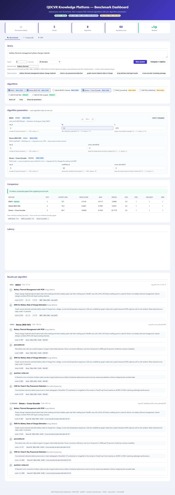

# benchmark-web — paper-replication dashboard

A runnable RAG-retrieval benchmark: **upload your own documents**, then compare
eight retrieval algorithms on the same corpus, each with **its own tunable
parameters**. Every algorithm is tagged with its provenance:

| tag | meaning |
|---|---|
| `REAL-CODE` | an actual open-source library (rank_bm25, FAISS, sentence-transformers) |
| `REAL-ALGO` | a published paper's algorithm implemented here from its description |
| `PROJECT` | this platform's own QDCVR retrieval path, called over its API |



---

## Quick start

```bash
# 1. backend — FastAPI on 127.0.0.1:8800
cd benchmark-web/backend
uv pip install --python .venv/Scripts/python.exe -r requirements.txt   # first time
python verify.py                                                       # dependency check
python main.py

# 2. frontend — Nuxt on 127.0.0.1:3001
cd benchmark-web/frontend
npm install                                                            # first time
npm run dev
```

Open <http://127.0.0.1:3001>. The API's own interactive docs are at
<http://127.0.0.1:8800/docs>.

The `qdcvr_*` baselines additionally need the **platform** running
(`ragctl up` in the repo root) — everything else works standalone.

### Pointing the UI at a different backend

```bash
NUXT_PUBLIC_API_BASE=http://127.0.0.1:9000 npm run dev
```

No port, URL or model name is hardcoded: `backend/config.py` reads the monorepo's
`config.yml` and `.env` (same `env var > config.yml > default` priority as the
rest of the platform), and the front end reads the algorithm catalogue from the
API at runtime.

---

## Algorithms and their parameters

`GET /api/algorithms` is the single source of truth. Every entry publishes a
parameter schema — name, type, default, bounds, description — which drives
request validation *and* the UI's parameter panel, so the two can never drift.

| id | family | implementation | parameters |
|---|---|---|---|
| `bm25` | sparse | `REAL-CODE` rank_bm25 | `top_k`, `k1` (0–3), `b` (0–1) |
| `dense` | dense | `REAL-CODE` FAISS + BGE-M3 | `top_k`, `score_threshold` |
| `hybrid` | hybrid | `REAL-CODE` BM25+FAISS fusion | `top_k`, `alpha`, `candidate_k`, `norm`, `k1`, `b` |
| `ce_rerank` | rerank | `REAL-CODE` FAISS → ms-marco cross-encoder | `top_k`, `candidate_k`, `score_threshold` |
| `crag` | corrective | `REAL-ALGO` Yan et al., NAACL 2024 | `top_k`, `candidate_k`, `upper_threshold`, `lower_threshold`, `expand_trigger`, `expand_k`, `w_overlap`, `w_dense` |
| `selfrag` | self-reflective | `REAL-ALGO` Asai et al., 2023 | `top_k`, `candidate_k`, `threshold`, `w_rel`, `w_sup`, `w_use`, `support_gain` |
| `qdcvr_flat` | project | `PROJECT` platform API, all KBs | `top_k`, `score_threshold`, `kb_id` |
| `qdcvr_domain` | project | `PROJECT` platform API, one KB | `top_k`, `score_threshold`, `kb_id` (required) |

Aliases accepted for backwards compatibility: `vector` → `dense`,
`qdcvr` → `qdcvr_flat`, `self_rag` → `selfrag`, `cross_encoder` → `ce_rerank`.

Example — three algorithms, three different parameter sets:

```bash
curl -s -X POST http://127.0.0.1:8800/api/compare \
  -H "Content-Type: application/json" \
  -d '{
    "query": "battery thermal management",
    "methods": ["bm25", "dense", "hybrid", "crag"],
    "top_k": 5,
    "params": {
      "bm25":   { "k1": 1.2, "b": 0.6 },
      "hybrid": { "alpha": 0.3, "norm": "minmax" },
      "crag":   { "upper_threshold": 0.7, "expand_trigger": 0.4 }
    },
    "relevant": ["battery-thermal"]
  }'
```

Only the deviations from the defaults need to be sent; the response echoes the
**fully resolved** parameter set that actually ran, so a result is always
reproducible from its own record.

---

## API

| Method | Path | Purpose |
|---|---|---|
| `GET` | `/` | self-describing index (routes, algorithms, resolved config) |
| `GET` | `/api/health` | liveness + corpus and index readiness |
| `GET` | `/api/algorithms` | registry **including every parameter schema** |
| `GET` | `/api/domains` | local domains + platform knowledge bases |
| `POST` | `/api/documents` | add or replace one document (JSON) |
| `POST` | `/api/documents/batch` | add many documents |
| `POST` | `/api/documents/upload` | **upload files** (multipart, multi-file) |
| `GET` | `/api/documents` | list the corpus |
| `GET` | `/api/documents/{id}` | read one document and its chunks |
| `DELETE` | `/api/documents/{id}` | delete one document |
| `DELETE` | `/api/documents` | clear the corpus |
| `POST` | `/api/search` | run algorithms for one query |
| `POST` | `/api/compare` | same, plus the cross-method comparison block |
| `POST` | `/api/reindex` | rebuild the dense index |

Legacy paths from the original dashboard are kept as aliases: `GET /api/docs`,
`GET /api/documents/list`, `POST /api/docs/add`, `POST /api/docs/batch`,
`POST /api/documents/add`.

### Uploads

`POST /api/documents/upload` accepts `pdf · docx · md · markdown · rst · txt ·
log · csv · tsv · json · jsonl · html`. Each file is parsed, chunked and indexed
independently — **one bad file never discards the rest of the batch**:

```json
{
  "uploaded": 3, "failed": 1,
  "files": [
    { "filename": "paper.pdf", "ok": true, "kind": "pdf", "chunks": 12, "characters": 5821 },
    { "filename": "notes.md",  "ok": true, "kind": "text", "chunks": 2,  "characters": 940 },
    { "filename": "dump.xyz",  "ok": false, "error": "unsupported file type '.xyz'. Supported: …" }
  ]
}
```

Scanned PDFs with no text layer are reported with a warning rather than indexed
as empty documents.

### Metrics

`/api/search` and `/api/compare` differ only in that `/api/compare` always
returns the `comparison` block. It reports latency, score distribution and
inter-method overlap (Jaccard) unconditionally, and **real IR metrics —
`precision@k`, `recall@k`, `ndcg@10`, `mrr` — only when you supply `relevant`
(ground-truth document ids)**. Without ground truth the response says so
explicitly; it never derives a precision figure from a similarity score.

### Failure isolation

Algorithms run independently. If one cannot run — the platform API is down, a
model is missing, a parameter is out of range — its own result carries an
`error` string, and the other methods still return their results. A broken
baseline never turns a comparison into a 500.

---

## Tests

```bash
# API: 61 checks covering the whole surface against a running backend
cd benchmark-web/backend && python e2e_test.py

# UI: 29 checks driving a real Chromium through upload -> tune -> compare
cd benchmark-web && python e2e_ui_test.py --headed

# Chart sanity: proves the latency canvas actually painted pixels
python check_chart.py
```

`e2e_ui_test.py` needs Playwright (`pip install playwright && playwright install
chromium`); it seeds a known corpus through the API, then verifies the browser
renders the algorithm registry, the per-algorithm parameter panel, an upload,
a comparison table, real IR metrics with ground truth, and the API tab.

---

## Layout

```
benchmark-web/
├── backend/                 FastAPI service
│   ├── main.py              routes + request models
│   ├── algorithms.py        algorithm registry, parameter schemas, runners
│   ├── store.py             chunking, BM25 index, FAISS index, persistence
│   ├── loaders.py           file -> text (pdf/docx/csv/json/html/…)
│   ├── metrics.py           P@k, R@k, nDCG, MRR, Jaccard (no invented numbers)
│   ├── config.py            reads the monorepo config.yml + .env
│   ├── verify.py            dependency + config pre-flight
│   ├── e2e_test.py          API end-to-end suite
│   └── data/corpus.json     persisted corpus (gitignored)
├── frontend/                Nuxt 3 dashboard
├── benchmark/               corpus-build + ingestion pipelines (see BENCHMARK-TEST-PLAN.md)
├── e2e_ui_test.py           browser end-to-end suite
└── check_chart.py           canvas paint check
```

## Notes

* **Chunking is character-based** with sentence-boundary preference, so CJK
  documents chunk correctly (whitespace splitting collapses them to one chunk).
* **BM25 tokenisation** uses lowercased Latin words plus CJK character bigrams —
  reasonable recall without pulling in a segmenter.
* **Models are read from `models_cache/`** via `HF_HUB_CACHE`. That variable is
  set explicitly rather than relying on `HF_HOME`, which is often already
  defined machine-wide and would otherwise silently win.
* The corpus persists to `backend/data/corpus.json`, so restarting the server
  does not empty the benchmark.
