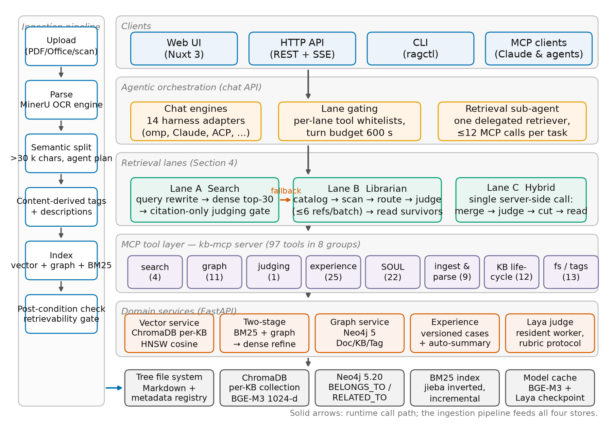
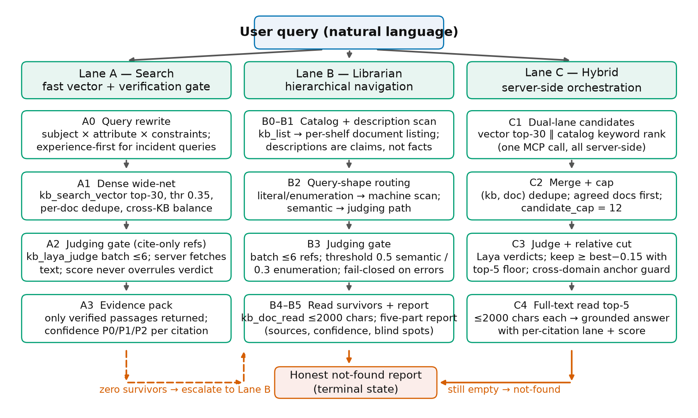
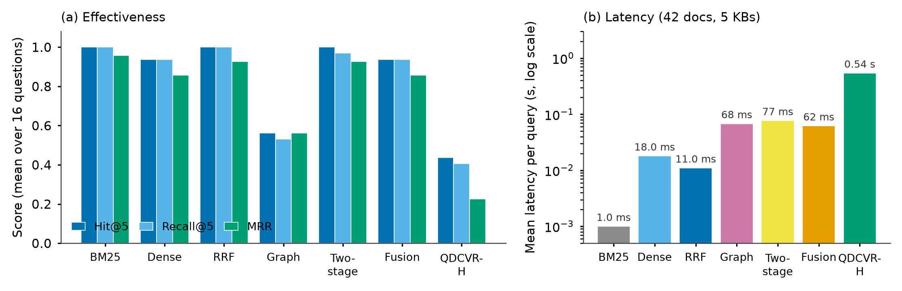
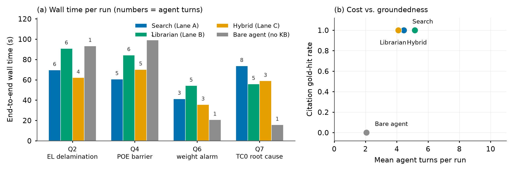
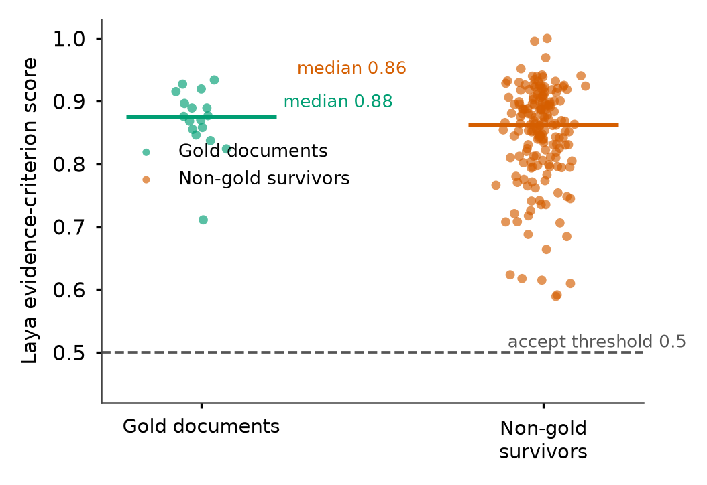

Retrieval-augmented generation ,Agentic retrieval ,Knowledge base management ,Content verification ,Trustworthy question answering , Model Context Protocol

# Introduction

Enterprises accumulate process regulations, failure analyses, and operational lessons as unstructured documents spread across shared drives. Answering a concrete engineering question — *why did edge delamination appear in an EL inspection of a laminated photovoltaic module?* — requires locating the one report among thousands that records the decision, reading it, and citing it. Retrieval-augmented generation (RAG) addresses the location step by embedding documents and the query into a shared vector space \[rag-lewis, dpr\], and modern agentic stacks let a large language model (LLM) orchestrate retrieval tools iteratively \[mcp, singh-agentic-rag\]. Yet the dominant ranking signal — dense cosine similarity — is a measure of *topic relatedness*, not of *evidence presence*. A document that merely discusses similar materials can outrank the one document that contains the answer, and a fluent generator can readily synthesize an answer from the wrong source. The result is the well-documented hallucination and misgrounding behavior of LLM pipelines \[siren\].

This paper argues that a primitive most deployed RAG stacks leave implicit is an *explicit content-verification gate*: before a candidate document is allowed to support an answer, its actual text must be fetched and judged against the query by a model whose only job is to answer “does this text contain direct evidence for this question?” Vectors are fast; content is accurate. We built QDCVR (Query-Driven Content-Verified Retrieval), a self-hosted platform that makes this primitive the backbone of a complete knowledge-base system — content-routed organization at ingestion, a 97-tool MCP server as the machine interface \[mcp\], and three retrieval lanes that all terminate at the same verification gate — and, because the primitive is itself a model, subjects it to the same scrutiny as any model (Section <a href="#sec:inflation" data-reference-type="ref" data-reference="sec:inflation">7.3</a>).

The three lanes embody a deliberate latency/recall trade-off. The *Search* lane is a vector fast lane: rewrite the query, retrieve a wide candidate net, and submit citation-only references to the verification gate. The *Librarian* lane is a hierarchical navigator that walks library→document catalogs, routes enumeration-style queries to a machine scanner, judges survivors in small batches, and reads only what survived — all within a hard budget of twelve tool calls. The *Hybrid* lane collapses vector and catalog channels into a single server-side orchestrated call that merges candidates, judges them, applies a relative cut with a top-5 floor, and returns full text for the top documents. All lanes fail closed: zero verified evidence yields an explicit not-found report, never a speculative answer.

We assess the platform with two experiment tiers on a production corpus of five industrial photovoltaic knowledge bases (42 documents): a tool-layer comparison of seven retrieval methods on sixteen gold-annotated questions, and 16 end-to-end agentic runs that answer four questions through the platform’s public chat API in four arms (three lanes plus a bare agent without knowledge-base tools). The contributions are:

1.  **A verifiable-retrieval architecture** (Sections <a href="#sec:system" data-reference-type="ref" data-reference="sec:system">3</a>–<a href="#sec:lanes" data-reference-type="ref" data-reference="sec:lanes">4</a>): content-verified retrieval as a platform primitive whose measured value lies in auditability, per-citation provenance, and fail-closed semantics — with three interchangeable lanes under enforced budgets and an engine-agnostic harness layer that exposes everything as MCP tools.

2.  **A two-tier empirical analysis** (Sections <a href="#sec:setup" data-reference-type="ref" data-reference="sec:setup">6</a>–<a href="#sec:results" data-reference-type="ref" data-reference="sec:results">7</a>): at the tool layer, BM25 and reciprocal-rank fusion are strong baselines on a curated same-domain corpus, and dense retrieval misses exactly one question (Q16) through a near-duplicate confuser family; the verification gate’s re-ranking *reduces* top-5 hit rate from 0.94 to 0.44 when confusers — near-miss same-domain distractors — dominate the candidate pool. At the agent layer, all knowledge-base-grounded lanes ground their answers in gold documents while end-to-end latency is almost entirely LLM turns (machine retrieval is sub-second).

3.  **A quantified verifier-failure analysis** (Section <a href="#sec:inflation" data-reference-type="ref" data-reference="sec:inflation">7.3</a>): the same-domain evidence-inflation phenomenon — non-gold documents scoring a median 0.86 versus gold 0.88 on an evidence-criterion judge (Mann–Whitney `p = 0.26`, i.e. no separation) — together with the mitigations (hierarchical reading, relative cuts with floors, and calibration as future work).

4.  **Operational lessons from production use** (Section <a href="#sec:discussion" data-reference-type="ref" data-reference="sec:discussion">8</a>): three documented incidents, each with its detection symptom and fix — resident judge workers (batch judging 10–12 s → 1–2 s), vector-index segment corruption surfacing as honest “success with zero results” failures, and GPU memory hygiene between embedding and judging workloads.

A preliminary demo describing the platform’s organization and retrieval layers was accepted as a CIKM 2026 demo \[qdcvr-demo\]. This paper extends it with the multi-lane agentic retrieval methodology, the end-to-end agentic evaluation, the verifier-failure analysis, and the deployment lessons.

# Related work

## Retrieval-augmented generation and ranking

RAG couples a retriever with a generator to ground open-domain QA \[rag-lewis\]; dense retrievers encode queries and passages into a shared space \[dpr\] and multi-lingual, multi-granularity embedders such as BGE-M3 support hybrid dense–sparse signals \[bge-m3\]. Lexical probabilistic ranking remains a strong baseline in many regimes \[bm25\], and reciprocal-rank fusion is a standard parameter-light way to merge ranked lists \[rrf-cormack\]. Our tool-layer evaluation confirms this picture on a curated industrial corpus: BM25 and RRF match or beat dense retrieval at Hit@5, at millisecond latency. QDCVR uses dense, BM25, and graph signals, but treats all of them as *candidate generators* whose output must still pass content verification.

## Structured and graph-based organization

GraphRAG builds entity–relation graphs over corpora for query-focused summarization \[graphrag\], LightRAG distills the idea into a simpler dual-level retrieval \[lightrag\], and RAPTOR recursively abstracts document trees \[raptor\]. QDCVR’s graph layer is intentionally leaner — Document, KnowledgeBase, and Tag nodes with **BelongsTo**, **HasTag**, and weighted **RelatedTo** edges — because its graph serves two engineering purposes (two-stage candidate expansion and cross-library navigation) rather than global summarization. Our measurements show the keyword-limited graph search is the weakest standalone signal on this corpus (Hit@5 0.56), which is why the platform never lets it answer alone.

## Verification, correction, and abstention

Self-RAG trains a generator to critique retrieved evidence and its own output \[selfrag\]; CRAG adds a corrective retriever that re-evaluates and re-queries when retrieval quality is low \[crag\]; FLARE interleaves generation with forward-looking retrieval triggers \[flare\]; Kamath et al. formalize selective prediction under domain shift \[kamath\]; and CyberBOT applies ontology-grounded retrieval for reliability-critical domains \[cyberbot\]. These approaches verify *during generation* with the generator itself. QDCVR instead externalizes verification into a dedicated judging model that sees only (query, document-text) pairs and is consumed as a tool; any lane, agent, or external system can call it, and its verdicts fail closed. This makes verification an inspectable, reusable platform service rather than an implicit property of one generator’s prompting.

## Agentic retrieval and tool protocols

ReAct established interleaved reasoning and acting over tools \[react-yao\]; tool-learning extended it to self-supervised tool use \[toolformer\]; the Model Context Protocol standardizes tool servers as a machine interface \[mcp\]; and recent surveys systematize agentic RAG \[singh-agentic-rag\], listing efficiency among its open challenges. DeepRead shows that structure-aware navigation over long documents improves agentic search \[deepread\], which matches our librarian lane’s document-coordinate reading. QDCVR contributes an agentic-retrieval *policy* layer: per-lane tool whitelists enforced by the server (a librarian-lane agent physically cannot call the vector tool), hard call budgets, and single-call server-side orchestration for the hybrid lane, targeting the turn count that our measurements (Section <a href="#sec:composition" data-reference-type="ref" data-reference="sec:composition">7.5</a>) show dominates agentic latency.

## Positioning

Table <a href="#tab:positioning" data-reference-type="ref" data-reference="tab:positioning">1</a> contrasts QDCVR with representative systems. No prior system combines (i) content-verified citations as a platform-wide gate, (ii) multiple interchangeable lanes with enforced tool budgets, and (iii) fail-closed abstention, inside one self-hosted knowledge-base product with a standard tool protocol. We also report where this design fails (Section <a href="#sec:inflation" data-reference-type="ref" data-reference="sec:inflation">7.3</a>), which closed systems rarely do.

| System | Dense/lex. | Graph | Verified | Abstain | Lanes | KB mgmt |
|:---|:--:|:--:|:--:|:--:|:--:|:--:|
| Vanilla RAG \[rag-lewis\] | ✓ |  |  |  |  |  |
| GraphRAG \[graphrag\] | ✓ | ✓ |  |  |  |  |
| RAPTOR \[raptor\] | ✓ |  |  |  |  |  |
| Self-RAG \[selfrag\] | ✓ |  | gen.-internal | partial |  |  |
| CRAG \[crag\] | ✓ |  | corrective |  |  |  |
| DeepRead \[deepread\] | ✓ |  |  |  | agentic |  |
| QDCVR (this work) | ✓ | ✓ | ✓ | ✓ | ✓ | ✓ |

Positioning against representative systems. “Verified” = retrieved content is judged against the query by a dedicated model before it may enter an answer (Self-RAG’s check is performed internally by the generator \[selfrag\]; CRAG re-queries on low retrieval confidence \[crag\]). “Abstain” = an explicit not-found is a terminal system state (CRAG instead falls back to parametric knowledge or web search). “Lanes” = multiple retrieval strategies behind one interface; “KB mgmt” = ingestion, organization, and library lifecycle management.

# Platform architecture

## Design principles

QDCVR (v2.3) is a self-hosted platform that turns a folder of PDFs, Office documents, and scans into knowledge bases that agents can be trusted to answer from. Five principles shape the architecture (Fig. <a href="#fig:arch" data-reference-type="ref" data-reference="fig:arch">1</a>):

P1 – Content-routed organization.  
Documents are organized by what they *say*, not by which folder they sat in: ingestion derives tags and a five-field description from the extracted content, and retrieval starts from a library catalog rather than a directory path.

P2 – MCP-first machine interface.  
Every capability is exposed as a tool of a Model Context Protocol server \[mcp\]: 97 tools in eight groups (search, graph, judging, experience, persona management (SOUL), ingestion/parsing, library lifecycle, filesystem/tags). Web, HTTP, CLI, and MCP clients sit on the same layer, so a capability added once is available to every harness.

P3 – Verification before promotion.  
No similarity score, however high, promotes a document into an answer; a judging model must read the candidate’s fetched content and vote. Verdicts fail closed: missing text, engine errors, or timeouts reject the candidate rather than pass it.

P4 – Honest abstention.  
When verification eliminates every candidate, the system returns an explicit not-found report listing what was searched and what was not covered. Refusing to answer is a terminal success state, not an error path.

P5 – Engine-agnostic agency.  
Answer agents are pluggable harnesses (14 adapters, e.g. `omp`, Claude, ACP-compatible CLIs); the platform constrains them through tool whitelists and prompts, never by coupling to a particular vendor.

<figure id="fig:arch" data-latex-placement="t">

<figcaption>QDCVR architecture. The ingestion pipeline (left) parses, splits, describes, and indexes documents into four stores. At run time (right), clients reach answer agents through the chat API; a lane-gating policy constrains each retrieval lane to its toolset; the MCP server exposes 97 tools over FastAPI domain services, which in turn operate the storage engines. All retrieval lanes terminate at the verification gate (the Laya judging service, Section <a href="#sec:gate" data-reference-type="ref" data-reference="sec:gate">4.4</a>).</figcaption>
</figure>

## Ingestion pipeline

Ingestion is a nine-step, quality-gated flow executed by an archival sub-agent through MCP tools: (1) pre-flight tool probing; (2) duplicate detection (exact SHA-256 plus near-duplicate vector search at `≥ 0.90` cosine); (3) a library census; (4) parsing with MinerU \[mineru\] (local OCR engine for scanned PDFs, direct reading for Markdown/text); (5) a semantic split gate for documents beyond 30 000 characters (the agent proposes split boundaries; a validator enforces a 0.85 target utilization and forbids oversized atomic units); (6) content-derived tagging and description; (7) multi-channel indexing (vector + graph + BM25); (8) a post-condition check that the new document is actually retrievable; and (9) an audited report. Two design choices matter in practice. First, descriptions are generated by reading the content, and the retrieval layer treats them as *claims to be verified* rather than truth — in an audit of 26 document descriptions on a predecessor corpus, 24 were found to mismatch their documents’ actual content (released audit logs). Second, indexing success is judged by observable effects (`total_chunks` `> 0`), because we observed GPU out-of-memory failures that returned success envelopes with empty index payloads.

## Storage and service layers

Four stores back the platform. A tree filesystem holds Markdown documents with a metadata registry (library states, document paths, tags); per-library ChromaDB collections index BGE-M3 embeddings \[bge-m3, chroma\] (1024-d, cosine space, 500-char chunks with 50-char overlap); Neo4j \[neo4j\] maintains the Document/KnowledgeBase/Tag graph with weighted **RelatedTo** edges derived from shared tags, vector similarity, and agent judgments; and a jieba-tokenized BM25 inverted index \[bm25\] supports lexical matching. Domain services wrap these stores: the vector service serializes writes per collection (we traced one production incident to concurrent HNSW segment handles), the two-stage service fuses BM25 and graph expansion for candidate generation before a dense refine stage, the experience service versions operational lessons as first-class documents with their own retrieval threshold, and the verification gate is served by a resident judge worker whose engineering details appear in Section <a href="#sec:impl" data-reference-type="ref" data-reference="sec:impl">5</a>.

# Multi-lane verified retrieval

All answering agents reach the platform through one chat endpoint. The server-side *lane policy* inspects the request (pinned libraries, prompt suffixes, engine) and attaches the corresponding tool whitelist and instructions; a librarian-lane agent, for example, is denied the vector and two-stage tools at the protocol level, so the lane is a property of the enforcement layer, not of prompt discipline. Fig. <a href="#fig:lanes" data-reference-type="ref" data-reference="fig:lanes">2</a> summarizes the three lanes.

<figure id="fig:lanes" data-latex-placement="t">

<figcaption>The three retrieval lanes. Every lane ends at the same content-verification gate and the same honesty contract: zero verified evidence escalates (Lane A→B) or terminates in an explicit not-found report.</figcaption>
</figure>

## Lane A: Search — vector fast lane with a verification gate

Lane A optimizes for latency on pinned libraries. Phase A0 rewrites the query into (subject, attribute, constraints) form, splits multi-entity and comparison questions into parallel sub-queries, and routes incident-style queries to the experience store (Section <a href="#sec:system" data-reference-type="ref" data-reference="sec:system">3</a>) first. Phase A1 issues one wide dense query (top-30, threshold 0.35, cross-library balancing), deduplicates by document, and *keeps all candidate documents rather than truncating to the top chunks*. Phase A2 submits citation-only references (library id + document path) to the verification gate in batches of at most six; the server fetches the full text itself, so the agent never fabricates content when arguing for a document. A document with vector score 0.95 that the judge rejects is dropped; a document at 0.40 with one *yes* verdict survives. Phase A3 returns the judge’s evidence pack (the only full-content channel in this lane) and the agent composes an answer whose citations carry confidence levels (P0 direct evidence, P1 partial, P2 weak).

## Lane B: Librarian — hierarchical navigation under a budget

Lane B is for exhaustive recall across all libraries and for queries whose vocabulary may not match the corpus. It walks a fixed spine with a hard budget of twelve tool calls: L0 reads the library catalog (ids, names, descriptions, counts) and prunes shelves (libraries) by the rewritten query; L1 lists each surviving shelf’s documents with descriptions; L2 routes by query shape — literal/enumeration questions (“which documents mention X”) go to a machine-side scanner (`≈`<!-- -->0.5 s per document, no LLM turns), semantic questions go to judging; L3 judges in batches of at most six references (larger batches historically triggered transport timeouts and fail-closed batch loss); L4 reads only survivors (bounded to 2 000 characters, starting at the judge-reported evidence line); L5 emits a five-part report (search paths, answer, sources, confidence, blind spots). Two rules are absolute: catalog descriptions never prune documents by themselves, and an exhausted budget terminates in blind-spot disclosure, not in a guessed answer.

## Lane C: Hybrid — server-side orchestration in one call

Agentic latency is dominated by LLM turns, not by tools (Section <a href="#sec:composition" data-reference-type="ref" data-reference="sec:composition">7.5</a>); Lane C spends exactly one call by moving the entire pipeline into the server. A single `kb_hybrid_search` call executes P1 (a parallel block: vector channel, top-30 at threshold 0.35, and catalog keyword channel); P3 merges candidates by (library, document) with agreed-by-both documents first, capped at twelve; P4 judges every candidate with the verification gate in batches of six (criterion *evidence*, threshold 0.5); P4b applies a document-level relative cut — keep scores `≥ best -
0.15` with a top-5 floor, plus a cross-domain anchor guard that prevents an inflated out-of-domain score from setting the cut line; and P5 reads the top five documents in full (≤2 000 characters each). The response carries the complete audit trail (per-lane candidates, merge counts, judge statistics, cut decisions, read contents), so a one-call lane is still an inspectable lane.

## The verification gate

The gate is a locally hosted evidence-classification model (the Laya judging service \[laya\]) invoked through a `kb_laya_judge` tool. Its contract: given the query and a batch of document references, fetch each document server-side, segment it, and score *does this text contain direct evidence that answers the query* under one of three criteria — *evidence* (specific substantiation; mere topic match is insufficient), *instance* (contains at least one member of the requested class; routed automatically for enumeration questions), or *auto*. Scores live in `[0,1]` with an acceptance threshold of 0.5 (0.3 for enumeration). All operating constants in this section — thresholds, the six-reference judge batch, the hybrid candidate cap of twelve, and the 0.15 relative-cut margin with its top-5 floor — are the platform’s shipped production defaults, fixed during earlier deployments on a different corpus, and were not tuned on the evaluation questions of Section <a href="#sec:setup" data-reference-type="ref" data-reference="sec:setup">6</a>. At the protocol layer the platform documents scores as a 0–8 rubric (topic 0–3, scenario 0–3, evidence 0–2; ≥6 answers directly, 5 escalates to the librarian lane, ≤4 drops); the `[0,1]` score is the machine-readable projection of that rubric, and the rubric is the human-auditable contract published to platform clients. Fail-closed semantics apply to every failure mode: fetch errors, engine errors, and timeouts count as rejection. Survivors are aggregated into an evidence pack with per-passage provenance.

## Honest abstention

If a lane ends with zero verified documents, Lane A escalates once to Lane B; if Lane B also exhausts its budget without a survivor, the answer is the not-found report: what was searched (libraries, document counts), what the query was routed as, and which topics sit outside the corpus. Because abstention is a terminal state in the lane contract — enforced by the server-side policy rather than advised in a prompt — it can be evaluated like any other outcome, which Section <a href="#sec:agentic" data-reference-type="ref" data-reference="sec:agentic">7.2</a> does.

# Implementation

The backend is Python 3.12/FastAPI; storage engines are ChromaDB (per-KB HNSW \[hnsw\] collections, cosine space) and Neo4j 5.20; embeddings are BGE-M3 \[bge-m3\] (1024-d, normalized, batch 32, lazy-loaded singleton with an LRU encode cache); parsing uses MinerU \[mineru\] with a local OCR engine; lexical indexing uses jieba tokenization \[jieba\]. The MCP server exposes 97 tools over SSE and stdio transports \[mcp\]; the judging model runs as a resident worker with a machine-level file lock, an LRU verdict cache, and explicit CUDA-cache release between workloads. The worker matters in production: a cold judge load costs 10–12 s per batch, the resident worker 1–2 s; and when judge and bulk-embedding workloads ran interleaved without cache cleanup, one end-to-end run degraded from 68 s to 27 minutes under the Windows WDDM display-page manager (internal profiling; released operations log). The web tier is Nuxt 3 with a chat endpoint that adapts 14 agent harnesses to a uniform message stream; the lane policy whitelists 21 read-only MCP tools per retrieval turn and denies 40+ harness-internal tools (file editors, web search, sub-agents) which, when left enabled in our profiling, added 14–170 s of detour behavior per run (per-run logs in the released artifact). An experience subsystem versions operational lessons as retrievable documents (higher threshold, 0.55) and supports a rules-based rolling summary triggered every fifth ingestion. The full system, including the experiment harness of Section <a href="#sec:setup" data-reference-type="ref" data-reference="sec:setup">6</a>, is open source.[^1]

# Experimental setup

## Corpus and gold questions

The live catalog contains five production knowledge bases from an industrial photovoltaic setting: thin-film process regulations (3 documents), a PV-module failure-analysis library (2), a PV-plant O&M library (5), an industrial workshop library with 31 documents including 20 near-duplicate equipment-telemetry reports, and a one-document production watch-clause library — 42 documents in total. The telemetry cluster is a deliberate stressor: its documents share prefixes, domains, and vocabulary, mimicking the confuser density of real deployments. We authored sixteen domain questions (Table <a href="#tab:questions" data-reference-type="ref" data-reference="tab:questions">2</a>), each with one or two gold documents identified by unique filename fragments, and 1–3 fact markers (numbers or terms any grounded answer must contain, e.g. the 61–68% vs. ≥85% cure-degree contrast and the recorded `-8`C thermocouple drift for the EL question (Q2), and the “TC0” dead-loop verdict for the telemetry question (Q7)). Two corpus-integrity incidents surfaced while setting up the evaluation and were repaired through the platform’s own remediation path before any measurement: one document missing from its vector collection (re-indexed via `index-document`) and one library whose collection had been silently lost (rebuilt via `reindex`); both incidents are instances of the failure class discussed in Section <a href="#sec:discussion" data-reference-type="ref" data-reference="sec:discussion">8</a>.

| \# | Question (abridged, translated) | Gold document(s) | Design intent |
|:---|:---|:---|:---|
| Q1 | EVA encapsulation film lamination: how to set the temperature, pressure and time window; how to control cure degree | EVA process essentials; EVA hydro-thermal aging mechanism | multi-gold |
| Q2 | EL inspection shows edge delamination: root cause and corrective actions | EL-2025-0317 delamination RCA report | incident → RCA |
| Q3 | Why does humid aging of EVA generate acetic acid and corrode ribbons; moisture transport mechanism | EVA hydro-thermal aging mechanism | mechanism |
| Q4 | Moisture-barrier behavior of POE encapsulant; lamination differences vs. EVA | POE process essentials | cross-material |
| Q5 | Summer power drop at a PV plant: systematic troubleshooting order | Power-drop troubleshooting manual; O&M lessons | synonym gap (“drop” vs. “plunge”) |
| Q6 | Trigger condition, nominal value and tolerance of the line-1027 part weight alarm | Watch-clause document (31.35 g ±<!-- -->0.05 g, 5 min) | numeric exactness |
| Q7 | Melt temperature fell 206→<!-- -->180 °C on extruder line 1: final root-cause verdict | TC0 dead-loop RCA revision (among 20 telemetry dups) | confuser density |
| Q8 | PET biaxial stretching process flow and critical temperature ranges | PET process regulation | plain factual |
| Q9 | Frequent inverter alarm trips: handling steps | Inverter alarm handling manual | PV O&M family |
| Q10 | Hot-spot acceptance criteria and disposal | Hot-spot detection and disposal procedure | PV O&M family |
| Q11 | String mismatch causes; IV-curve diagnosis | String mismatch analysis method | PV O&M family |
| Q12 | PP cast-film extrusion parameters; chill-roll temperature | PP cast film process regulation | plain factual |
| Q13 | Weight closed-loop run1: staircase excitation design | Weight optimization staircase record | telemetry cluster |
| Q14 | FT full-function regression after P0 optimization | FT regression test record | telemetry cluster |
| Q15 | Multimodal diagnosis: fusing scalar, vector and image signals | Three-modality closed-loop record | telemetry cluster |
| Q16 | Post-compensation recovery verification of the heatdecay092 event | heatdecay092 compensation verification (among 3 near-dup incident docs) | confuser density |

Gold-annotated question set over the five production knowledge bases. “Gold” lists unique filename fragments of the ground-truth documents. All sixteen questions serve the tool-layer experiment; Q2, Q4, Q6, Q7 also serve the agentic experiment.

## Methods and arms

*Tool layer* (Section <a href="#sec:retrieval" data-reference-type="ref" data-reference="sec:retrieval">7.1</a>): seven methods answer “which documents back this question” with top-5 document lists: BM25 (jieba+Okapi, `k_1{=}1.5`, `b{=}0.75`, built over all 42 full texts), Dense (`kb_search_vector`, BGE-M3, per-document best chunk), RRF (k=60 fusion of the two), Graph (`kb_graph_search` over top jieba keywords, best-rank merge), Two-stage (`kb_search_two-stage`: BM25+graph candidates then dense refine), Fusion-only (the hybrid lane’s merge order without judging), and QDCVR-Hybrid (the full single-call lane with judging and relative cut). All seven methods run over the full 42-document catalog with no library pinning; all output document-level rankings (BM25 scores full texts; dense aggregates chunks by max-pooling), so lists are directly comparable. Two construction asymmetries should be kept in mind when reading the lexical results: BM25 is an evaluation-side reimplementation over full texts (the platform’s internal lexical channel uses the same tokenizer with chunked documents), and its full-text granularity plus the questions’ corpus-vocabulary phrasing both favor lexical matching. All platform methods are invoked exactly as an external agent would invoke them: through the MCP tool interface against the live services.

*Agent layer* (Section <a href="#sec:agentic" data-reference-type="ref" data-reference="sec:agentic">7.2</a>): four arms answer four questions (Q2, Q4, Q6, Q7) through the public chat API, non-streaming, 20-turn budget, 15-minute client timeout: *Search* (library pinned, Lane A policy), *Librarian* (all libraries, Lane B policy), *Hybrid* (library pinned + Lane C suffix), and *Bare* (no knowledge-base tools, answer from parametric knowledge only). Note the deliberate scope difference from the tool layer: pinned arms search a single library (as small as two documents), so their confuser pools are a fraction of the full catalog — Section <a href="#sec:agentic" data-reference-type="ref" data-reference="sec:agentic">7.2</a> returns to this. Every arm is driven by the `omp` CLI agent engine[^2] (v18.4.10) wrapping the same LLM (GLM-5.3-Flash,[^3] default thinking level), so arms differ only in retrieval affordance. Zero-turn empty responses and transient gateway timeouts are retried once (a known transport flake): across the campaign the retry fired on two runs, both of which succeeded on re-run; orphaned engine processes are cleaned between runs. The entire grid is run twice (rounds 1 and 2); Section <a href="#sec:agentic" data-reference-type="ref" data-reference="sec:agentic">7.2</a> reports round 1 in its tables and both rounds in the text.

## Abstention and calibration probes

Beyond the gold questions, four out-of-corpus queries probe the honesty contract at the tool layer, two of them also at the agent layer (across all three grounded arms); and because every judged score is logged, the hybrid cut’s relative margin is replayed offline across a sweep of values (Section <a href="#sec:inflation" data-reference-type="ref" data-reference="sec:inflation">7.3</a>).

## Metrics

Tool layer: Hit@5 (any gold document in top-5), Recall@5 (fraction of gold documents in top-5), MRR, and per-call latency (mean and median; each method warmed up once, first call discarded). Agent layer: end-to-end wall time, agent turns returned by the engine, gold-document citation hit — the answer text contains the gold document’s unique filename fragment (automated substring check; gold fragments were chosen to be unambiguous) — and fact-marker hits (automated substring check against 2–3 ground-truth values or terms per question). Refusals are detected when a hedging marker appears in the answer’s opening 200 characters. All checks are automated string matches against the released transcripts; no human rater was involved. For the verifier analysis we log per-candidate judge scores from the hybrid response. Hardware: one RTX 5060 (8 GB) serves embeddings and the judge worker; all services run locally on Windows.

# Results

## Tool layer: strong baselines and the cost of verification

| Method                 | Hit@5 | Recall@5 |  MRR  | Latency (mean) | Latency (median) |
|:-----------------------|:-----:|:--------:|:-----:|:--------------:|:----------------:|
| BM25                   | 1.00  |   1.00   | 0.958 |     0.9 ms     |       1 ms       |
| Dense (BGE-M3)         | 0.94  |   0.94   | 0.856 |     18 ms      |      17 ms       |
| RRF (BM25‖Dense)       | 1.00  |   1.00   | 0.927 |     11 ms      |       9 ms       |
| Graph (Neo4j)          | 0.56  |   0.53   | 0.562 |     68 ms      |      68 ms       |
| Two-stage              | 1.00  |   0.97   | 0.927 |     77 ms      |      40 ms       |
| Fusion-only (no judge) | 0.94  |   0.94   | 0.856 |     62 ms      |      66 ms       |
| QDCVR-Hybrid (judge)   | 0.44  |   0.41   | 0.226 |     542 ms     |      582 ms      |

Tool-layer retrieval on the 42-document production corpus (mean over 16 gold-annotated questions; top-5 document lists; latency per call, warmed).

<figure id="fig:retrieval" data-latex-placement="t">

<figcaption>Tool-layer comparison. (a) BM25 and RRF solve this curated corpus almost perfectly; the judged hybrid loses top-5 hits relative to its own fusion stage. (b) All machine retrieval is sub-second; the judged hybrid adds ≈0.5 s over fusion-only for a 12-candidate verification.</figcaption>
</figure>

Table <a href="#tab:retrieval" data-reference-type="ref" data-reference="tab:retrieval">3</a> and Fig. <a href="#fig:retrieval" data-reference-type="ref" data-reference="fig:retrieval">3</a> give the tool-layer results. Three observations matter for practitioners.

**Curated same-domain corpora favor lexical precision.** With 42 well-described documents and questions authored in the corpus’s vocabulary, BM25 achieves Hit@5 1.00 (MRR 0.958) at millisecond latency, RRF matches it (MRR 0.927), and two-stage fusion joins them at Hit@5 1.00 once the corpus is healthy. Dense retrieval misses exactly one question (Q16): the query asks about the *heatdecay092 post-compensation verification* while four near-duplicate sibling reports from the same incident family crowd the top-5 — a confuser-density failure, not a vocabulary one (the earlier 8-question round additionally exposed a synonym miss, Q5’s *drop* vs. *plunge*, which fusion repairs). Graph search, limited to **contains** matching on node names and tags, is the weakest standalone signal (0.56).

**Verification is cheap; re-ranking is the risk.** Judging twelve candidates adds well under a second with the resident worker. But the QDCVR-Hybrid arm loses top-5 hits relative to its own fusion stage (0.44 vs. 0.94 Hit@5). The failure decomposes cleanly: on eight questions (Q2, Q4, Q5, Q6, Q8, Q9, Q11, Q12) the gold document *was* judged and the gate’s verdicts reordered same-domain confusers above it; on Q16 the gold never reached the judge at all — all twelve candidate slots were taken by confusers upstream in the fusion stage. Both halves trace to the same root cause, quantified next.

**Two-stage fusion recovers its inputs here.** On the healthy corpus the BM25+graph-then-dense pipeline reaches Hit@5 1.00 (Recall@5 0.97, one second-place gold outside the top-5), confirming that its added stages neither add nor subtract on this corpus once the stores are intact; per-question results are in the released logs.

## Agent layer: three lanes, one honesty contract

| Arm           | Q   | Wall (s) | Turns | Cite | Facts |
|:--------------|:----|:--------:|:-----:|:----:|:-----:|
| Search (A)    | Q2  |    70    |   6   |  ✓   |  3/3  |
| Search (A)    | Q4  |    61    |   5   |  ✓   |  2/2  |
| Search (A)    | Q6  |    41    |   3   |  ✓   |  3/3  |
| Search (A)    | Q7  |    74    |   8   |  ✓   |  2/2  |
| Librarian (B) | Q2  |    91    |   6   |  ✓   |  3/3  |
| Librarian (B) | Q4  |    84    |   6   |  ✓   |  2/2  |
| Librarian (B) | Q6  |    54    |   5   |  ✓   |  3/3  |
| Librarian (B) | Q7  |    56    |   5   |  ✓   |  2/2  |
| Hybrid (C)    | Q2  |    62    |   4   |  ✓   |  3/3  |
| Hybrid (C)    | Q4  |    70    |   5   |  ✓   |  2/2  |
| Hybrid (C)    | Q6  |    36    |   3   |  ✓   |  3/3  |
| Hybrid (C)    | Q7  |    59    |   3   |  ✓   |  2/2  |
| Bare (no KB)  | Q2  |    93    |   1   |  –   |  2/3  |
| Bare (no KB)  | Q4  |    99    |   1   |  –   |  2/2  |
| Bare (no KB)  | Q6  |    21    |   1   |  –   |  1/3  |
| Bare (no KB)  | Q7  |    16    |   1   |  –   |  0/2  |

Agentic end-to-end runs, round 1: four questions × four arms through the public chat API (engine `omp` over GLM-5.3-Flash, 20-turn budget; the full grid is run twice, see text). “Cite” = the answer names the gold document; “Facts” = ground-truth fact markers contained / available. The bare arm’s sporadic marker matches are coincidental: it cites no source, and its answers typically disclaim figures as unverified parametric recall.

Table <a href="#tab:agentic" data-reference-type="ref" data-reference="tab:agentic">4</a> and Fig. <a href="#fig:e2e" data-reference-type="ref" data-reference="fig:e2e">4</a> summarize the round-1 runs. We present them as an end-to-end case study of the deployed system rather than a statistical comparison; full per-run JSON transcripts are released.

**Grounding is a property of the lanes, not of the model.** All three knowledge-base-grounded arms named the gold document in all twelve valid runs and reproduced all twelve available fact-marker sets — including the exact watch-clause numbers (31.35 g, ±<!-- -->0.05 g, 5 min) and the telemetry root cause (a dead thermocouple loop, “TC0”). The marker hits survive decontamination: after deleting every answer line that names a gold document (so markers must come from the answer’s own prose or tables), all twelve grounded runs still reproduce their full marker sets. The bare arm never cited a source: on the EL question it produced a plausible *textbook* diagnosis (interfacial adhesion failure, moisture ingress) that misses the corpus’s recorded root cause (a thermocouple drifting `-8`C); on the telemetry question it hit none of the fact markers. This is the honesty contract of Section <a href="#sec:lanes" data-reference-type="ref" data-reference="sec:lanes">4</a> observed end to end: without verification-grounded retrieval, the same engine produces fluent, unsourced, and in these cases partly wrong answers.

**Reconciling the tool layer and the agent layer.** At the tool layer, the judged hybrid missed nine of sixteen questions; here the hybrid arm hit the gold on all four. Two design differences explain this, and both are part of the lane contract rather than luck. First, pinned scope: the agent arm searches one library (Q2’s failure-analysis library holds two documents), so the same-domain confusers that flood the 42-document tool-layer catalog never enter its candidate pool. Second, agency: a lane that can read what it retrieved and issue follow-up calls is not bound by a single ranking — the librarian lane in particular is built to keep looking. The tool layer measures the ranking stage in isolation; the agent layer measures the lane as deployed. Both results stand, and their difference is the paper’s central lesson about where verification helps (ranked-list quality) and where it cannot (pool composition).

**Partial honesty counts.** The one refusal-flagged grounded run, hybrid-Q4, is a positive case rather than a failure: its answer cites the POE gold document correctly and states explicitly that the library holds no EVA-side comparison data — a scoped, honest disclosure instead of speculation. No grounded run fabricated a citation.

**The lanes buy their latency profiles with turn structure.** Hybrid completed every round-1 question in 3–5 turns (mean 3.8) and 36–70 s; librarian spent 5–6 turns (mean 5.5) and 54–91 s; search sat between on wall time but needed 8 turns on the hardest question (Q7, the telemetry cluster). The librarian’s extra turns buy exhaustive coverage with blind-spot disclosure — the arm that must not miss a document, not the arm that must be fast.

**Repetition: outcomes reproduce, latency does not.** The full grid was run a second time. Citation outcomes agree on all 16 of 16 cells; the decontaminated fact-marker check is a clean sweep in round 1 (12/12) and near-clean in round 2 (11/12 — in the one exception the key values appear only inside evidence lines that also cite the gold document, an artifact of the line-deletion rule rather than a grounding failure; its citation hit stands). Wall time and turn counts fluctuate substantially (e.g. search-Q2: 70 s/6 turns in round 1 versus 165 s/11 turns in round 2; librarian-Q4: 84 s/6 turns versus 92 s/11 turns; hybrid-Q2: 62 s/4 turns versus 60 s/3 turns). The dichotomy — stable grounding under unstable latency — is exactly what the turn-economics model of Section <a href="#sec:composition" data-reference-type="ref" data-reference="sec:composition">7.5</a> predicts, and it is the strongest argument for the platform’s fixed turn budgets.

**The fast lane has a real tail.** In the first campaign pass, the search arm (Q2) and the bare arm (Q4) hit the server’s 600 s turn budget and returned gateway timeouts; both re-runs completed normally (70 s and 99 s). We attribute the stalls to engine-side transport stalls under LLM provider load, not to the retrieval layer (whose machine-side latency is sub-second); the platform’s retry-once policy (Section <a href="#sec:setup" data-reference-type="ref" data-reference="sec:setup">6</a>) fired on exactly these two runs. Interactive deployments should treat the server turn budget as the operative tail-latency knob.

<figure id="fig:e2e" data-latex-placement="t">

<figcaption>Agentic runs. (a) Wall time per run; printed numbers are agent turns. (b) Citation gold-hit rate vs. mean agent turns (horizontal offsets added for readability): the hybrid lane reaches fully grounded answers with the fewest turns, the librarian lane spends the most turns for exhaustive recall, and the bare agent cannot ground citations at all.</figcaption>
</figure>

## The verifier’s own failure mode: same-domain inflation

<figure id="fig:inflation" data-latex-placement="t">

<figcaption>Evidence-criterion judge scores from the sixteen QDCVR-Hybrid tool runs: all 191 judged candidates. Gold documents (green, <em>n</em> = 17**; Q16’s gold never entered its candidate pool) and same-domain non-gold survivors (orange, <em>n</em> = 174**) overlap almost completely: medians 0.876 versus 0.863, Mann–Whitney <em>p</em> = 0.26**. The 0.5 acceptance threshold separates both groups from zero, not from each other.</figcaption>
</figure>

Fig. <a href="#fig:inflation" data-reference-type="ref" data-reference="fig:inflation">5</a> plots every judge score from the sixteen hybrid runs: 191 candidates (twelve per run except Q14, whose merge produced eleven). Not one candidate was rejected — every logged score is `≥ 0.589`, far above the 0.5 acceptance threshold, so at the threshold layer the gate’s filtering power on this corpus is zero. The failures concentrate in ranking, not acceptance. Aggregating the 17 in-pool gold instances (Q1 and Q5 carry two golds each; Q16’s gold was never judged): only 5 of 17 rank in the top-3 of the judged ordering, while 9 rank eighth or lower. Gold and non-gold score distributions are statistically indistinguishable at this sample size (medians 0.876 vs. 0.863; Mann–Whitney `p = 0.26`, a gold-favoring trend with Cliff’s `δ ≈ 0.17`; scores are nested within 16 runs, so we treat the test as indicative only). On Q6 (the 31.35 g±<!-- -->0.05 g watch clause), the fusion ranking placed the gold clause document first, but the judged re-ranking promoted five unrelated telemetry reports (0.92–0.93) while the gold document scored 0.82 — pushing the gold document out of the top-5 that the answer agent reads in full; the same pattern recurs on Q2, where extruder-telemetry reports and an unrelated PET process document (0.89–0.93) outrank the gold EL report (0.85). Even the relative cut participates in the failure: it bound in most rounds (trimming one to five tail candidates), and on Q11 its best-minus-0.15 line fell *above* the gold’s score (0.741 vs. 0.711), deleting the gold from the kept set outright.

**An offline replay turns this failure into a calibration result.** Because every judged score is logged, the cut margin can be replayed without re-running the pipeline. Sweeping the margin from 0.05 to 0.35 (with the top-5 floor unchanged): at 0.05 the kept set shrinks to a mean 6.4 candidates but retains only 8/17 golds; the shipped 0.15 margin keeps a mean of 10.4 candidates and 16/17 golds; at 0.20 all 17 golds survive with 11.1 candidates retained. The margin is therefore repairable by a small configuration change — an analysis the platform should run per library at deployment time — but no margin separates golds from confusers, because the scores themselves overlap.

**Cross-domain claims do not survive measurement either.** The design intent — that reading content separates topical neighbors from evidence — does deliver cross-domain filtering *in the answer layer* (Section <a href="#sec:abstention" data-reference-type="ref" data-reference="sec:abstention">7.4</a>), but the acceptance threshold carries none of it. On four out-of-corpus probe queries (lithium-battery thermal runaway, child vaccination schedules, Python concurrency, injection-mold vent design), dense retrieval still returns same-corpus documents at 0.40–0.60 cosine, and the judged hybrid keeps 9–11 of its 12 candidates — the same inflation, now cross-domain. (One early production incident in which an out-of-domain document scored 0.92 on a PV question motivated the anchor guard; the probes show such inflation is the norm, not the exception.) What the probes establish is where honesty actually lives: not in the threshold, but in the reading-and-answer layer that the lanes wrap around it.

This failure is the mirror image of the one the gate was built to stop: dense similarity over-trusts topical neighbors, and the judge — a model used for evidence discrimination — over-trusts domain-internal discourse. The lane design contains two partial mitigations, and their limits are exactly what this analysis exposes. Lane B’s mandatory reading of survivors surfaces mismatched content to the answering agent; and the hybrid cut’s relative margin with a top-5 floor keeps most outranked gold documents in the machine-readable audit trail — though, as Q11 shows, it can also delete one. The quantified repair is cut-margin calibration per library (the replay above); the open problem is the score overlap itself: domain-aware negative training, score normalization against a per-library null distribution, or pairing the judge with a contradiction check. We report this as a measured open problem rather than a solved one.

## Honest abstention under out-of-corpus probes

The lanes’ final contract — an explicit not-found instead of speculation — was never exercised by the gold questions, all of which are in-corpus. Four out-of-corpus probe queries (lithium-battery thermal runaway, child vaccination schedules, Python concurrency, injection-mold vent design) close that gap, at both layers. At the tool layer, abstention does *not* happen: as Section <a href="#sec:inflation" data-reference-type="ref" data-reference="sec:inflation">7.3</a> showed, the acceptance threshold keeps 9–11 of 12 candidates even for vaccination or battery queries. At the agent layer, the contract holds without exception: all six runs (three grounded arms × two probes) answered with an explicit not-found report — each enumerates the libraries searched, states that the corpus does not cover the topic, and declines to answer from memory; none cites a document as evidence (zero `.md` citations across all six transcripts). Three runs add a dedicated blind-spot section, two disclosing search coverage limits: one librarian run reports that its vector and experience channels were unavailable that round, completed only a catalog-level scan, and therefore “cannot claim exhaustive coverage,” and several runs recommend ingestible sources (e.g. the relevant national standards) instead of fabricating a procedure. The honesty contract is thus real but its enforcement point is the reading-and-answer layer — precisely why the platform wraps verification inside lanes that must read before they answer, rather than exposing a bare similarity threshold.

## Where the time goes: LLM turns, not retrieval

Across the agentic runs, machine-side retrieval is uniformly sub-second (Table <a href="#tab:retrieval" data-reference-type="ref" data-reference="tab:retrieval">3</a>) while the twelve grounded end-to-end runs take 36–91 s: wall time is dominated by LLM turns, at 12–15 s per turn on average (per-arm means: search 11.7, librarian 12.8, hybrid 15.3; computed over the twelve grounded runs), consistent with the observation that agentic-RAG latency is turn-dominated \[singh-agentic-rag\]. The lanes differ almost entirely in turn structure: Lane C compresses its pipeline into one tool call; Lane B spends turns on catalog navigation but buys exhaustive coverage and readable provenance; Lane A sits between. The practical consequence is an engineering rule the platform now follows everywhere: *move orchestration server-side and cap turns* — the single-call hybrid lane is both the fastest and the most auditable, because its audit trail ships with the one response.

# Discussion and lessons learned

**L1. Vectors are fast; content is accurate — and verification has two costs.** The tool-layer table is the cleanest statement of the retrieval subproblem the platform must address: on a curated corpus a millisecond BM25 beats an 18 ms dense retriever, and neither knows whether a document *answers* the question. The verification gate converts ranked candidates into accountable, per-citation-provenance evidence; its costs are both temporal (`≈`<!-- -->0.5 s per dozen candidates end-to-end in Table <a href="#tab:retrieval" data-reference-type="ref" data-reference="tab:retrieval">3</a>; 1–2 s per six-document batch for the resident worker in production load) and, on this corpus, an accuracy one (0.94→<!-- -->0.44 Hit@5 under same-domain inflation, Section <a href="#sec:inflation" data-reference-type="ref" data-reference="sec:inflation">7.3</a>). Auditability is what the gate buys today; ranking quality is what calibration must earn back.

**L2. Latency engineering is turn engineering.** With retrieval sub-second, the only lever that matters for interactive latency is the number of agent turns. Tool whitelists that remove detour tools, one-call server-side pipelines, and small judge batches that avoid transport timeouts together took our hybrid runs from `≈`<!-- -->29 turns in the earliest serial-skill configuration (historical runs, logs released) to 3–5 turns in the present measurements.

**L3. The verifier is a model too — calibrate it.** Section <a href="#sec:inflation" data-reference-type="ref" data-reference="sec:inflation">7.3</a> is the paper’s cautionary result: a verifier inherits domain-internal blind spots, and a threshold calibrated on cross-domain negatives (0.5) does not separate same-domain near-misses. Fail-closed semantics and reading requirements contain the damage; they do not replace calibration.

**L4. Honesty needs an enforcement layer, not a prompt.** Lane separation works because the server physically withholds tools: a librarian-lane agent cannot call the vector tool even if instructed to. The out-of-corpus probes (Section <a href="#sec:abstention" data-reference-type="ref" data-reference="sec:abstention">7.4</a>) show the same asymmetry for abstention: a threshold cannot refuse — it accepted every out-of-corpus candidate it was shown — while the reading-and-answer layer refused all six probe prompts with disclosed searches and zero fabricated citations. Honesty is a property of the pipeline’s shape, not of the model’s mood.

**L5. Production incidents taught honest observability.** Three incidents shaped the implementation: a corrupted HNSW segment that made one library silently un-retrievable across lanes (fixed by re-index; detected because “success with zero results” is itself treated as suspect); GPU-OOM indexing that returned success envelopes with empty vector payloads (success is now judged by chunk counts); and judge/engine failures that must reject candidates rather than pass them. The common thread: every layer reports what it actually verified, and every consumer treats unverifiable as failed.

## Threats to validity

**Scale.** The live corpus is 42 documents across five libraries; absolute Hit@5 values (e.g. BM25’s 1.00) will not transfer to corpora orders of magnitude larger, where the hybrid lane’s candidate cap and the librarian’s shelf pruning become load-bearing rather than optional. The benchmark suite shipped with the platform scales the corpus to hundreds of scientific documents for exactly this purpose. **Question set.** Sixteen tool-layer and four agent-layer questions were authored by the system’s developers; all gold documents and fact markers are released for independent scrutiny, but the sample is small and favors the corpus’s vocabulary. **Judge and engine dependence.** Scores and turn counts come from one judging model and one agent engine; lanes, not models, are the object of comparison, but absolute numbers will move with engine versions. **Nondeterminism.** Agent runs are stochastic; we report two full repetitions of the 16-cell grid (citation agreement 16/16; wall time and turn counts fluctuate substantially), retry only zero-turn transport flakes, and release all per-run JSON logs, including the timeout re-runs. Fact-marker checks are automated substring matches; we additionally report decontaminated checks computed after removing answer lines that name a gold document, and the OOD probe answers were audited manually.

# Conclusion

QDCVR turns “the retriever found it” into “the system verified it”: a platform where organization, retrieval, and agency all terminate at an explicit content-verification gate, where three interchangeable lanes trade latency for recall under enforced budgets, and where the system’s refusal to speculate is a first-class outcome. Our experiments on a production industrial corpus ground the design in measured behavior: lexical and fused retrieval remain strong tool-layer baselines; the verification gate costs well under a second but inherits its own same-domain blind spot, which we quantify and partially repair by cut-margin replay; the honesty contract refuses every out-of-corpus probe at the answer layer even though the threshold refuses nothing; and end-to-end latency belongs to LLM turns, so the fastest lane is the one that moved its orchestration server-side. The immediate roadmap is verifier calibration against per-library null distributions, larger-corpus evaluation with the shipped benchmark suite, and lane auto-selection from query-shape features — steps toward retrieval systems whose trustworthiness is an inspectable property of the pipeline rather than a hope about the model.

# Data availability

The platform source code, the tool-layer and agentic experiment scripts, the gold question set with fact markers, the judging-service checkpoint reference, and all raw per-run JSON logs (tool-layer retrieval rows and agentic transcripts, including the timeout re-runs) are available at <https://github.com/kingdol666/rag-knowledge> (benchmark suite: `benchmark-suite/`; paper artifacts: `paper-kbs/`).

# Declaration of generative AI in the writing process

During the preparation of this work the authors used LLM-based coding agents to assist with experiment execution, data tabulation, figure preparation, and manuscript drafting. All experimental numbers originate from logged runs of the deployed system on the authors’ machine; the authors reviewed and take full responsibility for the content of the published article.

# Declaration of competing interest

The authors declare that they have no known competing financial interests or personal relationships that could have appeared to influence the work reported in this paper.

# Author contributions (CRediT)

**Author 1:** Conceptualization, Methodology, Software, Investigation, Data curation, Writing – original draft. **Author 2:** Validation, Writing – review & editing, Supervision.

# Acknowledgments

This research did not receive any specific grant from funding agencies in the public, commercial, or not-for-profit sectors.

[^1]: <https://github.com/kingdol666/rag-knowledge>

[^2]: <https://github.com/can1357/oh-my-pi>

[^3]: Model card: <https://open.bigmodel.cn>
