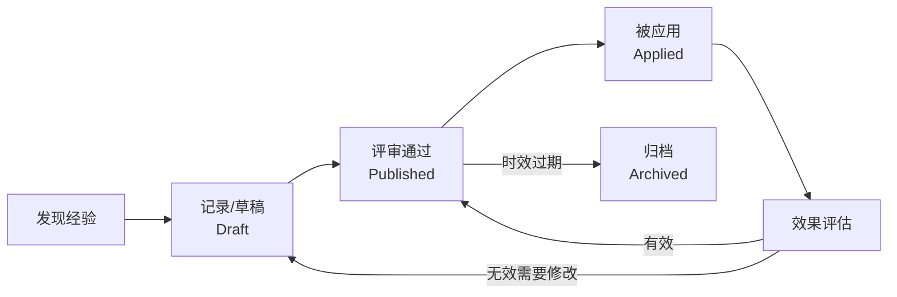

# Experience 经验机制 — 完美设计方案

> 计划制定日期: 2026-07-02
> 状态: 待实现

---

## 一、核心理念：经验 ≠ 文档

### 知识库中的两类知识

| 维度 | Document（文档） | Experience（经验） |
|------|-----------------|-------------------|
| **本质** | 事实性知识（What IS） | 经验性知识（What WORKS） |
| **来源** | 论文、报告、手册 | 实践中总结的行动经验 |
| **可执行性** | 需要自行理解转化 | 拿到就能照着做 |
| **时效性** | 长期有效 | 可能过时，需要review |
| **评价** | 无（没有好坏的判断） | 有(成功/失败/待验证) |
| **场景绑定** | 泛领域 | 强绑定具体作业场景 |
| **关联性** | 独立存在 | 可关联文档和其他经验 |

### 经验的价值

```
一次故障排查 → 记录为经验 → 下次同类问题直接复用
一次调优成功 → 记录为经验 → 团队所有人受益
一次决策失誤 → 记录为经验 → 避免重复踩坑
```

---

## 二、存储架构设计

### 2.1 文件系统结构

```
web/storage/tree-file-system/
├── Thermal-Power-Monitoring/          # 一个知识库
│   ├── .knowledge-base.yml            # 文档索引（已有）
│   ├── experience/                     # ★ 经验文件夹（新建）
│   │   ├── .experience-index.yml      # 经验元数据索引
│   │   ├── exp-coal-mill-001.md       # 经验正文（Markdown）
│   │   ├── exp-turbine-002.md
│   │   ├── exp-best-practice-003.md
│   │   └── images/                    # 经验相关图片
│   ├── doc1.md                        # 已有文档
│   └── images/
├── .tree-fs.json                      # 文件树（已有）
```

### 2.2 `.experience-index.yml` 元数据索引

```yaml
# 知识库经验索引
knowledge_base:
  id: "Thermal-Power-Monitoring"
  name: "Thermal-Power-Monitoring"
experience_count: 3
experience_tags:
  - coal-mill-fault
  - turbine-diagnostics
  - best-practice
  - mset-tuning

experiences:
  - id: "exp-coal-mill-001"
    title: "磨煤机堵煤故障排查流程"
    path: "Thermal-Power-Monitoring/experience/exp-coal-mill-001.md"
    
    # 场景绑定
    scenario: "coal-mill-fault-prediction"  # 场景标签
    category: "troubleshooting"              # 类别
    
    # 核心内容摘要
    problem: "磨煤机压差异常升高，怀疑即将发生堵煤故障"
    solution: "结合CNN-LSTM预警模型的输出和SCADA实时数据，分三步排查..."
    result: "success"                        # success / partial / failed / inconclusive
    
    # 关键经验（可执行条目的核心）
    key_lessons:
      - "CNN-LSTM预警信号提前15分钟出现时，必须即刻检查给煤量"
      - "压差>3.5kPa且CNN-LSTM偏差度>0.7时，堵煤概率超过90%"
      - "快速恢复操作：降低给煤量10%并维持5分钟，如压差仍上升则紧急停磨"
    
    # 量化指标
    metrics:
      effectiveness: 95          # 有效性评分 0-100
      difficulty: 60             # 实施难度 0-100
      time_saved: "避免2小时停机"
      success_rate: 88           # 历史成功率
    
    # 上下文关联
    context:
      related_docs:
        - "Thermal-Power-Monitoring/基于卷积神经网络-长短时记忆神经网络的磨煤机故障预警_7cbcc650.md"
        - "Thermal-Power-Monitoring/mset-coal-mill-fault-prediction.md"
      related_experiences:
        - "exp-turbine-002"     # 关联的其它经验
      prerequisites:
        - "需要CNN-LSTM模型已运行且产生偏差度输出"
    
    # 标签系统
    tags: ["磨煤机", "堵煤", "故障排查", "CNN-LSTM", "紧急操作"]
    severity: "critical"        # critical / important / normal / tip
    
    # 生命周期
    status: "published"         # draft / published / archived
    author: "chief-engineer-li"
    created_at: "2026-06-28T14:30:00Z"
    updated_at: "2026-07-01T09:15:00Z"
    
    # 使用统计
    applied_count: 12           # 12次被引用来解决实际问题
    rating_avg: 4.5             # 用户评分 0-5
    review_count: 8
    
    # 向量索引
    vector_index:
      collection: "exp_Thermal-Power-Monitoring"
      total_chunks: 5

  - id: "exp-turbine-002"
    title: "汽轮机振动异常判断的3条黄金法则"
    scenario: "turbine-vibration-analysis"
    category: "best_practice"
    problem: "生产团队对振动异常等级判断不一致导致误报警"
    solution: "建立基于MSET振动基线+趋势斜率的判断标准"
    result: "success"
    key_lessons:
      - "振动幅值在基线±15%内且趋势平稳→正常运行"
      - "振动幅值超过基线30%但趋势收敛→观察运行，30分钟复查"
      - "振动幅值超过基线50%且趋势发散→立即降负荷，安排停机检查"
    metrics:
      effectiveness: 98
      difficulty: 30
      time_saved: "减少80%误报警"
      success_rate: 95
    tags: ["汽轮机", "振动分析", "判断标准", "黄金法则"]
    severity: "important"
    status: "published"
    applied_count: 45
    rating_avg: 4.8
```

### 2.3 经验正文 Markdown 格式

```markdown
# 磨煤机堵煤故障排查流程

## 场景信息
- **知识库**: Thermal-Power-Monitoring
- **类别**: 故障排查
- **严重程度**: 🔴 紧急
- **创建者**: chief-engineer-li
- **创建时间**: 2026-06-28

## 问题背景
磨煤机堵煤是火电机组最常见的故障之一，传统依赖压力阈值报警往往滞后。
CNN-LSTM模型偏差度输出提供了提前预警，但需要配合正确的操作流程才能发挥价值。

## 排查步骤

### 第1步：确认预警信号
- 检查CNN-LSTM偏差度是否 >0.7
- 确认压差变化趋势（15分钟窗口）
- 排除传感器故障（交叉验证3个测点）

### 第2步：快速响应
- 如偏差度>0.7且压差上升→立即降低给煤量10%
- 如偏差度>0.5但<0.7→加强监控频率至每分钟1次

### 第3步：深度诊断
- 加载MSET模型比对历史正常工况
- 分析磨煤机电流+入口风量+出口温度的联合趋势

## 关键结论
> CNN-LSTM预警+MSET比对+压差趋势三重确认后，堵煤诊断准确率可达95%以上。

## 关联知识
- 📄 [CNN-LSTM磨煤机故障预警论文](./基于卷积神经网络-长短时记忆神经网络的磨煤机故障预警_7cbcc650.md)
- 📄 [MSET磨煤机故障预测论文](./mset-coal-mill-fault-prediction.md)

## 评审记录
| 评审人 | 评价 | 评分 | 日期 |
|--------|------|:----:|------|
| senior-operator-wang | 流程实用，建议补充停机阈值 | 4/5 | 2026-06-30 |

## 应用记录
| 使用者 | 场景 | 效果 | 日期 |
|--------|------|:----:|------|
| shift-lee-zhang | #3机组压差异常 | 成功避免堵煤 | 2026-07-01 |
```

---

## 三、MCP 工具设计（10个新工具）

### 3.1 CRUD 工具

| # | 工具名 | 功能 | 参数 |
|:-:|--------|------|------|
| 1 | **`experience_create`** | 创建经验 | `kb_id, title, scenario, category, problem, solution, result, key_lessons, tags, severity, related_docs, prerequisites` |
| 2 | **`experience_read`** | 读取经验 | `kb_id, exp_id or path` |
| 3 | **`experience_update`** | 更新经验 | `kb_id, exp_id, ...任意字段` |
| 4 | **`experience_delete`** | 删除经验 | `kb_id, exp_id` |

### 3.2 检索工具

| # | 工具名 | 功能 | 参数 |
|:-:|--------|------|------|
| 5 | **`experience_list`** | 列出经验 | `kb_id, scenario?, category?, severity?, status?, tags?, sort_by?` |
| 6 | **`experience_search`** | 元信息搜索 | `query, kb_id?, scenario?, tags?, top_k` |
| 7 | **`experience_search_vector`** | 向量语义搜索 | `query, kb_id?, scenario?, top_k` |
| 8 | **`experience_find_by_scenario`** | 按场景查找 | `scenario, kb_id?, severity?` |

### 3.3 智能工具

| # | 工具名 | 功能 | 参数 |
|:-:|--------|------|------|
| 9 | **`experience_apply`** | 标记应用并记录效果 | `kb_id, exp_id, context, result, notes` |
| 10 | **`experience_review`** | 评审经验 | `kb_id, exp_id, reviewer, rating, comment` |

---

## 四、Backend API 设计

### 4.1 路由定义

```python
# backend/app/api/routes/experience.py

router = APIRouter(prefix="/api/v1/experience", tags=["Experience"])

# 经验CRUD
POST   /api/v1/experience/{kb_id}                  → create_experience
GET    /api/v1/experience/{kb_id}                   → list_experiences
GET    /api/v1/experience/{kb_id}/{exp_id}          → read_experience
PUT    /api/v1/experience/{kb_id}/{exp_id}          → update_experience
DELETE /api/v1/experience/{kb_id}/{exp_id}          → delete_experience

# 经验检索
POST   /api/v1/experience/{kb_id}/search            → search_experience
POST   /api/v1/experience/{kb_id}/vector-search     → vector_search_experience
POST   /api/v1/experience/cross-kb-search           → cross_kb_experience_search

# 经验操作
POST   /api/v1/experience/{kb_id}/{exp_id}/apply    → apply_experience
POST   /api/v1/experience/{kb_id}/{exp_id}/review   → review_experience
GET    /api/v1/experience/{kb_id}/summary           → experience_summary

# 经验文件夹初始化
POST   /api/v1/experience/{kb_id}/init              → init_experience_folder
```

### 4.2 核心数据结构

```python
# backend/app/models/experience_models.py

class ExperienceCategory(str, Enum):
    BEST_PRACTICE = "best_practice"         # 最佳实践
    TROUBLESHOOTING = "troubleshooting"      # 故障排查
    LESSON_LEARNED = "lesson_learned"        # 经验教训
    OPTIMIZATION = "optimization"            # 优化方案
    TIP = "tip"                              # 小技巧
    WORKFLOW = "workflow"                    # 工作流
    DECISION = "decision"                    # 决策记录

class ExperienceResult(str, Enum):
    SUCCESS = "success"
    PARTIAL = "partial"
    FAILED = "failed"
    INCONCLUSIVE = "inconclusive"

class ExperienceSeverity(str, Enum):
    CRITICAL = "critical"
    IMPORTANT = "important"
    NORMAL = "normal"
    TIP = "tip"

class ExperienceStatus(str, Enum):
    DRAFT = "draft"
    PUBLISHED = "published"
    ARCHIVED = "archived"

class ExperienceCreate(BaseModel):
    title: str
    scenario: str
    category: ExperienceCategory
    problem: str
    solution: str
    result: ExperienceResult = ExperienceResult.SUCCESS
    key_lessons: list[str] = []
    tags: list[str] = []
    severity: ExperienceSeverity = ExperienceSeverity.NORMAL
    related_docs: list[str] = []
    prerequisites: list[str] = []
    metrics: dict = {}

class ExperienceDocument(BaseModel):
    id: str
    title: str
    path: str
    scenario: str
    category: str
    problem: str
    result: str
    severity: str
    status: str
    tags: list[str]
    key_lessons: list[str]
    author: str
    applied_count: int
    rating_avg: float
    created_at: str
    updated_at: str
```

---

## 五、Experience Service 核心逻辑

```python
# backend/app/services/experience_service.py

class ExperienceService:
    """经验管理系统服务"""
    
    def __init__(self):
        self.storage_path = None  # 从config解析
    
    async def init_experience_folder(self, kb_path: str) -> bool:
        """在KB初始化时创建experience/文件夹和索引文件"""
        exp_dir = Path(kb_path) / "experience"
        exp_dir.mkdir(exist_ok=True)
        (exp_dir / "images").mkdir(exist_ok=True)
        
        index_path = exp_dir / ".experience-index.yml"
        if not index_path.exists():
            yaml_content = {
                "knowledge_base": {"id": kb_path, "name": kb_path},
                "experience_count": 0,
                "experience_tags": [],
                "experiences": []
            }
            with open(index_path, "w", encoding="utf-8") as f:
                yaml.dump(yaml_content, f, allow_unicode=True)
        return True
    
    async def create_experience(self, kb_id: str, data: ExperienceCreate) -> dict:
        """创建新经验"""
        # 1. 生成经验ID
        exp_id = f"exp-{uuid4().hex[:12]}"
        
        # 2. 写入 .md 正文
        md_content = self._generate_markdown(data, exp_id)
        md_path = f"{kb_id}/experience/{exp_id}.md"
        fs_path = self._resolve_path(md_path)
        fs_path.write_text(md_content, encoding="utf-8")
        
        # 3. 更新 .experience-index.yml
        self._append_to_index(kb_id, exp_id, data, md_path)
        
        # 4. 更新文件树（使experience可见）
        self._sync_tree_fs(kb_id, exp_id)
        
        # 5. 返回结果
        return {"id": exp_id, "path": md_path, "status": "created"}
    
    async def search_experience(self, query: str, kb_id: str = "", 
                                scenario: str = "", tags: list = None, 
                                top_k: int = 5) -> list:
        """元信息搜索经验"""
        # 搜索 .experience-index.yml 中的 title/scenario/problem/tags
        # 支持精确匹配和关键词模糊匹配
        pass
    
    async def vector_search_experience(self, query: str, kb_id: str = "",
                                        scenario: str = "", top_k: int = 5) -> list:
        """向量语义搜索经验"""
        # 使用向量数据库搜索经验片段
        # 集合名: exp_{kb_id}
        pass
    
    async def apply_experience(self, kb_id: str, exp_id: str, 
                                context: str, result: str, notes: str) -> dict:
        """标记经验被应用"""
        # 1. 增加 applied_count
        # 2. 记录应用日志
        # 3. 可选：根据result动态调整success_rate
        pass
```

---

## 六、Skill 集成方案

### 6.1 新建 `knowledge-experience` Skill

```markdown
# .claude/skills/knowledge-experience/SKILL.md

# Knowledge Experience — 经验管理系统

## 触发场景
- 用户说"记录一个经验""保存这个操作经验"
- 用户说"查一下有没有这方面的经验"
- 用户说"这个经验有用/没用"
- 用户说"总结一下这个场景的经验"

## 经验管理流程

### E1 — 记录经验
1. 识别当前作业场景（scenario）
2. 引导用户填写: 问题→方案→结果→关键教训
3. 调用 `experience_create` 保存
4. 自动向量索引 `experience_search_vector`

### E2 — 检索经验
1. 解析用户问题的场景/技术关键词
2. 优先 `experience_search_vector` 语义搜索
3. 兜底 `experience_search` 元信息搜索
4. 按 severity + rating_avg 排序返回

### E3 — 应用经验
1. 找到匹配经验后询问用户是否参考
2. 调用 `experience_apply` 记录应用情况
3. 应用成功则自动提升该经验的 rating

### E4 — 评审经验
1. 对使用过的经验邀请用户评分
2. 记录评审意见
3. 低评分经验标记为需review
```

### 6.2 其他 Skill 中集成经验钩子

在 `knowledge-search` 的检索流程中增加：
```
├─ Globe     （看所有KB）
├─ Region    （定位候选KB）  
├─ City      （读摘要确认）
├─ Street    （向量精排）
├─ 🆕 Experience  （检索该场景下的经验）  ← NEW
└─ A4 Assembly（综合回答+经验建议）
```

---

## 七、文件改动清单

### 新建文件

| 文件 | 说明 |
|------|------|
| `backend/app/api/routes/experience.py` | 经验 API 路由 |
| `backend/app/models/experience_models.py` | 经验 Pydantic 模型 |
| `backend/app/services/experience_service.py` | 经验服务逻辑 |
| `web/server/api/experience/` | Nuxt 经验代理路由 |
| `web/server/services/experience-service.ts` | 前端经验服务 |
| `web/pages/experience.vue` | 经验管理页面 |
| `web/pages/experience-detail.vue` | 经验详情+评审页面 |
| `web/composables/useExperience.ts` | 经验操作 Composables |
| `web/types/experience.ts` | TypeScript 类型定义 |
| `kb-mcp/kb_client/client.py` | 添加经验相关 HTTP 方法 |
| `.claude/skills/knowledge-experience/SKILL.md` | 经验 Skill |

### 修改文件

| 文件 | 变更 |
|------|------|
| `kb-mcp/server.py` | 添加 10 个经验 MCP 工具 |
| `backend/app/main.py` | 注册 experience router |
| `web/nuxt.config.ts` | 添加 experience 路由 |
| `.claude/agents/knowledge-admin.md` | 添加经验管理技能引用 |
| `scripts/SKILL-TEST-PROMPT.md` | 添加经验测试场景 |

---

## 八、实现路线图

### Phase 1（2-3天）— 基础存储 + CRUD

- [ ] `experience_models.py` — Pydantic schema
- [ ] `experience_service.py` — init_experience_folder / create / read / update / delete
- [ ] Backend API routes（CRUD 5 endpoints）
- [ ] `experience.py` in `kb-mcp/kb_client/client.py`
- [ ] First 5 MCP tools: `experience_{create,read,update,delete,list}`
- [ ] KB 初始化时自动创建 experience/ 文件夹（修改 `kb_create`）
- [ ] 文件树支持 experience 节点
- [ ] 单元测试（新建/读取/更新/删除）

### Phase 2（2-3天）— 搜索 + 索引

- [ ] `experience_search` — 元信息搜索
- [ ] `experience_search_vector` — 向量搜索集成
- [ ] 经验文档自动索引（创建后触发 `index_document`）
- [ ] Next 3 MCP tools: `experience_search`, `experience_search_vector`, `experience_find_by_scenario`
- [ ] 跨 KB 经验搜索
- [ ] 集成测试（搜索+向量）

### Phase 3（2-3天）— 智能 + Skill

- [ ] `experience_apply` — 应用记录
- [ ] `experience_review` — 评审机制
- [ ] `knowledge-experience` Skill 完整实现
- [ ] `knowledge-search` 增加经验检索钩子
- [ ] 前端经验管理页面（experience.vue）
- [ ] 经验统计面板（评分/应用次数/成功率）
- [ ] E2E 测试（完整经验生命周期）

### Phase 4（1-2天）— 高级功能

- [ ] 经验报告生成（按场景/按severity/按时间段）
- [ ] 经验生命周期自动化（draft → published → archived）
- [ ] 经验推荐（基于当前作业场景自动推荐）
- [ ] 跨 KB 经验聚合
- [ ] 经验与文档双向链接可视化

---

## 九、经验生命周期



---

## 十、预期效果

### 使用场景示例

**场景：磨煤机堵煤预警**
```
用户：磨煤机压差升高，有没有处理经验？
系统：找到3条相关经验：
  ⭐ 经验1: 磨煤机堵煤排查流程（评分4.5/5，已应用12次）
     → CNN-LSTM偏差度>0.7+压差上升→立即降给煤量10%
  ⭐ 经验2: 磨煤机预警阈值调整技巧（评分4.2/5，已应用8次）
     → 不同负荷工况下阈值自适应调整方法
  ⭐ 经验3: 给煤机堵塞快速判断（评分3.8/5）
     → 电流下降+振动升高的联合判断
```

**场景：新建知识库时自动初始化**
```
用户：kb_create("Nuclear-Power-Monitoring")
系统：创建KB并自动初始化 experience/ 文件夹
  → 以后所有核电运维经验都有家了
```

---

## 十一、验收标准

### 必须通过

| # | 标准 | 验证方式 |
|:-:|------|---------|
| 1 | 新建KB自动创建 experience/ 文件夹 | `fs_get_tree` 可见 |
| 2 | 经验 CRUD 完整 | 创建→读取→更新→删除 |
| 3 | 经验内容可追溯源文件 | `preview_file` 可预览 `.md` |
| 4 | 经验标签可搜索 | `experience_search` + `experience_find_by_scenario` |
| 5 | 经验向量可语义检索 | `experience_search_vector` 返回相关结果 |
| 6 | 经验应用记录 | `experience_apply` → applied_count 增加 |
| 7 | 经验评审 | `experience_review` → rating/comment 记录 |
| 8 | Skill 集成 | `knowledge-experience` 完整流程 |

### 兼容性要求

- 不破坏现有任何文档操作
- experience/ 文件夹不干扰现有 kb_doc_read/search
- 所有新工具都走 `config.yml` 端口
- 所有路径都用 `pathlib` 动态解析
